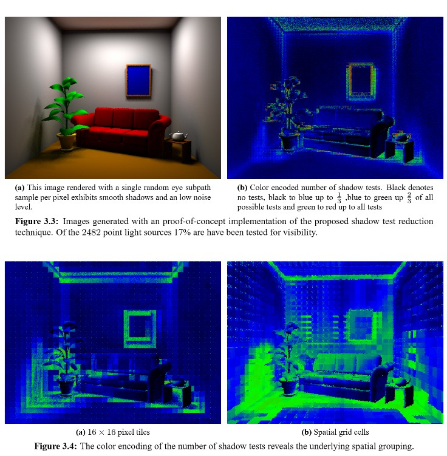

<p align="center">
  
</p>

# Unbiased Visibility Prediction-with-Correction for Real-Time Path Tracing

**Shadow Ray Reduction using a Filtered Adaptive Multi-Level Hash Cache**

**[Paper draft](https://ManuelKugelmann.github.io/VisCacheSketch/paper.html)** | **[2006 Diplomarbeit (PDF)](docs/references/Kugelmann2006_ThesisMK.pdf)**

**Author:** Manuel Kugelmann
**Status:** Implementation in progress. Paper draft in progress.

---

### History

The core ideas behind this project — control variates, Russian roulette, spatial hashing, variance-driven sampling — are not new. They are textbook Monte Carlo techniques ([Knuth 1973][r-knuth]; [Hammersley and Handscomb 1964][r-hammersley]) and well-known data structures. The contribution of the [2006 thesis][r-kugelmann] was combining them in a specific way for visibility estimation in rendering. Much of the same ground has since been covered independently by others, often with better engineering, better framing, or both. We all stand on the shoulders of giants.

**The 2006 thesis.** Manuel Kugelmann's 2006 Diplomarbeit ("Efficient Adaptive Global Illumination Algorithms", Universität Ulm, supervisor Alexander Keller) developed a framework called *prediction with correction* (Sec. 3.4): a spatial hash map stores cached predictions used as control variates, with Russian roulette deciding whether to trace a correction ray and variance driving the RR survival probability (Sec. 3.4.1). The framework was applied to visibility prediction (Sec. 3.2.2), contribution prediction (Sec. 3.2.3), and other cached quantities. The approach of using variance — not absolute light — to drive sampling rate, and the use of spatial hashing for the cache, was inspired by A. Keller's lectures on the role of variance and the "curse of dimensionality". The test case was Instant Radiosity [[Keller 1997][r-keller]], but the caching is algorithm-agnostic — it operates on pairwise queries regardless of the rendering algorithm.

The thesis was never properly finished and remained unpublished. Its artifacts (text and code) likely linger in the Universität Ulm archives and A. Keller's archives. A definitive hardcopy and compact disk with source code exists in Manuel Kugelmann's storage.

**Prior and parallel work on CV+RR.** Using a control variate instead of zero on RR termination is at least implicit in the "go with the winners" family ([Aldous and Vazirani 1994][r-aldous]; [Grassberger 2002][r-grassberger]). In the graphics context, [Szécsi, Szirmay-Kalos and Kelemen 2003][r-szecsi] formalized the non-zero termination estimate for rendering (CV with fixed RR probability). [Szirmay-Kalos et al. 2005][r-szirmay] added variance-driven RR using a scene-global radiance estimate. The 2006 thesis arrived at the same CV+VRRR math independently, differing mainly in the estimation source (per-point spatial cache rather than a scene-global constant) and the variance feedback loop (cache quality drives trace rate and spatial resolution). The overlap with both Szécsi et al. and Szirmay-Kalos et al. was discovered late in the writing process.

**Spatial hashing.** The spatial grids were visible in the thesis screenshots, but the use of *spatial hashing* to map grid cells to memory went unmentioned — it was treated as an implementation detail, not a contribution. The practical inspiration came from [ODE][r-ode] (Open Dynamics Engine, Russell Smith, 2001–2004), which uses spatial hashing for broad-phase collision detection. Kugelmann encountered ODE through a Universität Ulm course project ([Animal Race](http://animalrace.bitcraft.org/)).



**What was not in 2006.** The Bernoulli optimization (var = μ(1−μ), requiring no separate variance accumulator for binary visibility) was not realized — the thesis used generalized variance estimation across all cached quantities. Narrowing to binary visibility allows exploiting the Bernoulli structure. GPU implementation, modern hash functions, LOD-in-key, and ReSTIR integration are all new (see [Key additions](#key-additions-beyond-kugelmann-2006) below).

Since the thesis was unpublished with no online abstract or indexed metadata, independent rediscovery of these ideas by the community is the expected and natural outcome.

**Let's try an LLM-assisted speed run of getting the old 2006 work up to date ...**

## Overview

Most shadow rays in real-time path tracing are redundant — nearby surface points querying the same light region overwhelmingly agree on the outcome. We store binary visibility predictions in a flat, multilevel spatial hash table with 8-byte entries and lock-free atomic updates, and correct cached predictions stochastically so that the estimator remains unbiased regardless of cache quality.

### Core mechanism

The **prediction-with-correction** (**C**ontrol **V**ariate + **V**ariance-driven **R**ussian **R**oulette **R**esidual) estimator converts any visibility prediction into an unbiased shadow ray estimator:

```
variance = µ(1 − µ)
p = clamp(variance / varianceThreshold, pMin, 1.0)
if random < p:
    V = traceShadowRay()
    return µ + (V - µ) / p    # unbiased correction
else:
    return µ                  # no trace, use cached mean
```

The **Bernoulli structure** of binary visibility makes this easy: The same scalar µ gives both the cached estimate and the variance.

The variance signal drives two reinforcing mechanisms:
1. **Correction rate** — variance steers the number of samples via RR
2. **Spatial resolution** — sample count and variance determine which resolution levels of the cache get writes

High-variance regions trace more often *and* at finer spatial resolution.
Low-variance regions trace rarely and only update the coarse level.
This self-regulating behaviour makes the system practical without per-scene tuning.

The cache is algorithm-agnostic — it operates on pairwise (point, point) → {0,1} queries regardless of the rendering algorithm generating them.

### Key additions beyond [Kugelmann 2006][r-kugelmann]

- **Position Jitter as Filtering** intrinsic box filter across cell boundaries, based on [Binder et al. 2018][r-binder] 
- **Good and Fast Hash** - based on PCG3D [Jarzynski & Olano 2020][r-jarzynski]
- **Hash Collision Handling** - fingerprint like [Binder et al. 2018][r-binder], double-hash probing, pressure-scaled eviction
- **LOD in the hash key** - multiple resolutions in one flat table [Gautron 2020][r-gautron20], [Gautron 2021][r-gautron21]
- **Coupled variance adaptation** - variance drives resolution level like in [Stotko et al. 2025][r-stotko]
- **GPU implementation** — built on NVIDIA Falcor 8.0 [Kallweit et al. 2022][r-falcor]
- **Cache-weighted light selection** — cached μ weights ReSTIR candidate selection like [Bokšanský & Meister 2025][r-boksansky]
- **ReSTIR integration** — example integration with ReSTIR DI [Bitterli et al. 2020][r-bitterli] and ReSTIR PT [Lin et al. 2022][r-lin]

#### ReSTIR integration

The visibility cache plugs into two points of the ReSTIR pipeline. During **light selection**, the cached mean µ replaces the usual visibility assumption in the RIS target function, yielding µ-weighted candidate selection that steers samples toward actually visible lights. During **visibility revalidation**, the correction estimator replaces unconditional occlusion rays with variance-driven Russian Roulette, reducing shadow rays while maintaining equal quality. This offers a middle way between skipping revalidation completely (biased) and full revalidation (expensive). Note: Instead of our visibility cache any other prediction of visibility, e.g. from ReSTIR reservoir data, can be used.

### Independent parallel work

The individual ideas in the 2006 thesis — control variates, Russian roulette, spatial hashing, variance-driven sampling — are well-established techniques. Many researchers independently arrived at similar combinations. This is a non-exhaustive selection; there is likely more work we are not yet aware of.

**CV + Russian Roulette in rendering.**
[Szécsi et al. 2003][r-szecsi] and [Szirmay-Kalos et al. 2005][r-szirmay] preceded the 2006 thesis (see [History](#history)). More recently, [Dereviannykh et al. 2024][r-n2lmc] (Neural Two-Level MC) use a related approach — their MLMC residual estimator shares the cached-estimate-plus-unbiased-correction structure, framed as two-level Monte Carlo with an MIS-based termination heuristic.

**Visibility caching.**
The idea of caching visibility to reduce shadow rays predates 2006 — [Ward 1991][r-ward] used heuristic ordering to skip predictable shadow rays. Independent work arrived at the idea through different paths: [Popov et al. 2013][r-popov] an adaptive octree for offline rendering, [Guo et al. 2020][r-guo] (NEE++) per-voxel-pair visibility caching, [SHaRC (Benyoub et al. 2024)][r-sharc] a world-space radiance hash (RTX SDK), and [Bokšanský & Meister 2025][r-boksansky] a neural visibility cache.

**Spatial hashing in rendering.**
Spatial hashing was independently adopted in rendering by [Binder et al. 2018][r-binder] (path-space filtering), [Gautron 2020][r-gautron20]/[2021][r-gautron21] (ambient occlusion), [Müller et al. 2022][r-muller] (Instant NGP — multi-resolution hash encoding, backbone of [Bokšanský & Meister 2025][r-boksansky] and [Dereviannykh et al. 2024][r-n2lmc]), and [SHaRC (Benyoub et al. 2024)][r-sharc] (world-space spatial hash, RTX SDK).

**Variance-driven adaptive sampling.**
[Rath et al. 2022][r-rath] (EARS) uses efficiency-aware RR/splitting for path continuation. [Stotko et al. 2025][r-stotko] (MrHash) independently couples variance to spatial resolution in a flat hash (TSDF domain).

[r-n2lmc]: https://arxiv.org/abs/2412.04634
[r-ward]: https://doi.org/10.1007/978-3-642-77145-8_2
[r-sharc]: https://github.com/NVIDIAGameWorks/RTXGI
[r-rath]: https://doi.org/10.1145/3528223.3530168
[r-guo]: https://doi.org/10.1111/cgf.14142
[r-popov]: https://doi.org/10.1111/cgf.12166

---

## Related work

| Paper | Relation |
|-------|---------|
| [Kugelmann 2006 (Diplomarbeit)][r-kugelmann] | Direct ancestor — CV+RR with per-point spatial cache, variance-driven adaptive sampling |
| [Szécsi et al. 2003][r-szecsi] | Non-zero termination estimate for rendering (CV, fixed RR probability) |
| [Szirmay-Kalos et al. 2005][r-szirmay] | Variance-driven splitting/RR for path tracing |
| [Teschner et al. 2003][r-teschner] | Spatial hashing for collision detection — foundational technique |
| [Smith 2001–2004 (ODE)][r-ode] | `dHashSpace` broad-phase collision via spatial hashing; inspiration for spatial hashing in 2006 thesis |
| [Binder et al. 2018][r-binder] | Spatial hashing, jitter-quantize, fingerprint collision detection |
| [Gautron 2020][r-gautron20], [Gautron 2021][r-gautron21] | LOD in hash key, lock-free GPU hash updates |
| [Jarzynski & Olano 2020 (JCGT)][r-jarzynski] | PCG3D hash function |
| [Stotko et al. 2025 (MrHash)][r-stotko] | Parallels — variance-driven resolution in flat hash (TSDF domain) |
| [Rath et al. 2022 (EARS)][r-rath] | Efficiency-aware RR/splitting for path continuation |
| [Guo et al. 2020 (NEE++)][r-guo] | Voxel-to-voxel visibility probability caching |
| [Popov et al. 2013][r-popov] | Adaptive quantization visibility caching (offline) |
| [Benyoub et al. 2024 (SHaRC)][r-sharc] | Spatial Hash Radiance Cache — world-space hash, roughness-gated LoD (RTX SDK) |
| [Lin et al. 2022 (GRIS/ReSTIR_PT)][r-lin] | Baseline for GI revalidation |
| [Bitterli et al. 2020 (ReSTIR DI)][r-bitterli] | Spatiotemporal reservoir resampling for direct lighting; integration target |
| [Bokšanský & Meister 2025 (JCGT)][r-boksansky] | Parallels — neural visibility cache for light selection |
| [Dereviannykh et al. 2024 (Neural Two-Level MC)][r-n2lmc] | Parallels — MLMC residual shares cached-estimate + correction structure (but framed as MLMC, not CV; BTH is MIS-based, not variance-driven RR), multi-level hash encodings |
| [Müller et al. 2022 (Instant NGP)][r-muller] | Multi-resolution hash encoding — spatial hashing for neural graphics; backbone of Bokšanský 2025 and Dereviannykh 2024 |
| [Kallweit et al. 2022 (Falcor)][r-falcor] | GPU rendering framework used as implementation base |

[r-kugelmann]: docs/references/Kugelmann2006_ThesisMK.pdf
[r-szecsi]: https://www.researchgate.net/publication/221546555_Variance_Reduction_for_Russian-roulette
[r-szirmay]: https://www.researchgate.net/publication/228769903_Go_with_the_Winners_Strategy_in_Path_Tracing
[r-teschner]: https://matthias-research.github.io/pages/publications/tetraederCollision.pdf
[r-ode]: https://ode.org/
[r-binder]: https://doi.org/10.1145/3214745.3214806
[r-gautron20]: https://doi.org/10.1145/3388767.3407365
[r-gautron21]: https://link.springer.com/chapter/10.1007/978-1-4842-7185-8_41
[r-jarzynski]: https://jcgt.org/published/0009/03/02/
[r-stotko]: https://arxiv.org/abs/2511.21459
[r-lin]: https://doi.org/10.1145/3528223.3530158
[r-bitterli]: https://doi.org/10.1145/3386569.3392382
[r-falcor]: https://github.com/NVIDIAGameWorks/Falcor
[r-muller]: https://doi.org/10.1145/3528223.3530127
[r-boksansky]: https://jcgt.org/published/0014/02/01/
[r-knuth]: https://doi.org/10.1007/978-3-642-56592-2
[r-hammersley]: https://doi.org/10.1007/978-94-009-5819-7
[r-aldous]: https://doi.org/10.1007/BF01208571
[r-grassberger]: https://doi.org/10.1016/S0010-4655(02)00467-3
[r-keller]: https://doi.org/10.1145/258734.258769

---

## Quickstart

```bat
cmd /c "curl -sL https://raw.githubusercontent.com/ManuelKugelmann/VisCacheSketch/main/scripts/install.bat?%RANDOM% -o %TEMP%\vc-install.bat && %TEMP%\vc-install.bat"
```

Idempotent — safe to re-run. Clones (or pulls), downloads test scenes, downloads the latest release, runs CPU tests, and launches Mogwai with Bistro.

See **[Getting Started](docs/GETTING_STARTED.md)** for build-from-source, Linux/WSL, and release usage.

