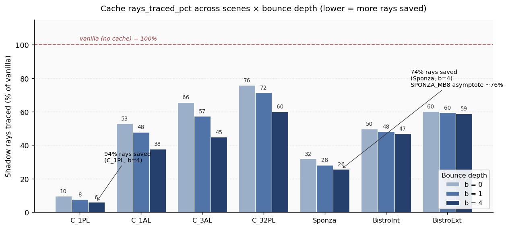
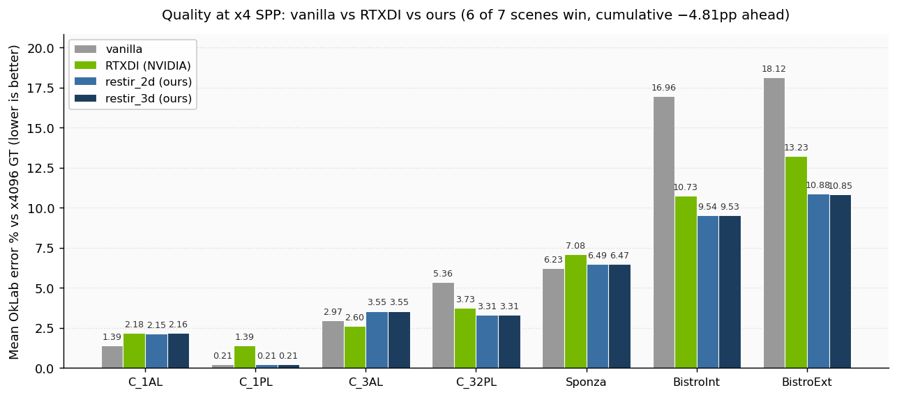
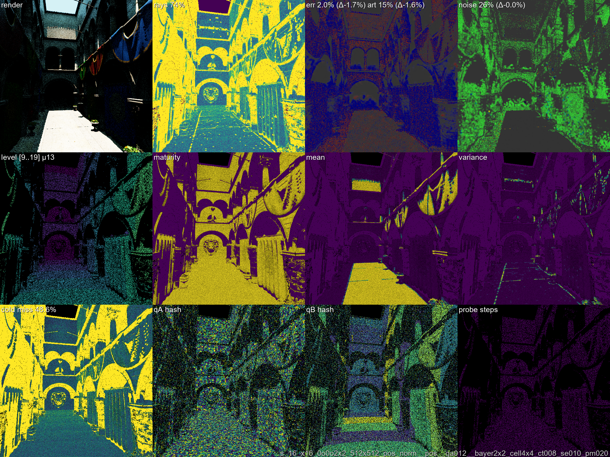

<p align="center">
  
</p>

# Unbiased Visibility Prediction-with-Correction for Real-Time Path Tracing

**Shadow Ray Reduction using a Filtered Adaptive Multi-Level Hash Cache**

**[Paper draft](https://ManuelKugelmann.github.io/VisCache/paper.html)** | **[2006 Diplomarbeit (PDF)](docs/references/Kugelmann2006_ThesisMK.pdf)** | **[Dev Log](docs/devlog/DEVLOG.md)** | **[Ladder Plan](docs/LADDER_PLAN.md)** | **[Ladder Log](docs/LADDERLOG.md)**

**Author:** Manuel Kugelmann
**Status:** Implementation in progress. Paper draft in progress.

---

### Headline results

**Shadow rays saved across the matrix at vanilla-quality match** (cache `rays_traced_pct`; lower = more rays saved; 100% = vanilla). Static-scene frame-accumulation, x4 SPP, canonical config (`stderrThreshold=0.10`).

<p align="center">
  
</p>

**Quality at x4 SPP vs RTXDI** (mean OkLab perceptual error vs x4096 GT, lower = better). Cache integrates into ReSTIR DI as `restir_2d` (per-pixel reservoir + screen-tile pool, RTXDI's exact data structure) and `restir_3d` (3D-cell pool with footprint-derived entry level — world-space analog). **Net 6 wins / 1 trail / cumulative −4.81pp ahead of production RTXDI.** `|restir_2d − restir_3d| ≤ 0.03pp` on every scene (structural-equivalence claim from §3.0 made operational).

<p align="center">
  
</p>

**Algorithm in action — Sponza canonical, x16 SPP, stderr=0.10.** 4×3 diagnostic grid: row 1 = render | rays-traced heatmap | error vs GT | noise; row 2 = LOD level | maturity | cached μ | variance; row 3 = cold-miss | qA hash | qB hash | probe steps. The cache trusts most of the wall and floor (purple = low rays_traced; cells are mature with low variance) and refines only at the penumbra boundaries (yellow rays, high variance). **Mean error 2.0% vs vanilla x4096 GT, art5 15%, 26.5% rays traced — 73.5% saved.**

<p align="center">
  
</p>

Full numbers in [paper §13](viscachepaper/sections/13-results.md); methodology and per-step ladder narrative in [LADDERLOG.md](docs/LADDERLOG.md).

---

### History

The core ideas behind this project — control variates, Russian roulette, spatial hashing, variance-driven sampling — are not new. They are textbook Monte Carlo techniques ([Knuth 1973][r-knuth]; [Hammersley and Handscomb 1964][r-hammersley]) and well-known data structures. The contribution of the [2006 thesis][r-kugelmann] was combining them in a specific way for visibility estimation in rendering. Much of the same ground has since been covered independently by others, often with better engineering, better framing, or both. We all stand on the shoulders of giants.

**The 2006 thesis.** Manuel Kugelmann's 2006 Diplomarbeit ("Efficient Adaptive Global Illumination Algorithms", Universität Ulm, supervisor Alexander Keller) developed a framework called *prediction with correction* (Sec. 3.4): a spatial hash map stores cached predictions used as control variates, with Russian roulette deciding whether to trace a correction ray and variance driving the RR survival probability (Sec. 3.4.1). The framework was applied to visibility prediction (Sec. 3.2.2), contribution prediction (Sec. 3.2.3), and other cached quantities. The approach of using variance — not absolute light — to drive sampling rate, and the use of spatial hashing for the cache, was inspired by A. Keller's lectures on the role of variance and the "curse of dimensionality". The test case was Instant Radiosity [[Keller 1997][r-keller]], but the caching is algorithm-agnostic — it operates on pairwise queries regardless of the rendering algorithm.

The thesis was never properly finished and remained unpublished. Its artifacts (text and code) likely linger in the Universität Ulm archives and A. Keller's archives. A definitive hardcopy and compact disk with source code exists in Manuel Kugelmann's storage.

**Why it was cut short.** The 2006 thesis was looking for a workable solution to the concrete problem of the day — rendering many lights, many shadow rays, and many paths in tractable time — aiming too high. Funding pressure throughout the Diplomarbeit pulled time toward paid sidework, and afterwards a paid Computer-Vision thesis became the priority. The visibility-caching line was left at "promising sketch with empirical results" — the polish, broader scene validation, and journal write-up never happened. The 2026 work picks the same investigation back up two decades later.

**Prior and parallel work on CV+RR.** Using a control variate instead of zero on RR termination is at least implicit in the "go with the winners" family ([Aldous and Vazirani 1994][r-aldous]; [Grassberger 2002][r-grassberger]). In the graphics context, [Szécsi, Szirmay-Kalos and Kelemen 2003][r-szecsi] formalized the non-zero termination estimate for rendering (CV with fixed RR probability). [Szirmay-Kalos et al. 2005][r-szirmay] added variance-driven RR using a scene-global radiance estimate. The 2006 thesis arrived at the same CV+VRRR math independently, differing mainly in the estimation source (per-point spatial cache rather than a scene-global constant) and the variance feedback loop (cache quality drives trace rate and spatial resolution). The overlap with both Szécsi et al. and Szirmay-Kalos et al. was discovered late in the writing process.

**Spatial hashing.** The spatial grids were visible in the thesis screenshots, but the use of *spatial hashing* to map grid cells to memory went unmentioned — it was treated as an implementation detail, not a contribution. The practical inspiration came from [ODE][r-ode] (Open Dynamics Engine, Russell Smith, 2001–2004), which uses spatial hashing for broad-phase collision detection. Kugelmann encountered ODE through a Universität Ulm course project ([Animal Race](http://animalrace.bitcraft.org/)).


**What was not in 2006.** The Bernoulli optimization (var = μ(1−μ), requiring no separate variance accumulator for binary visibility) was not realized — the thesis used generalized variance estimation across all cached quantities. Narrowing to binary visibility allows exploiting the Bernoulli structure. GPU implementation, modern hash functions, LOD-in-key, and ReSTIR integration are all new (see [Key additions](#key-additions-beyond-kugelmann-2006) below).

Since the thesis was unpublished with no online abstract or indexed metadata, independent rediscovery of these ideas by the community is the expected and natural outcome.


**Let's try an LLM-assisted speed run of getting the old 2006 work up to date ...**

## Overview

Most shadow rays in real-time path tracing are redundant — nearby surface points querying the same light region overwhelmingly agree on the outcome. We store binary visibility predictions in a flat, multilevel spatial hash table with 8-byte entries and lock-free atomic updates, and correct cached predictions stochastically so that the estimator remains unbiased regardless of cache quality.

### Core mechanism

The **prediction-with-correction** (**C**ontrol **V**ariate + **V**ariance-driven **R**ussian **R**oulette **R**esidual) estimator converts any visibility prediction into an unbiased shadow ray estimator:

```
variance = µ(1 − µ)
p = clamp(variance / varianceThreshold, pMin, 1.0)
if random < p:
    V = traceShadowRay()
    return µ + (V - µ) / p    # unbiased correction
else:
    return µ                  # no trace, use cached mean
```

The **Bernoulli structure** of binary visibility makes this easy: The same scalar µ gives both the cached estimate and the variance.

The variance signal drives two reinforcing mechanisms simultaneously (**coupled dual adaptation**):
1. **Correction rate** — variance steers the number of samples via RR
2. **Spatial resolution** — variance gates which resolution levels of the cache get writes

High-variance regions trace more often *and* at finer spatial resolution.
Low-variance regions trace rarely and only update the coarse level.
This one-signal-two-decisions coupling is what makes the cache self-regulating without per-scene tuning.

The cache is algorithm-agnostic — it operates on pairwise visibility queries regardless of the rendering algorithm generating them.

### Key addressing: position+normal × direction+distance

The hash key decomposes the visibility query into **shading point** (position + surface normal) and **query** (direction + distance). This exploits free geometric information that symmetric position × position addressing cannot:

- **Normal** disambiguates thin geometry and corners — nearby points with different normals get separate entries
- **Direction** enables angular LOD — coarse angular bins where visibility is smooth, fine bins at shadow edges
- **Distance monotonicity** — if occluded at distance d, everything farther is also blocked; one any-hit ray (using the free `CommittedRayT()`) propagates V=0 to all farther distance bins at zero cost

A secondary position × position mode is available for GI revalidation queries. Both modes coexist in the same flat hash table.

### Key additions beyond [Kugelmann 2006][r-kugelmann]

- **Position+normal × direction+distance addressing** — exploits surface normal, angular LOD, and distance monotonicity
- **Position Jitter as Filtering** — intrinsic box filter across cell boundaries, based on [Binder et al. 2018][r-binder]
- **Good and Fast Hash** — based on PCG3D [Jarzynski & Olano 2020][r-jarzynski]
- **Hash Collision Handling** — fingerprint like [Binder et al. 2018][r-binder], double-hash probing, pressure-scaled eviction
- **LOD in the hash key** — multiple resolutions in one flat table [Gautron 2020][r-gautron20], [Gautron 2021][r-gautron21]
- **Coupled variance adaptation** — variance drives correction rate and spatial resolution like in [Stotko et al. 2025][r-stotko]
- **GPU implementation** — built on NVIDIA Falcor 8.0 [Kallweit et al. 2022][r-falcor]
- **Cache-weighted light selection** — cached μ weights ReSTIR candidate selection like [Bokšanský & Meister 2025][r-boksansky]
- **ReSTIR integration** — example integration with ReSTIR DI [Bitterli et al. 2020][r-bitterli] and ReSTIR PT [Lin et al. 2022][r-lin]

#### ReSTIR integration

The visibility cache plugs into two points of the ReSTIR pipeline. During **light selection**, the cached mean µ replaces the usual visibility assumption in the RIS target function, yielding µ-weighted candidate selection that steers samples toward actually visible lights. During **visibility revalidation**, the correction estimator replaces unconditional occlusion rays with variance-driven Russian Roulette, reducing shadow rays while maintaining equal quality. This offers a middle way between skipping revalidation completely (biased) and full revalidation (expensive). Note: Instead of our visibility cache any other prediction of visibility, e.g. from ReSTIR reservoir data, can be used.

### Current results

Canonical config: flat multilevel hash, `forceDescendFootprintPx=16`, 8-level cascade, Bayer 2×2, `bootThreshold=8`, `stderrThreshold=0.10`, `pMin=0.02`. Static-scene frame-accumulation, 1-spp-per-frame, x4 SPP unless noted. Full numbers in [paper §13](viscachepaper/sections/13-results.md).

**Shadow rays % traced (algorithmic).** Cache `rays_traced_pct` — lower is better; 100% = vanilla equivalent.

| Scene | b=0 | b=1 | b=4 | b=8 | b=16 |
|---|---:|---:|---:|---:|---:|
| Cornell_1PL  | 9.7%  | 7.7%  | **6.1%** | — | — |
| Cornell_1AL  | 53.0% | 47.9% | 37.8% | — | — |
| Cornell_3AL  | 65.7% | 57.4% | 44.8% | — | — |
| Cornell_32PL | 75.8% | 71.5% | 60.1% | — | — |
| Sponza | 31.9% | 28.2% | **25.7%** | 24.4% | **23.8%** |
| BistroInterior | 49.8% | 48.2% | 47.0% | — | — |
| BistroExterior | 60.3% | 59.6% | 58.9% | — | — |

**3–94% rays saved across the matrix at vanilla-quality match.** Rays-saved increases monotonically with bounce depth on every scene; Sponza b=8/16 establishes the asymptote at ~76% rays saved (24% traced).

**Quality at matched SPP (b=4 multibounce, x4):** OkLab perceptual error matches vanilla within 0.05pp on every scene; art5 differs by ≤1pp. Multibounce relmse improves dramatically on indoor multi-light (BistroInterior 2.4× better than vanilla, Cornell_1PL 9% better) — the cache averages out per-bounce firefly variance via cell-level means.

**RTXDI parity (single-bounce DI, x4 OkLab vs x4096 GT):**

| Scene | vanilla | RTXDI | restir_2d (ours) | Δ vs RTXDI |
|---|---:|---:|---:|---:|
| Cornell_1AL | 1.39 | 2.18 | **2.15** | **−0.03 win** |
| Cornell_1PL | 0.21 | 1.39 | **0.21** | **−1.18 win** |
| Cornell_3AL | 2.97 | **2.60** | 3.55 | +0.95 trail |
| Cornell_32PL | 5.36 | 3.73 | **3.31** | **−0.42 win** |
| Sponza | 6.23 | 7.08 | **6.49** | **−0.59 win** |
| BistroInterior | 16.96 | 10.73 | **9.54** | **−1.19 win** |
| BistroExterior | 18.12 | 13.23 | **10.88** | **−2.35 win** |

**Net: 6 wins / 1 trail; cumulative −4.81pp ahead** of the production RTXDI baseline. The 3D-cell pool with footprint-derived entry level recovers RTXDI's screen-tile pool at matched parameters: `|restir_2d − restir_3d| ≤ 0.03pp` on every scene (structural-equivalence claim from §3.0 made operational).

*Wall-clock numbers are deferred from this README — measurement methodology is being tightened (see [LADDERLOG.md](docs/LADDERLOG.md) `TIMING_HONEST` row). Initial steady-state results indicate positive savings on Sponza single-bounce DI even with no GPU optimization; multibounce wall-clock and dynamic-scene measurements are open implementation milestones.*

### Independent parallel work

The individual ideas in the 2006 thesis — control variates, Russian roulette, spatial hashing, variance-driven sampling — are well-established techniques. Many researchers independently arrived at similar combinations. This is a non-exhaustive selection; there is likely more work we are not yet aware of.

**Control Variate + Russian Roulette in rendering.**
[Szécsi et al. 2003][r-szecsi] and [Szirmay-Kalos et al. 2005][r-szirmay] preceded the 2006 thesis (see [History](#history)). More recently, [Dereviannykh et al. 2024][r-n2lmc] (Neural Two-Level MC) use a related approach — their MLMC residual estimator shares the cached-estimate-plus-unbiased-correction structure, framed as two-level Monte Carlo with an MIS-based termination heuristic.

**Visibility Caching.**
The idea of caching visibility to reduce shadow rays predates 2006 — [Ward 1991][r-ward] used heuristic ordering to skip predictable shadow rays. Independent work arrived at the idea through different paths: [Popov et al. 2013][r-popov] an adaptive octree for offline rendering, [Guo et al. 2020][r-guo] (NEE++) per-voxel-pair visibility caching, [SHaRC (Benyoub et al. 2024)][r-sharc] a world-space radiance hash (RTX SDK), [Bokšanský & Meister 2025][r-boksansky] a neural visibility cache, and [Tokuyoshi 2024][r-tokuyoshi] efficient visibility reuse across spatiotemporal neighbors in ReSTIR. [Zhang, Lin et al. 2025][r-zhang25] avoid shadow rays entirely for most lights via ReSTIR-selected shadow maps. [Conner et al. 2025][r-megalights] (MegaLights, Unreal Engine 5) trace a fixed budget of shadow rays per pixel via stochastic light importance sampling.

**Spatial Hashing in rendering.**
Spatial hashing was independently adopted in rendering by [Binder et al. 2018][r-binder] (path-space filtering), [Gautron 2020][r-gautron20]/[2021][r-gautron21] (ambient occlusion), [Müller et al. 2022][r-muller] (Instant NGP — multi-resolution hash encoding, backbone of [Bokšanský & Meister 2025][r-boksansky] and [Dereviannykh et al. 2024][r-n2lmc]), and [SHaRC (Benyoub et al. 2024)][r-sharc] (world-space spatial hash, RTX SDK).

**Variance-driven adaptive sampling.**
[Vorba and Křivánek 2016][r-adrrs] (ADRRS) precompute an adjoint importance function to set per-event RR/splitting weight windows. [Rath et al. 2022][r-rath] (EARS) uses efficiency-aware RR/splitting for path continuation; [Meyer et al. 2024][r-mars] (MARS) generalize to per-technique sample counts. [Jin et al. 2025][r-nrrs] (NRRS) pioneer neural networks with hash-grid encoding for learning RR factors in wavefront path tracing. [Stotko et al. 2025][r-stotko] (MrHash) independently couples variance to spatial resolution in a flat hash (TSDF domain). All operate on path continuation decisions, not shadow ray gating — our work is orthogonal.

[r-n2lmc]: https://arxiv.org/abs/2412.04634
[r-ward]: https://doi.org/10.1007/978-3-642-77145-8_2
[r-sharc]: https://github.com/NVIDIAGameWorks/RTXGI
[r-rath]: https://doi.org/10.1145/3528223.3530168
[r-guo]: https://doi.org/10.1111/cgf.14142
[r-popov]: https://doi.org/10.1111/cgf.12166

---

## Related work

| Paper | Relation |
|-------|---------|
| [Kugelmann 2006 (Diplomarbeit)][r-kugelmann] | Direct ancestor — CV+RR with per-point spatial cache, variance-driven adaptive sampling |
| [Szécsi et al. 2003][r-szecsi] | Non-zero termination estimate for rendering (CV, fixed RR probability) |
| [Szirmay-Kalos et al. 2005][r-szirmay] | Variance-driven splitting/RR for path tracing |
| [Teschner et al. 2003][r-teschner] | Spatial hashing for collision detection — foundational technique |
| [Smith 2001–2004 (ODE)][r-ode] | Broad-phase collision via spatial hashing; inspiration for spatial hashing in 2006 thesis |
| [Binder et al. 2018][r-binder] | Spatial hashing, jitter-quantize, fingerprint collision detection |
| [Gautron 2020][r-gautron20], [Gautron 2021][r-gautron21] | LOD in hash key, lock-free GPU hash updates |
| [Jarzynski & Olano 2020 (JCGT)][r-jarzynski] | PCG3D hash function |
| [Stotko et al. 2025 (MrHash)][r-stotko] | Variance-driven resolution in flat hash (TSDF domain) |
| [Vorba and Křivánek 2016 (ADRRS)][r-adrrs] | Adjoint-driven RR/splitting weight windows for path continuation |
| [Rath et al. 2022 (EARS)][r-rath] | Efficiency-aware RR/splitting for path continuation |
| [Meyer et al. 2024 (MARS)][r-mars] | Per-technique sample allocation via RR/splitting |
| [Jin et al. 2025 (NRRS)][r-nrrs] | Neural RR factors with hash-grid encoding for wavefront path tracing |
| [Guo et al. 2020 (NEE++)][r-guo] | Voxel-to-voxel visibility probability caching |
| [Popov et al. 2013][r-popov] | Adaptive quantization visibility caching (offline) |
| [Benyoub et al. 2024 (SHaRC)][r-sharc] | Spatial Hash Radiance Cache — world-space hash, roughness-gated LoD (RTX SDK) |
| [Lin et al. 2022 (GRIS/ReSTIR_PT)][r-lin] | Baseline for GI revalidation |
| [Tokuyoshi 2024][r-tokuyoshi] | Efficient visibility reuse across spatiotemporal neighbors in ReSTIR |
| [Zhang, Lin et al. 2025 (ReSTIR Shadow Maps)][r-zhang25] | ReSTIR-selected shadow maps — avoids shadow rays for most lights |
| [Conner et al. 2025 (MegaLights)][r-megalights] | Fixed-budget stochastic direct lighting in Unreal Engine 5 |
| [Bitterli et al. 2020 (ReSTIR DI)][r-bitterli] | Spatiotemporal reservoir resampling for direct lighting; integration target |
| [Bokšanský & Meister 2025 (JCGT)][r-boksansky] | Neural visibility cache for light selection |
| [Dereviannykh et al. 2024 (Neural Two-Level MC)][r-n2lmc] | MLMC residual shares cached-estimate + correction structure (but framed as MLMC, not CV; BTH is MIS-based, not variance-driven RR), multi-level hash encodings |
| [Müller et al. 2022 (Instant NGP)][r-muller] | Multi-resolution hash encoding — spatial hashing for neural graphics; backbone of Bokšanský 2025 and Dereviannykh 2024 |
| [Kallweit et al. 2022 (Falcor)][r-falcor] | GPU rendering framework used as implementation base |

[r-kugelmann]: docs/references/Kugelmann2006_ThesisMK.pdf
[r-szecsi]: https://www.researchgate.net/publication/221546555_Variance_Reduction_for_Russian-roulette
[r-szirmay]: https://www.researchgate.net/publication/228769903_Go_with_the_Winners_Strategy_in_Path_Tracing
[r-teschner]: https://matthias-research.github.io/pages/publications/tetraederCollision.pdf
[r-ode]: https://ode.org/
[r-binder]: https://doi.org/10.1145/3214745.3214806
[r-gautron20]: https://doi.org/10.1145/3388767.3407365
[r-gautron21]: https://link.springer.com/chapter/10.1007/978-1-4842-7185-8_41
[r-jarzynski]: https://jcgt.org/published/0009/03/02/
[r-stotko]: https://arxiv.org/abs/2511.21459
[r-lin]: https://doi.org/10.1145/3528223.3530158
[r-bitterli]: https://doi.org/10.1145/3386569.3392382
[r-falcor]: https://github.com/NVIDIAGameWorks/Falcor
[r-muller]: https://doi.org/10.1145/3528223.3530127
[r-boksansky]: https://jcgt.org/published/0014/02/01/
[r-tokuyoshi]: https://doi.org/10.1145/3641233.3664320
[r-zhang25]: https://doi.org/10.1111/cgf.70059
[r-megalights]: https://advances.realtimerendering.com/s2025/content/MegaLights_Stochastic_Direct_Lighting_2025.pdf
[r-adrrs]: https://doi.org/10.1145/2897824.2925912
[r-mars]: https://doi.org/10.1145/3687923
[r-nrrs]: https://arxiv.org/abs/2510.07868
[r-knuth]: https://doi.org/10.1007/978-3-642-56592-2
[r-hammersley]: https://doi.org/10.1007/978-94-009-5819-7
[r-aldous]: https://doi.org/10.1007/BF01208571
[r-grassberger]: https://doi.org/10.1016/S0010-4655(02)00467-3
[r-keller]: https://doi.org/10.1145/258734.258769

---

### Convergent timeline

Two largely-independent threads developed structurally-equivalent multilevel spatial hash machinery between 2014 and 2025; cross-thread citation is sparse, which is the normal field structure rather than a gap. We re-enter this picture in 2026, modernizing the 2006 framework for the GPU + ReSTIR era and unifying both threads.

| Year | Path-filtering / path-guiding thread | Radiance-cache / light-reservoir thread | Visibility cache |
|------|--------------------------------------|------------------------------------------|------------------|
| 2003 | Teschner — spatial hashing (foundation, both threads) | ↰ | |
| 2005 | | Talbot — Resampled Importance Sampling | |
| **2006** | | | **Kugelmann — Diplomarbeit** (pos+normal+grid key, CV+RRR, unbiased Light Cuts) |
| 2014 | Keller, Dahm, Binder — Path Space Filtering | | |
| 2017 | Müller — Practical Path Guiding (SD-tree) | | |
| 2018 | Binder, Fricke, Keller — Jittered Spatial Hashing | | |
| 2019 | Binder, Keller — Massively Parallel Path Space Filtering | | |
| 2020 | Gautron — RT-AO via spatial hashing | Bitterli — ReSTIR DI | |
| 2021 | Müller, Rousselle, Novák, Keller — NRC ; Gautron — practical hash-map updates | Ouyang — ReSTIR GI ; Boksanský/Jukarainen/Wyman — **ReGIR** ; Boissé — **WS-ReSTIR** | |
| 2022 | Müller — instant-NGP (multi-resolution hashing) | Lin — GRIS ; Boissé — **GI-1.0** (two-level cache with promotion/decay) | |
| 2023 | Dittebrandt — MCMM (screen-space MCMC) | Zhang & Wang — World-Space Spatiotemporal Path Resampling (normal-aware grid) | |
| 2024 | Benyoub, Marteaux, Boudier — **SHaRC** (NVIDIA RTXGI 2.0) | | Zhang — Area ReSTIR ; Zheng — ReSTIR PG ; Bokšanský & Meister — Neural Visibility Cache |
| 2025 | Alber, Hanika, Dachsbacher — **MCPG** (multi-level adaptive + static, MLE α-floor) ; Stotko — MrHash | Liu — Reservoir Splatting ; Lin — ReSTIR BDPT | |
| **2026** | | | **VisCache (this work)** — 2006 framework brought to GPU + multi-level cascade + ReSTIR-family composition |

Reading top-to-bottom in the rightmost column is the shortest version of the timeline: 2006 already explores the cell-keying and CV+RRR machinery (in an unpublished thesis, invisible to the field); **2007–2025 is silent on the visibility-caching specifically**; the field develops elements of it independently in the two left columns; we pick up the rightmost column in 2026 and integrate with both threads.

The citation graph below makes the structure explicit. Solid arrows are actual citations from one paper to another. Dotted arrows labelled *same idea* are pairs of works that arrived at structurally equivalent designs *without* citing each other — convergent re-development across thread boundaries:

```mermaid
flowchart TB
    %% ============ Common ancestors (broad-phase spatial hashing roots) ============
    ODE["<b>2001–2004 Smith — ODE</b><br/>Open Dynamics Engine<br/>(spatial hashing for broad-phase<br/>collision detection)<br/>— the only inspiration MK2006 had,<br/>encountered through a Uni Ulm course project"]:::ancestorBig
    T03["2003 Teschner et al.<br/>Optimized Spatial Hashing for<br/>Collision Detection of Deformable Objects<br/>(unknown to MK2006 in 2006;<br/>academic ancestor of the path-filtering thread)"]:::ancestor
    TA05["2005 Talbot et al.<br/>RIS (foundational for ReSTIR thread)"]:::ancestor

    %% ============ Visibility-cache lineage ============
    MK06["<b>2006 Kugelmann (Diplomarbeit)</b><br/>pos+normal+grid cell key<br/>CV+RRR · unbiased Light Cuts<br/>(unpublished, invisible to the field)"]:::lineage

    %% ============ Path-filtering / path-guiding thread ============
    K14["2014 Keller, Dahm, Binder<br/>Path Space Filtering"]:::pfThread
    MU17["2017 Müller, Gerber, Gross<br/>Practical Path Guiding"]:::pfThread
    B1819["2018/19 Binder, Fricke, Keller<br/>Jittered Spatial Hashing /<br/>Massively Parallel PSF"]:::pfThread
    D23["2023 Dittebrandt et al.<br/>MCMM (screen-space)"]:::pfThread
    SHARC["2024 Benyoub et al.<br/>SHaRC (NVIDIA RTXGI 2.0)"]:::pfThread
    MCPG["2025 Alber, Hanika, Dachsbacher<br/>MCPG (multi-level + α-floor)"]:::pfThread

    %% ============ Radiance-cache / light-reservoir thread ============
    BI20["2020 Bitterli et al.<br/>ReSTIR DI"]:::rcThread
    REGIR["2021 Boksanský et al.<br/>ReGIR"]:::rcThread
    WS21["2021 Boissé<br/>WS-ReSTIR"]:::rcThread
    GI22["2022 Boissé et al.<br/>GI-1.0"]:::rcThread
    Z23["2023 Zhang & Wang<br/>WS Path Resampling"]:::rcThread

    %% ============ Algorithmic lineage: Metropolis mutations → GRIS shift mappings ============
    %% (Not the cache data structure — the path-transformation machinery threading through ReSTIR PT.
    %%  Citation chain is mostly explicit; this thread runs in parallel to both colour columns.)
    V97["1997 Veach & Guibas<br/>Metropolis Light Transport<br/>(path-space mutations)"]:::mutThread
    KEL02["2002 Kelemen et al.<br/>Simple and Robust MLT<br/>(PSS parameterization)"]:::mutThread
    LEH13["2013 Lehtinen et al.<br/>Gradient-Domain MLT<br/>(shift mappings + Jacobians<br/>between neighbour pixels)"]:::mutThread
    KET15["2015 Kettunen et al.<br/>Gradient-Domain BDPT<br/>(non-Markovian shifts)"]:::mutThread
    LIN22["2022 Lin et al.<br/>GRIS · ReSTIR PT<br/>(shift mappings + reservoir<br/>resampling, Markov dropped)"]:::mutThread
    HED25["2025 Hedstrom et al.<br/>ReSTIR BDPT<br/>(bidirectional + caustics)"]:::mutThread
    LIN26["2026 Lin, Kettunen, Wyman<br/>ReSTIR PT Enhanced<br/>(footprint criteria, dup-maps,<br/>RR-PSS decoupling, DI+GI unify)"]:::mutThread

    %% ============ Fringes: same data structure, parallel fields (non-rendering) ============
    NIES13(["2013 Nießner et al.<br/>Real-time 3D Reconstruction<br/>at Scale (voxel hashing, TSDF)"]):::fringe
    NVDB21(["2021 Museth<br/>NanoVDB<br/>(GPU sparse voxel data structure)"]):::fringe
    INGP(["2022 Müller, Evans, Schied, Keller<br/>instant-NGP<br/>(NeRF multi-res hash encoding)"]):::fringe
    FVDB(["2024 Williams et al.<br/>fVDB<br/>(sparse voxels, topology/value split)"]):::fringe
    WAL25(["2025 Walker et al.<br/>Spatially-Adaptive Hash Encodings<br/>(neural surface reconstruction)"]):::fringe
    MRH(["2025 Stotko et al.<br/>MrHash<br/>(TSDF, variance-adaptive)"]):::fringe

    %% ============ This work ============
    US["<b>2026 VisCache (this work)</b><br/>GPU realization · multi-level cascade<br/>ReSTIR-family composition"]:::ours

    %% ---- Inspiration into the visibility-cache lineage node ----
    %% (Teschner 2003 is NOT the inspiration: not in MK2006 bibliography, and
    %%  ODE predates Teschner anyway. ODE is the only inspiration for MK2006.)
    ODE ==> MK06

    %% ---- Citations within PF/PG thread (solid) ----
    T03 --> B1819
    K14 --> B1819
    MU17 --> D23
    B1819 --> MCPG
    B1819 --> SHARC
    D23 --> MCPG

    %% ---- Citations within radiance-cache thread (solid) ----
    TA05 --> BI20
    BI20 --> REGIR
    BI20 --> WS21
    WS21 --> GI22
    WS21 --> Z23

    %% ---- Citations into this work (solid, thick = direct lineage) ----
    MK06 ==> US
    B1819 --> US
    BI20 --> US
    REGIR --> US
    WS21 --> US
    GI22 --> US
    Z23 --> US
    SHARC --> US
    MCPG --> US

    %% ---- Convergent "same idea" connections (dotted, NO citation) ----
    MK06 -. "same idea: pos+normal+grid key (15 yrs apart)" .-> WS21
    MK06 -. "same idea: normal-aware grid (17 yrs apart)" .-> Z23
    MK06 -. "same idea: CV+RRR framework / unbiased adaptive sampling" .-> MCPG
    MK06 -. "same idea: cached prediction + RIS for sampling" .-> REGIR
    B1819 -. "same idea: jittered hashing (cross-thread)" .-> WS21
    GI22 -. "same idea: multi-level cache (different mechanism)" .-> MCPG

    %% ---- Cross-thread weak citation (rare) ----
    BI20 -.-> SHARC
    BI20 -.-> MCPG

    %% ---- Algorithmic lineage citations (solid; this is the GRIS-machinery thread) ----
    V97 --> KEL02
    V97 --> LEH13
    KEL02 --> LIN22
    LEH13 --> KET15
    LEH13 --> LIN22
    KET15 --> LIN22
    BI20 --> LIN22
    LIN22 --> HED25
    LIN22 --> LIN26
    LIN22 --> US
    LIN26 -.-> US

    %% ---- MK2006 received Metropolis as inspiration for its bidirectional/backtracing
    %%      reconnection work (informal mutation-style transformation, 6 years pre-Lehtinen)
    V97 -. "inspiration: path-space mutations<br/>(MK2006 sensor-loose reconnection)" .-> MK06

    %% ---- Fringe internal citations (non-rendering: TSDF / NeRF / sparse voxels) ----
    T03 --> NIES13
    NIES13 --> MRH
    NIES13 --> FVDB
    NVDB21 --> FVDB
    INGP --> MRH
    INGP --> WAL25
    INGP --> FVDB

    %% ---- Cross-field bridges (rare, dotted) ----
    B1819 -.-> INGP
    INGP -.-> SHARC

    %% ---- Shared-design links into the rendering convergence (no citation) ----
    INGP -. "same design: multi-res hash" .-> US
    MRH -. "same design: variance-adaptive hash" .-> US
    FVDB -. "same design: topology/value split" .-> US

    %% ============ Styles ============
    classDef lineage fill:#fdb,stroke:#a40,stroke-width:3px,color:#000
    classDef ours fill:#fcc,stroke:#900,stroke-width:3px,color:#000
    classDef pfThread fill:#cef,stroke:#048,color:#000
    classDef rcThread fill:#cfc,stroke:#060,color:#000
    classDef ancestor fill:#ddd,stroke:#666,color:#000
    classDef ancestorBig fill:#ccc,stroke:#444,stroke-width:2px,color:#000
    classDef fringe fill:#fef0d8,stroke:#a86,stroke-dasharray:3 3,color:#444
    classDef mutThread fill:#e8d8f0,stroke:#609,color:#000
```



**Reading the graph.** **The only inspiration MK2006 had was [ODE](http://animalrace.bitcraft.org/)** (Russell Smith's Open Dynamics Engine, 2001–2004), encountered through a Universität Ulm course project (*Animal Race*). ODE used spatial hashing for broad-phase collision detection; that's where Kugelmann took the spatial-hash idea from. The 2006 thesis bibliography contains no Teschner 2003 citation (verified by inspection); Teschner enters the rendering literature later via Binder/Keller's path-space-filtering line, where it serves as the academic-literature ancestor of the path-filtering thread on the left. ODE predates Teschner by two years, so even an indirect dependency is ruled out — they are best read as parallel independent developments of broad-phase spatial hashing in the early 2000s. The thick `ODE ==> MK06` arrow is the only personal-inspiration edge in the diagram; the thick `MK06 ==> US` arrow is the only intra-author lineage. Everything else is independent re-development. The two coloured columns are largely-independent citation chains: blue = path-filtering / path-guiding lineage (left), green = radiance-cache / light-reservoir lineage (right). Solid arrows trace actual citations; the chains stay within their own colours. Dotted *same idea* arrows connect works that arrived at the same structural primitive without citing each other — typically because the predecessor was either invisible to the field (Kugelmann 2006: an unpublished Diplomarbeit) or in a different thread the citing paper didn't engage with (Binder 2018/19's jittered hashing reaching into the radiance-cache thread).

**Algorithmic lineage (purple, not part of the cache data structure).** The purple cluster is the *algorithmic* thread that gives ReSTIR PT its mathematical machinery: Metropolis-style path mutations, formalised in primary sample space, then re-cast as deterministic shift mappings with explicit Jacobians, and finally fused with reservoir resampling — the chain that produces GRIS. **MLT** [Veach & Guibas 1997] introduced path-space mutations with acceptance ratios; **PSS-MLT** [Kelemen et al. 2002] moved the mutations into primary sample space (the parameterization GRIS and Lin 2026 §6 still use verbatim); **gradient-domain MLT** [Lehtinen et al. 2013] introduced shift mappings between neighbour pixels' path domains with explicit Jacobians, originally to estimate finite-difference gradients; **gradient-domain BDPT** [Kettunen et al. 2015] dropped the Markov chain while keeping the shift mappings; **GRIS / ReSTIR PT** [Lin et al. 2022] fused those shift mappings with reservoir importance-resampling (replacing accept/reject), making the same machinery parallel; **ReSTIR BDPT** [Hedstrom et al. 2025] brought bidirectional mutations back into the GRIS framework; **ReSTIR PT Enhanced** [Lin et al. 2026] is the engineering follow-up. The dotted edge `V97 ⇢ MK06` is an *inspiration* edge: MK2006's bidirectional/backtracing imperfect-reconnection work was conceptually a Metropolis-style path transformation done informally six years before Lehtinen formalised it as a shift mapping. This thread is orthogonal to the cache data structure (the green/blue columns) — the data structure is *what* gets stored, the GRIS thread is *how* samples get transformed and combined; both meet at our 2026 work, where ReSTIR PT (purple) rides on the cell data structure (green/blue).

**Outliers at the fringes (non-rendering).** The yellow oval-shaped nodes are the same hash data structure appearing in adjacent fields that are not part of the rendering citation lineage:

- **TSDF / 3D reconstruction**: Nießner et al. 2013 (real-time voxel hashing) — built directly on Teschner 2003 — extends through MrHash 2025 (variance-adaptive multi-resolution voxel hashing).
- **Sparse voxel data structures**: NanoVDB [Museth 2021] → fVDB [Williams et al. 2024] adds explicit topology/value separation that is structurally similar to splitting our `WSCellPool` slot table from the cascade hash.
- **Neural fields**: instant-NGP [Müller, Evans, Schied, Keller 2022] (Keller's group, sharing lineage with Binder/PSF) → MrHash 2025 and Walker 2025 (spatially-adaptive hash encodings for neural surface reconstruction) build on it.

The fringe cluster has its own internal citation chain (solid arrows within the yellow nodes), bridges occasionally to the rendering threads (dotted arrows: Binder 2018/19 → instant-NGP shares co-authorship with Keller; instant-NGP → SHaRC 2024 is the architectural cousin paired in NVIDIA RTXGI 2.0), and connects to our 2026 work via *same design* dotted links — they share the multilevel hash for the same reason but came at it from neural-feature-encoding, signed-distance-field, and point-cloud-reconstruction problems rather than from light transport. Their presence in the diagram is informational: orthogonal evidence that the design convergence transcends rendering. They are not cited as part of our rendering-design convergence claim, but the fact that the same machinery dominates these adjacent fields independently is itself supporting evidence that the design point is load-bearing.

The structural primitives that converged — flat single-buffer hash with level-in-key, position+normal cell descriptor, fingerprint collision check, jittered lookup, distance-driven cell sizing, MLE α-floor blending — appear independently across at least six teams in the table above. The convergence is on the **data structure**, not on the algorithm: the cached quantity differs by thread (binary V vs. radiance vs. light samples vs. vMF mixtures), the update rule differs (atomic running mean vs. MCMC accept vs. RIS), and the bias defence differs (CV+RRR vs. continuous MIS vs. RIS unbiasedness). Six independent teams agreeing on the same data structure is the validation; nothing in the data structure itself is a 2026 contribution. See [`viscachepaper/sections/03-data-structure.md`](viscachepaper/sections/03-data-structure.md) §3.0 for the per-primitive citation table.


## Quickstart

```bat
cmd /c "curl -sL https://raw.githubusercontent.com/ManuelKugelmann/VisCacheSketch/main/scripts/install.bat?%RANDOM% -o %TEMP%\vc-install.bat && %TEMP%\vc-install.bat"
```

Idempotent — safe to re-run. Clones (or pulls), downloads test scenes, downloads the latest release, runs CPU tests, and launches Mogwai with Bistro.

See **[Getting Started](docs/GETTING_STARTED.md)** for build-from-source, Linux/WSL, and release usage.

