# Convergent timeline

Two largely-independent threads developed structurally-equivalent multilevel spatial hash machinery between 2014 and 2025; cross-thread citation is sparse, which is the normal field structure rather than a gap. We re-enter this picture in 2026, modernizing the 2006 framework for the GPU + ReSTIR era and unifying both threads.

| Year | Path-filtering / path-guiding thread | Radiance-cache / light-reservoir thread | Visibility cache |
|------|--------------------------------------|------------------------------------------|------------------|
| 2003 | Teschner — spatial hashing (foundation, both threads) | ↰ | |
| 2005 | | Talbot — Resampled Importance Sampling | |
| **2006** | | | **Kugelmann — Diplomarbeit** (pos+normal+grid key, CV+RRR, unbiased Light Cuts) |
| 2014 | Keller, Dahm, Binder — Path Space Filtering | | |
| 2017 | Müller — Practical Path Guiding (SD-tree) | | |
| 2018 | Binder, Fricke, Keller — Jittered Spatial Hashing | | |
| 2019 | Binder, Keller — Massively Parallel Path Space Filtering | | |
| 2020 | Gautron — RT-AO via spatial hashing | Bitterli — ReSTIR DI | |
| 2021 | Müller, Rousselle, Novák, Keller — NRC ; Gautron — practical hash-map updates | Ouyang — ReSTIR GI ; Boksanský/Jukarainen/Wyman — **ReGIR** ; Boissé — **WS-ReSTIR** | |
| 2022 | Müller — instant-NGP (multi-resolution hashing) | Lin — GRIS ; Boissé — **GI-1.0** (two-level cache with promotion/decay) | |
| 2023 | Dittebrandt — MCMM (screen-space MCMC) | Zhang & Wang — World-Space Spatiotemporal Path Resampling (normal-aware grid) | |
| 2024 | Benyoub, Marteaux, Boudier — **SHaRC** (NVIDIA RTXGI 2.0) | | Zhang — Area ReSTIR ; Zheng — ReSTIR PG ; Bokšanský & Meister — Neural Visibility Cache |
| 2025 | Alber, Hanika, Dachsbacher — **MCPG** (multi-level adaptive + static, MLE α-floor) ; Stotko — MrHash | Liu — Reservoir Splatting ; Lin — ReSTIR BDPT | |
| **2026** | | | **VisCache (this work)** — 2006 framework brought to GPU + multi-level cascade + ReSTIR-family composition |

Reading top-to-bottom in the rightmost column is the shortest version of the timeline: 2006 already explores the cell-keying and CV+RRR machinery (in an unpublished thesis, invisible to the field); **2007–2025 is silent on the visibility-caching specifically**; the field develops elements of it independently in the two left columns; we pick up the rightmost column in 2026 and integrate with both threads.

The citation graph below makes the structure explicit. Solid arrows are actual citations from one paper to another. Dotted arrows labelled *same idea* are pairs of works that arrived at structurally equivalent designs *without* citing each other — convergent re-development across thread boundaries:

```mermaid
flowchart TB
    %% ============ Common ancestors (broad-phase spatial hashing roots) ============
    ODE["<b>2001–2004 Smith — ODE</b><br/>Open Dynamics Engine<br/>(spatial hashing for broad-phase<br/>collision detection)<br/>— the only inspiration MK2006 had,<br/>encountered through a Uni Ulm course project"]:::ancestorBig
    T03["2003 Teschner et al.<br/>Optimized Spatial Hashing for<br/>Collision Detection of Deformable Objects<br/>(unknown to MK2006 in 2006;<br/>academic ancestor of the path-filtering thread)"]:::ancestor
    TA05["2005 Talbot et al.<br/>RIS (foundational for ReSTIR thread)"]:::ancestor

    %% ============ Visibility-cache lineage ============
    MK06["<b>2006 Kugelmann (Diplomarbeit)</b><br/>pos+normal+grid cell key<br/>CV+RRR · unbiased Light Cuts<br/>(unpublished, invisible to the field)"]:::lineage

    %% ============ Path-filtering / path-guiding thread ============
    K14["2014 Keller, Dahm, Binder<br/>Path Space Filtering"]:::pfThread
    MU17["2017 Müller, Gerber, Gross<br/>Practical Path Guiding"]:::pfThread
    B1819["2018/19 Binder, Fricke, Keller<br/>Jittered Spatial Hashing /<br/>Massively Parallel PSF"]:::pfThread
    D23["2023 Dittebrandt et al.<br/>MCMM (screen-space)"]:::pfThread
    SHARC["2024 Benyoub et al.<br/>SHaRC (NVIDIA RTXGI 2.0)"]:::pfThread
    MCPG["2025 Alber, Hanika, Dachsbacher<br/>MCPG (multi-level + α-floor)"]:::pfThread

    %% ============ Radiance-cache / light-reservoir thread ============
    BI20["2020 Bitterli et al.<br/>ReSTIR DI"]:::rcThread
    REGIR["2021 Boksanský et al.<br/>ReGIR"]:::rcThread
    WS21["2021 Boissé<br/>WS-ReSTIR"]:::rcThread
    GI22["2022 Boissé et al.<br/>GI-1.0"]:::rcThread
    Z23["2023 Zhang & Wang<br/>WS Path Resampling"]:::rcThread

    %% ============ Algorithmic lineage: Metropolis mutations → GRIS shift mappings ============
    %% (Not the cache data structure — the path-transformation machinery threading through ReSTIR PT.
    %%  Citation chain is mostly explicit; this thread runs in parallel to both colour columns.)
    V97["1997 Veach & Guibas<br/>Metropolis Light Transport<br/>(path-space mutations)"]:::mutThread
    KEL02["2002 Kelemen et al.<br/>Simple and Robust MLT<br/>(PSS parameterization)"]:::mutThread
    LEH13["2013 Lehtinen et al.<br/>Gradient-Domain MLT<br/>(shift mappings + Jacobians<br/>between neighbour pixels)"]:::mutThread
    KET15["2015 Kettunen et al.<br/>Gradient-Domain BDPT<br/>(non-Markovian shifts)"]:::mutThread
    LIN22["2022 Lin et al.<br/>GRIS · ReSTIR PT<br/>(shift mappings + reservoir<br/>resampling, Markov dropped)"]:::mutThread
    HED25["2025 Hedstrom et al.<br/>ReSTIR BDPT<br/>(bidirectional + caustics)"]:::mutThread
    LIN26["2026 Lin, Kettunen, Wyman<br/>ReSTIR PT Enhanced<br/>(footprint criteria, dup-maps,<br/>RR-PSS decoupling, DI+GI unify)"]:::mutThread

    %% ============ Fringes: same data structure, parallel fields (non-rendering) ============
    NIES13(["2013 Nießner et al.<br/>Real-time 3D Reconstruction<br/>at Scale (voxel hashing, TSDF)"]):::fringe
    NVDB21(["2021 Museth<br/>NanoVDB<br/>(GPU sparse voxel data structure)"]):::fringe
    INGP(["2022 Müller, Evans, Schied, Keller<br/>instant-NGP<br/>(NeRF multi-res hash encoding)"]):::fringe
    FVDB(["2024 Williams et al.<br/>fVDB<br/>(sparse voxels, topology/value split)"]):::fringe
    WAL25(["2025 Walker et al.<br/>Spatially-Adaptive Hash Encodings<br/>(neural surface reconstruction)"]):::fringe
    MRH(["2025 Stotko et al.<br/>MrHash<br/>(TSDF, variance-adaptive)"]):::fringe

    %% ============ This work ============
    US["<b>2026 VisCache (this work)</b><br/>GPU realization · multi-level cascade<br/>ReSTIR-family composition"]:::ours

    %% ---- Inspiration into the visibility-cache lineage node ----
    %% (Teschner 2003 is NOT the inspiration: not in MK2006 bibliography, and
    %%  ODE predates Teschner anyway. ODE is the only inspiration for MK2006.)
    ODE ==> MK06

    %% ---- Citations within PF/PG thread (solid) ----
    T03 --> B1819
    K14 --> B1819
    MU17 --> D23
    B1819 --> MCPG
    B1819 --> SHARC
    D23 --> MCPG

    %% ---- Citations within radiance-cache thread (solid) ----
    TA05 --> BI20
    BI20 --> REGIR
    BI20 --> WS21
    WS21 --> GI22
    WS21 --> Z23

    %% ---- Citations into this work (solid, thick = direct lineage) ----
    MK06 ==> US
    B1819 --> US
    BI20 --> US
    REGIR --> US
    WS21 --> US
    GI22 --> US
    Z23 --> US
    SHARC --> US
    MCPG --> US

    %% ---- Convergent "same idea" connections (dotted, NO citation) ----
    MK06 -. "same idea: pos+normal+grid key (15 yrs apart)" .-> WS21
    MK06 -. "same idea: normal-aware grid (17 yrs apart)" .-> Z23
    MK06 -. "same idea: CV+RRR framework / unbiased adaptive sampling" .-> MCPG
    MK06 -. "same idea: cached prediction + RIS for sampling" .-> REGIR
    B1819 -. "same idea: jittered hashing (cross-thread)" .-> WS21
    GI22 -. "same idea: multi-level cache (different mechanism)" .-> MCPG

    %% ---- Cross-thread weak citation (rare) ----
    BI20 -.-> SHARC
    BI20 -.-> MCPG

    %% ---- Algorithmic lineage citations (solid; this is the GRIS-machinery thread) ----
    V97 --> KEL02
    V97 --> LEH13
    KEL02 --> LIN22
    LEH13 --> KET15
    LEH13 --> LIN22
    KET15 --> LIN22
    BI20 --> LIN22
    LIN22 --> HED25
    LIN22 --> LIN26
    LIN22 --> US
    LIN26 -.-> US

    %% ---- MK2006 received Metropolis as inspiration for its bidirectional/backtracing
    %%      reconnection work (informal mutation-style transformation, 6 years pre-Lehtinen)
    V97 -. "inspiration: path-space mutations<br/>(MK2006 sensor-loose reconnection)" .-> MK06

    %% ---- Fringe internal citations (non-rendering: TSDF / NeRF / sparse voxels) ----
    T03 --> NIES13
    NIES13 --> MRH
    NIES13 --> FVDB
    NVDB21 --> FVDB
    INGP --> MRH
    INGP --> WAL25
    INGP --> FVDB

    %% ---- Cross-field bridges (rare, dotted) ----
    B1819 -.-> INGP
    INGP -.-> SHARC

    %% ---- Shared-design links into the rendering convergence (no citation) ----
    INGP -. "same design: multi-res hash" .-> US
    MRH -. "same design: variance-adaptive hash" .-> US
    FVDB -. "same design: topology/value split" .-> US

    %% ============ Styles ============
    classDef lineage fill:#fdb,stroke:#a40,stroke-width:3px,color:#000
    classDef ours fill:#fcc,stroke:#900,stroke-width:3px,color:#000
    classDef pfThread fill:#cef,stroke:#048,color:#000
    classDef rcThread fill:#cfc,stroke:#060,color:#000
    classDef ancestor fill:#ddd,stroke:#666,color:#000
    classDef ancestorBig fill:#ccc,stroke:#444,stroke-width:2px,color:#000
    classDef fringe fill:#fef0d8,stroke:#a86,stroke-dasharray:3 3,color:#444
    classDef mutThread fill:#e8d8f0,stroke:#609,color:#000
```

**Reading the graph.** **The only inspiration MK2006 had was [ODE](http://animalrace.bitcraft.org/)** (Russell Smith's Open Dynamics Engine, 2001–2004), encountered through a Universität Ulm course project (*Animal Race*). ODE used spatial hashing for broad-phase collision detection; that's where Kugelmann took the spatial-hash idea from. The 2006 thesis bibliography contains no Teschner 2003 citation (verified by inspection); Teschner enters the rendering literature later via Binder/Keller's path-space-filtering line, where it serves as the academic-literature ancestor of the path-filtering thread on the left. ODE predates Teschner by two years, so even an indirect dependency is ruled out — they are best read as parallel independent developments of broad-phase spatial hashing in the early 2000s. The thick `ODE ==> MK06` arrow is the only personal-inspiration edge in the diagram; the thick `MK06 ==> US` arrow is the only intra-author lineage. Everything else is independent re-development. The two coloured columns are largely-independent citation chains: blue = path-filtering / path-guiding lineage (left), green = radiance-cache / light-reservoir lineage (right). Solid arrows trace actual citations; the chains stay within their own colours. Dotted *same idea* arrows connect works that arrived at the same structural primitive without citing each other — typically because the predecessor was either invisible to the field (Kugelmann 2006: an unpublished Diplomarbeit) or in a different thread the citing paper didn't engage with (Binder 2018/19's jittered hashing reaching into the radiance-cache thread).

**Algorithmic lineage (purple, not part of the cache data structure).** The purple cluster is the *algorithmic* thread that gives ReSTIR PT its mathematical machinery: Metropolis-style path mutations, formalised in primary sample space, then re-cast as deterministic shift mappings with explicit Jacobians, and finally fused with reservoir resampling — the chain that produces GRIS. **MLT** [Veach & Guibas 1997] introduced path-space mutations with acceptance ratios; **PSS-MLT** [Kelemen et al. 2002] moved the mutations into primary sample space (the parameterization GRIS and Lin 2026 §6 still use verbatim); **gradient-domain MLT** [Lehtinen et al. 2013] introduced shift mappings between neighbour pixels' path domains with explicit Jacobians, originally to estimate finite-difference gradients; **gradient-domain BDPT** [Kettunen et al. 2015] dropped the Markov chain while keeping the shift mappings; **GRIS / ReSTIR PT** [Lin et al. 2022] fused those shift mappings with reservoir importance-resampling (replacing accept/reject), making the same machinery parallel; **ReSTIR BDPT** [Hedstrom et al. 2025] brought bidirectional mutations back into the GRIS framework; **ReSTIR PT Enhanced** [Lin et al. 2026] is the engineering follow-up. The dotted edge `V97 ⇢ MK06` is an *inspiration* edge: MK2006's bidirectional/backtracing imperfect-reconnection work was conceptually a Metropolis-style path transformation done informally six years before Lehtinen formalised it as a shift mapping. This thread is orthogonal to the cache data structure (the green/blue columns) — the data structure is *what* gets stored, the GRIS thread is *how* samples get transformed and combined; both meet at our 2026 work, where ReSTIR PT (purple) rides on the cell data structure (green/blue).

**Outliers at the fringes (non-rendering).** The yellow oval-shaped nodes are the same hash data structure appearing in adjacent fields that are not part of the rendering citation lineage:

- **TSDF / 3D reconstruction**: Nießner et al. 2013 (real-time voxel hashing) — built directly on Teschner 2003 — extends through MrHash 2025 (variance-adaptive multi-resolution voxel hashing).
- **Sparse voxel data structures**: NanoVDB [Museth 2021] → fVDB [Williams et al. 2024] adds explicit topology/value separation that is structurally similar to splitting our `WSCellPool` slot table from the cascade hash.
- **Neural fields**: instant-NGP [Müller, Evans, Schied, Keller 2022] (Keller's group, sharing lineage with Binder/PSF) → MrHash 2025 and Walker 2025 (spatially-adaptive hash encodings for neural surface reconstruction) build on it.

The fringe cluster has its own internal citation chain (solid arrows within the yellow nodes), bridges occasionally to the rendering threads (dotted arrows: Binder 2018/19 → instant-NGP shares co-authorship with Keller; instant-NGP → SHaRC 2024 is the architectural cousin paired in NVIDIA RTXGI 2.0), and connects to our 2026 work via *same design* dotted links — they share the multilevel hash for the same reason but came at it from neural-feature-encoding, signed-distance-field, and point-cloud-reconstruction problems rather than from light transport. Their presence in the diagram is informational: orthogonal evidence that the design convergence transcends rendering. They are not cited as part of our rendering-design convergence claim, but the fact that the same machinery dominates these adjacent fields independently is itself supporting evidence that the design point is load-bearing.

The structural primitives that converged — flat single-buffer hash with level-in-key, position+normal cell descriptor, fingerprint collision check, jittered lookup, distance-driven cell sizing, MLE α-floor blending — appear independently across at least six teams in the table above. The convergence is on the **data structure**, not on the algorithm: the cached quantity differs by thread (binary V vs. radiance vs. light samples vs. vMF mixtures), the update rule differs (atomic running mean vs. MCMC accept vs. RIS), and the bias defence differs (CV+RRR vs. continuous MIS vs. RIS unbiasedness). Six independent teams agreeing on the same data structure is the validation; nothing in the data structure itself is a 2026 contribution. See [`viscachepaper/sections/03-data-structure.md`](../viscachepaper/sections/03-data-structure.md) §3.0 for the per-primitive citation table.
