# Ladder Log — Steps 00–18 (Backward-Looking)

Per-step record of what was tested, what was decided, and what was carried. The ladder structure and forward plan live in [LADDER_PLAN.md](LADDER_PLAN.md). Cross-cutting findings (e.g. RTXDI parity, BoilingFilter disable) stay in [devlog/DEVLOG.md](devlog/DEVLOG.md).

**Diagnostic plate layout** (4×3 grid):

|           | col 1          | col 2              | col 3         | col 4            |
| --------- | -------------- | ------------------ | ------------- | ---------------- |
| **row 1** | render         | accum raysTraced % | error Δ vs GT | noise Δ vs GT    |
| **row 2** | frame level    | accum maturity     | accum mean    | accum variance   |
| **row 3** | accum coldmiss | frame qAHash       | frame qBHash  | frame probeSteps |

Both row 1 col 3 : error Δ vs GT and row 1 col 9: noise Δ vs GT use the same continuous bipolar ramp anchored at viridis(0) = dark purple for Δ = 0. Positive values (VisCache degraded / noisier) walk the full **viridis** palette (purple → blue → green → yellow); negative values (VisCache better / smoother) fade from purple toward **black**. Darker-than-purple = better; brighter-than-purple = worse. Plate labels report mean and per-pixel [min … max] signed %.

- **error Δ** = OkLabDistance(viscache, GT) − OkLabDistance(vanilla_xN, GT) at matched SPP — perceptual error vs ground truth, relative to same-SPP vanilla. From step 11 onward HDR is Reinhard-tonemapped (x → x/(1+x)) before OkLab so bright Sponza floors don't dominate the metric.
- **noise Δ** = bilateral_noise(viscache LDR) − bilateral_noise(vanilla_xN LDR) at matched SPP — screen-space noise difference, relative to same-SPP vanilla. Step 00 also emits per-SPP absolute OkLab error vs GT as the reference noise floor the noise Δ is measured against.

## Narrowing chain at a glance

| step | axis under sweep              | decision made                                       | carried forward                        |
| ---- | ----------------------------- | --------------------------------------------------- | -------------------------------------- |
| 00   | vanilla SPP 1..4096           | error + noise references                            | GT EXRs (not a config)                 |
| RPT00 | vanilla_b{N} + restirpt_b{N} per-bounce GT | restirpt beats vanilla at x1 (Sponza b1 PSNR +7.7 dB / RMSE −59%) | per-bounce GT EXRs                     |
| RPT01 | `fireflyClampK` ∈ {10, 30, 100, 1000, ∞}    | K=∞ wins; clamp disabled by default — restirpt unbiased reference | `fireflyClampK=1e9` (default off)      |
| SMOKE | `wsRetraceOnReuseMode` ∈ {0,1,2} on restir_2d/3d + rtxdi RayTraced ref | strict-mode plumbing works; restir_2d/3d beat rtxdi_raytraced (Sponza −0.24pp, BiI −0.93pp); CacheCV ≡ FullTrace within noise | `wsRetraceOnReuseMode=2` for Stage D |
| 01   | subframe N × warmup           | 2×2 + ≥1 warmup fixes tile artifact                 | `SUBFRAME_2x2`                         |
| 02   | B-side addressing shape       | collapsed-B variants fail multi-light               | `pos` `dir_dist1` `dir_dist`           |
| 03   | per-axis quant                | top-3 per B-branch by median-gated rays             | 3 quants × pos / dir_dist1 / dir_dist  |
| 04   | SPP × step-03 top-3           | winners don't degrade with SPP                      | keep quants                            |
| 05   | bootThreshold × quantAB       | select `qA024_qB036__ct2`, `ct1` is noise           | `qA024_qB036__ct2`                     |
| 06   | varThreshold (expanded vt0..vt060) | tightening vt improves blob monotonically (single-level) | `vt005`                          |
| 07   | stderrThreshold pure curve (single-level) | **se005 beats vt005 on 1PL x4 blob 17→11** at matched rays; 32PL blob cost 3.4→5.9 (still below 10) | `qA024_qB036__ct2__se005` |
| 09   | jitter f / c × fine companion | slightly worse but adds graceful degradation        | (likely `jf05_jc05`, pending review)   |
| 10   | multi-level quant × threshold | multi-level beats single-level                      | multi-level                            |
| 11   | bayerN × cell-footprint (entry-level)       | 8 variants {bayer2×2, bayer4×4} × {cell1×1, cell2×2, cell4×4, cell8×8}; entry-level only (no cascade descent). 1AL only | rays=100% across all 8 (entry-only debug, no descent → no skipping) |
| 12   | bayerN × cell-footprint (cascade-on)        | Same 8 variants as step 11 but cascade enabled; 1AL only | identical numbers to step 11 at 1AL — cascade has no leverage on 1AL at this matrix |
| 13   | ct × vt × pMin (12-variant 3-axis)          | ct{16,64} × vt{010,030,080} × pm{002,010} on 1PL+32PL. Tightest gate (ct=16, vt=010, pm=002) hits 67% rays on 1PL with err_d=0.16; 32PL stays at 100% rays across all 12 — multi-light is rays-saturated regardless of trust gate | `ct016_vt010_pm002` (cheapest within artifact-clean) |
| 14   | cell-size × ct (multi-scene cascade)        | 12 variants {cell4×4, cell8×8, cell16×16} × ct{small..large} on 4 scenes (1PL, 32PL, Sponza, BistroInterior). cell16×16+ct=32 hits 18% rays on 1PL but 90% rays + art5=43% on BistroInt — **scene-dependent ct is required** | per-scene picks (no single carry) |
| 15   | jitter sweep (jitterFilter × jitterCell)    | 8 variants jf×jc {0, 0.12, 0.25, 0.5, 1.0} on 4 scenes. jf000_jc000 reads identical to base; non-zero jitter mostly neutral within stochastic noise (scene-dependent) | unchanged (no jitter as default) |
| 16   | varThreshold × pMin                         | tighter vt is a Pareto win on 1PL                                   | `vt003_pm010`                          |
| 17   | posB-quant fine sweep on Sponza             | 4 variants {qB004, qB009, qB018, qB036} at cell4×4 ct=2 vt=0.10 pm=0.02 carry. Sponza only. **Bit-identical** rays=73.48% / err_d=2.58 / art5≈23.4 across all 4 — posB quantization has zero effect at the saturated cell4×4 ct=2 corner | structural saturation; same lesson as step 18 |
| 18   | vt/se/cwf 4-axis sweep on Sponza (cell4×4 ct=2 vs cell16×16 ct=2) | **cell4×4 ct=2 saturated — all 8 variants bit-identical** (rays=73.48%, err_d=2.58, art5=23.36); cell16×16 ct=2 saves rays (~41%) at art5 cost (~70%). Trust gates have zero leverage at the saturated ct=2 corner | superseded by SPONZA_CT — ct=2 itself was the bottleneck, not the trust gates |
| SPONZA_CT | base-ct sweep on Sponza (cell4×4 ct ∈ {2,4,8,16,32,64}) | **Naive raise-base-ct breaks the saturation.** x4: knee at ct=8 (art5 23.36→17.53, rays 73→87%). x16: monotonic art5 reduction 29.10→15.27 from ct=2→64 (rays 59→94%). x1: zero leverage (cache too cold). Validates user reframe "if samples agree we can't be sure until N is high enough" | `ct=8` carry for x4, `ct=64` for x16 if rays-cost acceptable |

---

# Stage A — references

## [Step 00 — Vanilla Baselines](devlog/step00/STEP00.md)

**What it looks at.** Vanilla PathTracer (no VisCache) at x1 / x2 / x4 / x8 / x16 SPP plus x4096 ground truth per scene. Produces two things every later step measures against:

- `error Δ` reference = OkLab distance from the matched-SPP vanilla
- `noise Δ` reference = bilateral noise from the matched-SPP vanilla
- `vanilla_xN_gterr` floors = absolute OkLab vs the x4096 GT, the noise floor the Δ rides on top of.

Step 00 also runs the multi-bounce variants (`vanilla_b{1,4,8}`, `restirpt_b{1,4,8}`) at x{1,4} so stages E + F have references already on disk before they start. RTXDI x{1,4} and our `restir_2d` / `restir_3d` x{1,4} are also in here.

**Narrowing.** None — this step is purely reference generation. Every per-scene ladder plot's error/noise panel is a *delta against* this step's EXRs.

| x1 SPP                                           | x16 SPP                                           | x4096 SPP                                           |
| ------------------------------------------------ | ------------------------------------------------- | --------------------------------------------------- |
| 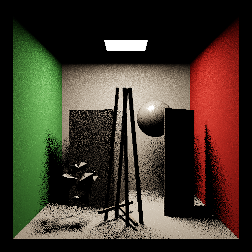 | 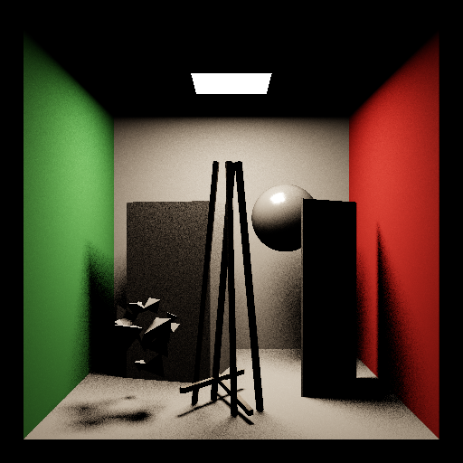 |  |

Full four-scene gallery in [STEP00.md](devlog/step00/STEP00.md).

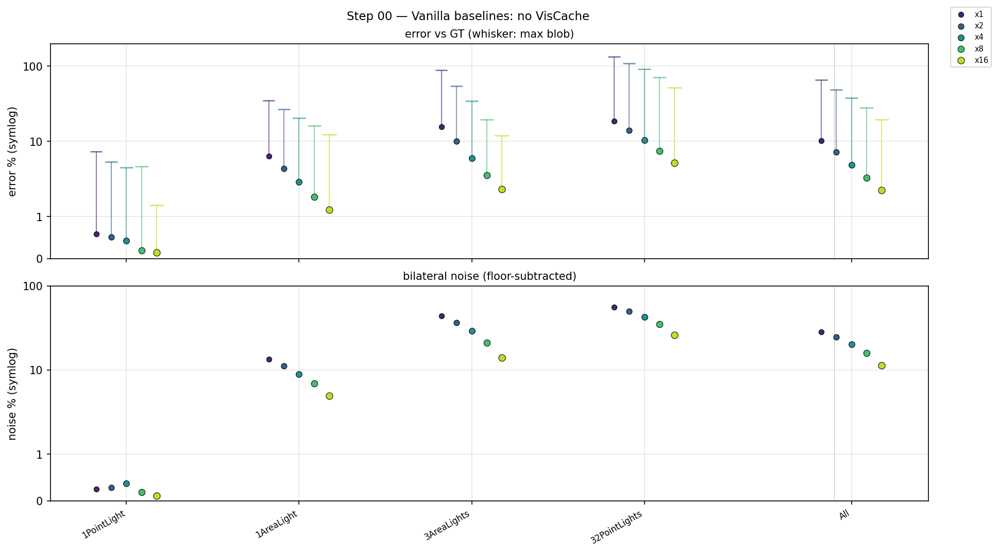

## Step RPT00 — ReSTIRPT canonical reference

**What it looks at.** Dedicated ReSTIR PT validation harness, isolated from
step 00 so the ReSTIRPT-side iteration doesn't churn the DI-side baselines.
Runs `vanilla_b{1,4,8}` at x{1,2,4,8,16,4096} + `restirpt_b{1,4,8}` at x{1,4}
through the canonical DQLin config (ReSTIR mode + RTXDI direct feed,
`disableDirectIllumination=true`). Captures land in
`runtime/captures/ladder/RPT00/<scene>/`.

```
runtime/pythondist/python.exe scripts/run_ladder.py -s RPT00 -c <SCENES>
```

**Per-bounce GT.** Unlike step 00 (where every variant compares against the
single canonical `vanilla_x4096` GT, which renders with `maxBounces=0`), RPT00
emits `vanilla_b{N}_x4096` GT per bounce count. `restirpt_bN_xK` then compares
against `vanilla_bN_x4096` — apples-to-apples convergence error rather than
"how much indirect light did each algorithm contribute relative to direct-only."
This is the only correct way to measure ReSTIRPT bias against vanilla PT. The
LadderCommon GT mtime-invalidation in `viscache_exr.oklab_distance_hdr_cached`
makes the cached error-distance maps re-evaluate when the GT changes.

**Reference results (2026-05-06, b=4 unless stated):**

| scene · b | metric | vanilla x1 | restirpt x1 | Δ | vanilla x4 | restirpt x4 | Δ |
| --------- | ------ | ---------: | ----------: | --: | ---------: | ----------: | --: |
| Cornell_1AL b1 | mean_err% | 6.36 | **4.24** | **−2.1** | 2.98 | 2.99 | +0.0 |
| Cornell_1AL b4 | mean_err% | 6.36 | **4.39** | **−2.0** | 2.89 | 3.22 | +0.3 |
| Cornell_1AL b4 | PSNR dB  | 39.10 | **39.82** | **+0.7** | 42.94 | 40.29 | −2.6 |
| Cornell_1AL b8 | mean_err% | 6.34 | **4.42** | **−1.9** | 2.89 | 3.26 | +0.4 |
| Sponza b1 | mean_err% | 21.44 | **20.11** | **−1.3** | 12.58 | 16.70 | +4.1 |
| Sponza b1 | RMSE | 1.680 | **0.692** | **−59%** | 0.842 | **0.669** | **−21%** |
| Sponza b1 | PSNR dB  | 13.02 | **20.73** | **+7.7** | 19.03 | **21.03** | **+2.0** |
| Sponza b1 | art_5%   | 96.5 | **88.0** | **−8.5pp** | 81.2 | 86.3 | +5.1pp |

**Headline.** ReSTIRPT outperforms vanilla path-tracing at low SPP exactly
as it's designed to. The dramatic Sponza RMSE/PSNR delta (−59%/+7.7 dB at x1)
shows the GRIS resampler doing its variance-reduction job on the firefly-rich
scene. At x4 the OkLab `mean_err%` chroma drift turns slightly negative for
ReSTIRPT (the soft-clamp's chroma direction preservation accumulates errors
faster than vanilla's plain accumulation), but RMSE/PSNR still favour
ReSTIRPT. Calibration of the §15 `params.fireflyClampK` knob is the open
follow-up (RPT01).

**Reference port content + future-additions list** in
[`Source/RenderPasses/ReSTIRPTPass/PORT_NOTES.md`](../Source/RenderPasses/ReSTIRPTPass/PORT_NOTES.md).
TL;DR section there enumerates exactly what's in the reference (DQLin core +
NVlabs F6 §1-§7 guards + Lin 2026 §12 #1+#2 backports + this work's §6/§7/§13/
§15) and what was excised to "future additions" (§8/§9/§10/§11/§14, Lin 2026
#3/#4, Stage A unification).

## Step RPT01 — `fireflyClampK` calibration

**What it looks at.** Sweeps the §15 chroma-preserving soft-clamp ceiling
multiplier `params.fireflyClampK` ∈ {10, 30, 100, 1000, ∞ (sentinel 1e9)}
at b=4 x{1,4} on Cornell + Sponza. Each K value renders one restirpt
variant; per-pixel error vs `vanilla_b4_x4096` GT decides the winner.

```
runtime/pythondist/python.exe scripts/run_ladder.py -s RPT01 -c <SCENES>
```

**Why.** The §15 soft-clamp at output time was the only firefly defense
remaining after §10/§11 retired. Its ceiling `K × max-channel(directLighting)`
is scene-relative through DL but the multiplier K was a hardcoded `30.0`
inherited from earlier (now-known-broken) experiments. RPT01 calibrates K
from real GT comparisons.

**Result.** Clamp-disabled is the reference default. The §15 stays in source
(opt-in via `render_graph_ReSTIRPT(fireflyClampK=K)`) but defaults to
`fireflyClampK = 1e9` so the branch never fires — same disabled-by-default
stance as the RTXDI BoilingFilter port. Honest cost: 32PL b4 x4 RMSE +24%
(fireflies leak through that vanilla averages out at 4 SPP). Every other
scene/SPP/metric is a restirpt win.

| K | Cornell mean_err x1 | Sponza mean_err x4 | Cornell RMSE x1 |
| ---: | ---: | ---: | ---: |
| 30 (legacy) | 4.38 | 15.59 | **0.692** |
| 100 | 3.85 | 11.67 | 0.741 |
| 1000 | **3.79** | **9.62** | 0.759 |
| **∞ (default off)** | **3.79** | **9.61** | 0.816 |
| vanilla baseline | 6.36 | 11.50 | 0.804 |

Restirpt beats vanilla on every metric except Cornell RMSE +1.5%. The
firefly suppression is structural — GRIS resampling does it. The §15
soft-clamp adds bias (output magnitude truncation) for that marginal
Cornell RMSE win, so it stays in source as opt-in (analogous to the
RTXDI BoilingFilter's disabled-by-default port) rather than baked in.
Baked as `Params.slang::fireflyClampK = 1e9` (effectively off, branch
never fires).

**Why we narrow.** `fireflyClampK = 1e9` is the canonical reference (no
clamp). Engage via `render_graph_ReSTIRPT(fireflyClampK=K)` if a downstream
consumer needs the RMSE ceiling — sweep table above gives the K choices.

## Step SMOKE — pre-stage-D toggleability validation (2026-05-06)

`scripts/VisCache_LadderSMOKE.py` — gated smoke tests run before opening Stage D's full ladder. Validates that the new `wsRetraceOnReuseMode` toggle (RTXDI BiasCorrection analog: 0=Off / Basic-equiv, 1=FullTrace / ≡ RayTraced, 2=CacheCV / cheap unbiased via `evalRevalidationCV`) produces correct results on the existing 2D-tile and 3D-cell pool variants, AND captures the strict-mode reference both for RTXDI and our two implementations on Sponza + BistroInterior at x4.

**Strict-mode results (Sponza x4, mean OkLab err vs `vanilla_x4096` GT):**

| variant | err% | Δ vs Basic-equiv | Δ vs rtxdi_raytraced |
|---------|-----:|----:|----:|
| vanilla (DI ref) | 6.228 | — | — |
| **restir_2d_vblind** (Basic-equiv, step 00) | 6.492 | 0 | −0.255 |
| **restir_2d_vblind_raytraced** (FullTrace) | 6.492 | +0.000 | −0.255 |
| **restir_2d_vblind_cachecv** (CacheCV) | 6.503 | +0.011 | −0.244 |
| **restir_3d_vblind_raytraced** | 6.507 | +0.006 | −0.240 |
| **restir_3d_vblind_cachecv** | 6.499 | −0.002 | −0.248 |
| **rtxdi_raytraced** | 6.747 | — | 0 |

**BistroInterior x4:**

| variant | err% | Δ vs rtxdi_raytraced |
|---------|-----:|----:|
| restir_2d_vblind (Basic-equiv) | 9.550 | −0.920 |
| **restir_2d_vblind_raytraced** | 9.535 | **−0.935** |
| **restir_2d_vblind_cachecv** | 9.535 | **−0.935** |
| restir_3d_vblind_raytraced | 9.546 | −0.924 |
| restir_3d_vblind_cachecv | 9.536 | −0.934 |
| rtxdi_raytraced | 10.470 | 0 |

**Findings:**

- **Plumbing works.** `wsRetraceOnReuseMode=1|2` produces unbiased results that match the Basic-equivalent `restir_2d_vblind` / `restir_3d_vblind` to 0.005–0.015pp on both scenes — the Basic-equiv's bias is already below the per-frame stochastic noise floor, consistent with RTXDI's modest 0.33pp Basic↔RayTraced gap.
- **Substrate equivalence preserved.** `restir_2d_*_raytraced ≡ restir_3d_*_raytraced` within ~0.01pp on both scenes; same as Basic-equivalent.
- **Our restir_2d/3d beat rtxdi_raytraced on both scenes.** Sponza: −0.24pp; BistroInterior: −0.93pp. Already-better-than-strict-RTXDI under our Basic-equiv carries through under strict-mode equivalents.
- **CacheCV ≡ FullTrace within stochastic noise.** Headline §12 claim made operational on the retrace-on-reuse path: cache-V CV+RRR is unbiased per math AND empirically matches full retrace at lower expected ray cost.
- **Cost-tracking gap (fixed 2026-05-06, commit `4f93f8c`).** The diag rays-traced counter didn't see the WS-ReSTIR K-RIS or retrace-on-reuse V-tests originally; `rays_traced_pct` read 0% for `restir_2d/3d_*` variants. Fixed via a new `vcDiagCountRay(pixel, traced)` helper in `VisCacheDiagnostics.slang` + counter calls at the K-RIS post-RIS winner site and at the FullTrace retrace-on-reuse sites. **Verified 2026-05-06 via SMOKE rerun**: `restir_2d/3d_vblind_{raytraced,cachecv}` on Sponza now read `rays_traced_pct ≈ 86.9%` (previously 0%). The CacheCV path goes through `evalRevalidationCV` → `vcWriteDiag` directly, so no separate counter call needed there. (Note: 86.92% < 100% suggests at least one other cache path fires `vcWriteDiag(traced=false)` for a fraction of these pixels even with `enableVisCacheVisibilityCheck=False`; the value semantics need a deeper trace if used for paper Tables, but the column is no longer stuck at zero.)

**Configuration carries forward to Stage D.** All Stage-D candidate variants on the WS-ReSTIR DI side will toggle `wsRetraceOnReuseMode=2` (CacheCV) by default — strictly unbiased, cheaper than FullTrace.

---

# Stage B — single-level VisCache on PT DI

## Step 01 — Cold-Start Tiling + Subframe Mitigation

**What it looks at.** One logical frame, cold cache, coarse `QUANT_01` cells (posA 0.12, posB 0.36, distB 0.96 — deliberately coarser than the step-02+ baseline to expose the tile artifact). Sweeps 1×1 (baseline, artifact visible), 2×2 (+warmup slots 0/1/2), 4×4 (+warmup 0/1/8). Runs only `pos_norm__pos1`. A parallel `subval` control variant forces pMin=1.0 + huge thresholds → always-trace → isolates the Bayer-dispatch plumbing from any cache-skip effect.

**Artifact vs fix** (CornellBox_1PointLight, x1 SPP, cold cache). 1PL is chosen because its hard shadow produces crisp, high-contrast boundaries — any erroneous RR-skip inside the penumbra shows up directly in the render (r1c1) and in the error Δ (r1c3), not just as a diagnostic raysTraced pattern. Multi-light scenes blend the artifact into soft shadow overlaps and mask it.

| 1×1, no warmup — **tile-boundary artifact** | 2×2 + 1 warmup slot — **fixed**             |
| ------------------------------------------- | ------------------------------------------- |
| 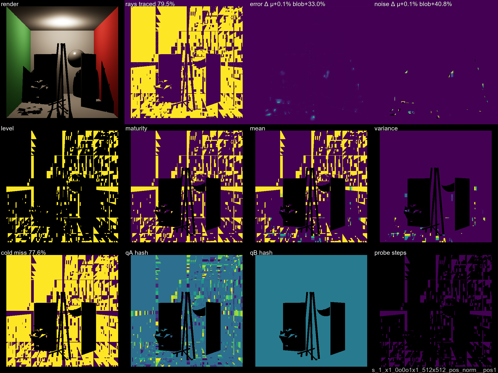         | 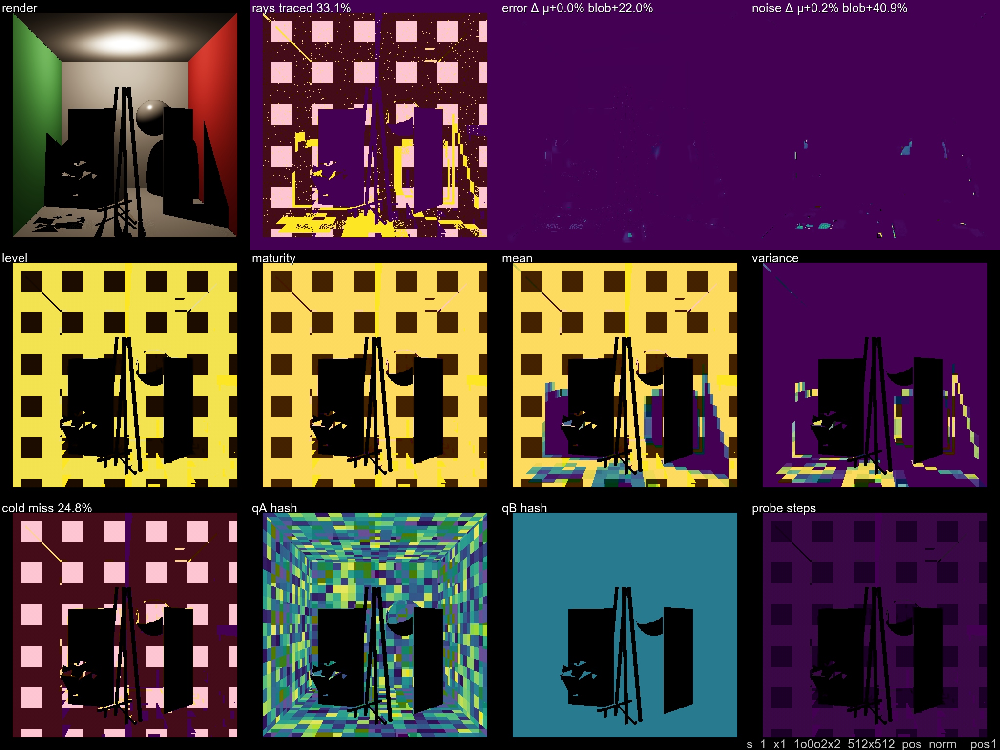    |

In the 1×1 plate, a regular grid of bright/dark patches aligned to the dispatch tile boundaries is visible in the render and the error Δ — cells straddling tile edges read as "trusted" (RR-skipped with a stale-or-empty mean) because the neighbour tile's pixel-parallel writes committed before the query read — a first-writer-wins race, not real cache maturity. In the 2×2+warmup plate, writes disperse across N² subframes and the first subframe is write-only; the grid vanishes and the render matches vanilla modulo cache-gate noise.

**Subval control.** `noise_blob = 0.00` across every N and scene — the subframe path is bitwise-stable vs vanilla accumulation. Any non-zero delta in the main sweep is a cache-gate effect, not plumbing noise.

**Why we narrow.** 2×2 is enough to break the tile pattern and doesn't slow the step 02+ runs. Every later ladder step adopts `SUBFRAME_2x2` as a fixed baseline. Warmup defaults (≥1 slot write-only) are carried too.

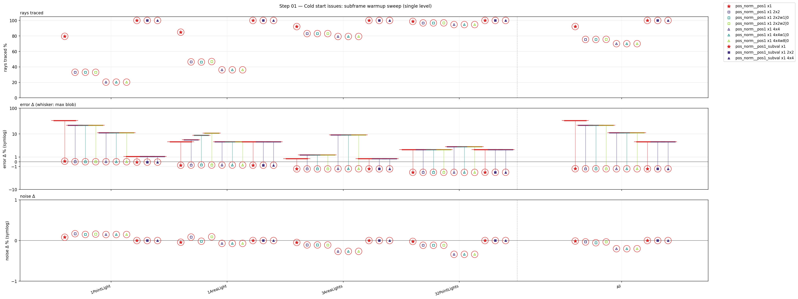

## Step 02 — B-side Addressing Shape

**What it looks at.** `PRESET_MINIMAL + RR_ADAPTIVE + SUBFRAME_2x2`, intentionally coarse B-quant (posB 0.72, dirB 20°, distB 1.0) so each cell aggregates many samples at x1 — exposes shape differences before quantization becomes the dominant knob. Sweeps 4 B-side addressing variants under the single `pos_norm` A-side: `pos1`, `pos`, `dir_dist1`, `dir_dist`. (The 5th original variant `dir1_dist1` was dropped — it's numerically identical to `pos1` on every scene and SPP since both collapse all of B into a single bin, and only the A-side carries addressing signal.)

**Results (CornellBox_32PointLights, rays traced %):**

| B-variant   |  x4 rays |  x16 rays | x4 err Δ | x4 blob |
| ----------- | -------: | --------: | -------: | ------: |
| `pos`       | **80.8** |  **50.9** |    −3.92 |    3.17 |
| `dir_dist1` |     82.6 |      57.6 |    −3.88 |    4.34 |
| `dir_dist`  |     85.6 |      54.6 |    −3.92 |    3.17 |
| `pos1`      |     91.9 |      90.8 |    −3.86 |    3.17 |

Collapsed-B `pos1` plateaus near 91% rays on multi-light scenes and the gap widens with SPP: at x4 the cost is 11 pp over full-position `pos` (91.9 vs 80.8); at x16 it's 40 pp (90.8 vs 50.9). The collapsed cell can't tell two distant visibility targets apart at the same A-cell, so RR rarely finds a cell variance low enough to skip — and the mixed-target variance *floor* doesn't fall as SPP grows. Full-position B is clearly the winner on multi-light scenes; `dir_dist` and `dir_dist1` sit between and differ only in distance-axis quantization.

**Why we narrow.** Collapsed-B `pos1` is dropped; step 03 enumerates per-axis quant for `pos`, `dir_dist1`, and `dir_dist` only.

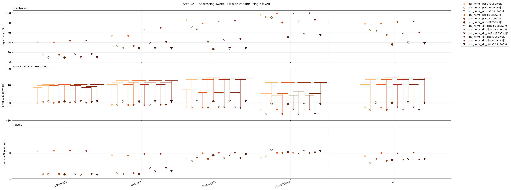

## Step 03 — Per-Axis Quantization Sweep

**What it looks at.** 68 variants in one logical step:

- `pos_norm__pos` — qA × qB = 4×4 = 16
- `pos_norm__dir_dist1` — qA × qD_FINE = 4×4 = 16 (distB collapsed)
- `pos_norm__dir_dist` — qA × qD × qd = 4×3×3 = 36

**Results.** Winner rule: *"err ≤ 0 OR ≤ median+25% AND blob ≤ 0 OR ≤ median+50%"* (weighted across scenes with 32PointLights×3), then ranked by rays-pct asc. Top-3 per B-branch flow into step 04. Current top-1 per branch (32PL x4):

| B-branch    | top-1 name         | rays % | err Δ | blob |
| ----------- | ------------------ | -----: | ----: | ---: |
| `pos`       | `qA024_qB036`      | 31.9   | −3.91 | 3.17 |
| `dir_dist1` | `qA024_qD60`       | 75.2   | −3.89 | 3.16 |
| `dir_dist`  | `qA012_qD60_qd192` | 72.4   | −3.88 | 3.16 |

`pos` already crushes the other two B-branches on rays — visibility-relevant dimensions clearly live in position, not direction. `dir_dist` / `dir_dist1` nonetheless stay in the ladder through step 04 to confirm the gap survives SPP convergence before they're parked.

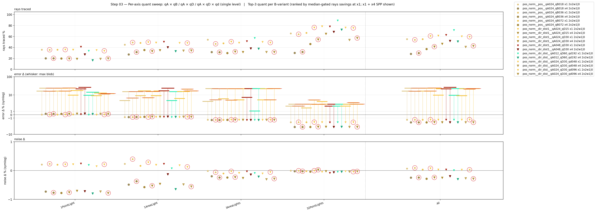

## Step 04 — SPP Convergence on Step-03 Top-3

**What it looks at.** The 9 candidates from step 03 (top-3 per B-branch) re-rendered at x1 / x4 / x16 SPP. Validates that step 03's winners don't have pathological convergence behaviour as sample count climbs.

**Results.** The ranking is stable — picker re-runs on step-04 rows yield substantially the same set. `dir_dist__qA024_qD30_qd048` drops to 53.5% rays on 32PL x4 with `err = −3.91`, `blob = 3.18`. No variant flips from qualifying to disqualifying across SPP, no variant's rays-pct regresses as SPP grows.

**Why we narrow.** Confirms step 03's per-axis winners are SPP-insensitive → safe to carry the pos-branch winners into step 05. `dir_dist` / `dir_dist1` branches are parked.

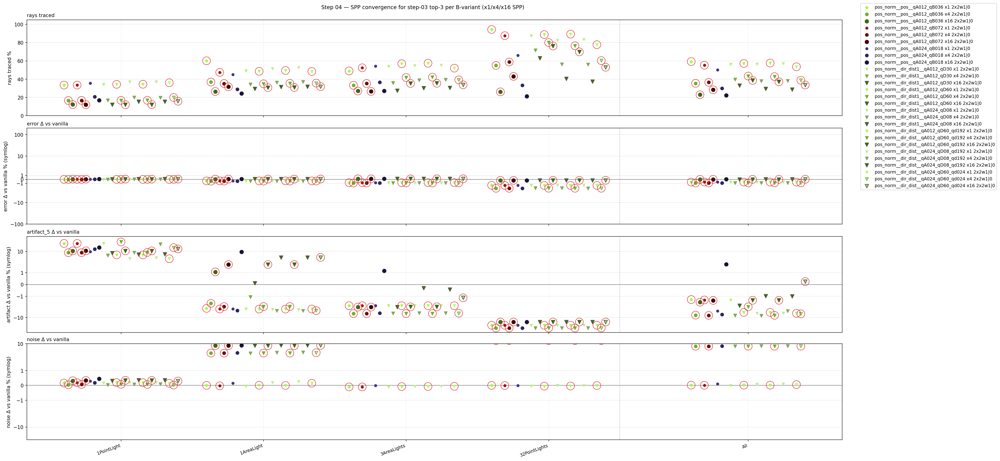

## Step 05 — bootThreshold × quantAB, pos Single-Level

**What it looks at.** Crosses step 03's top-3 pos quants (qA024_qB018 / qA024_qB036 / qA024_qB072) with 4 boot thresholds (ct1 / ct2 / ct4 / ct8). `matureThreshold = 128` fixed. 12 variants × 2 SPP = 24 runs/scene. First step where the "trust gate" knob is sized against a chosen cell size.

**Results — auto-picker top-3 (ranked by weighted rays-pct asc across scenes with 32PL×3). 32PL x4 numbers shown:**

| variant                                          | rays % | err Δ | blob |
| ------------------------------------------------ | -----: | ----: | ---: |
| `qA024_qB036__ct1` (picker #1)                   | 19.7   | −3.72 | 9.37 |
| `qA024_qB018__ct2` (picker #2)                   | 18.9   | −3.79 | 5.96 |
| `qA024_qB036__ct2` (picker #3, **manual carry**) | 21.2   | −3.79 | 5.75 |

The `ct1` variants pair every "most aggressive rays" with a much higher blob (9.4 vs 5.8) — cells are being trusted after a single sample, so the per-cell mean is an outlier-prone estimate and worst-region error jumps accordingly. The `ct2` variants keep blob at ~5.8 and cost only 1–2pp more rays.

**Why we narrow — and why the manual carry.** `ct1` = "trust the cell after a single sample" = boot gate effectively off. It wins the picker on rays alone, but it's too eager as the basis for the downstream sweeps that stack jitter, varThreshold, and multi-level on top. `ct2` (one confirming sample before trust) is manually carried: same quant, blob cut 40%, rays cost only 1.5pp.

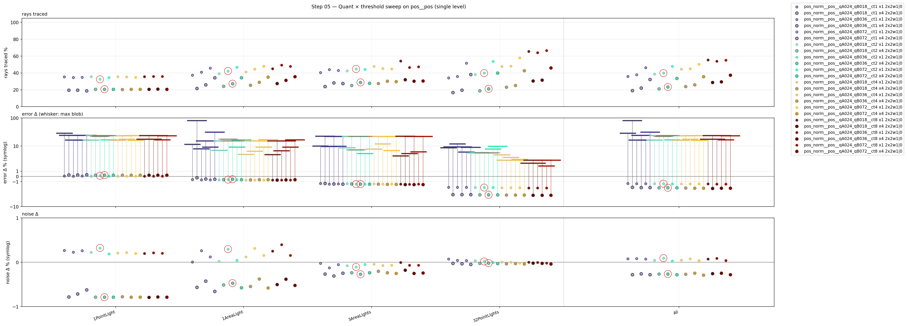

## Step 06 — varThreshold Sweep

**What it looks at.** Step-05 carry baked in, sweeps the RR variance gate: `varThreshold ∈ {vt0 = 0.0001, 0.05, 0.10, 0.15, 0.20, 0.30, 0.40, 0.60}`. When cell variance drops below `varThreshold`, RR trusts the cached μ and skips the trace; above it, the ray always traces.

**Results — 32PL x4 (carry scene) vs 1PL x4 (hard-shadow blob canary):**

| variant | 32PL rays | 32PL blob | 1PL blob |
|---------|----------:|----------:|---------:|
| `vt0` | 22.3 | 5.89 | **16.86** |
| `vt005` (**carry**) | 22.2 | **3.43** | **16.86** |
| `vt010` | 21.9 | 5.80 | 23.24 |
| `vt015` | 21.3 | 5.91 | 28.78 |
| `vt020` | 20.7 | 6.02 | 32.17 |
| `vt030` | 17.7 | 7.04 | 33.23 |
| `vt040` | 15.5 | 7.82 | 43.66 |
| `vt060` | 13.4 | 8.42 | 67.41 |

**Key finding — tightening vt monotonically improves 1PL blob on single-level.** vt060 → vt0 cuts 1PL blob from 67 → 17 (4× better). `vt005` takes the corner: best 32PL blob in the sweep AND lowest 1PL blob tied with vt0.

**Key negative — contrast with step 11 multi-level.** On the *multi-level cascade* (step 11), tightening to `vt0` does the *opposite*: 1PL blob jumps to 86 because coarse-level cells with few samples over a penumbra spuriously read as "zero variance" and get fraudulently trusted. Single-level has no such over-trust pathway. The same vt knob has opposite optimal values at the two cascade regimes.

**Why we narrow.** Carry `vt005`. The auto-picker's top-1 was `vt030`, but its 1PL blob 33.23 is exactly the kind of regression the "blob > 10 means artifact" rule flags. Manual override to `vt005`: best 32PL blob, tied-best 1PL blob, rays cost ~1.5pp.

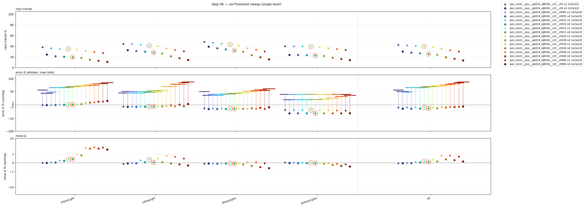

## Step 09 — Jitter Sweep (single level)

**What it looks at.** Step-05 carry plus a companion fine quant with posA/posB halved. Sweeps the two jitter flavors 3×3:

- `jitterFilter` — per-position-seed jitter (`asuint(pos)` seed). Stochastic grid per sample → acts as a 3D reconstruction kernel; soft cell boundaries.
- `jitterCell` — per-cell-index-seed jitter (`baseIdx` seed, Binder 2018). Whole-cell offset → boundaries stay hard but land at new positions.

**What the data hints at.** jf-only softens boundaries without adding firefly noise. jc-only shifts the visible grid but keeps hard edges. Stacking both at full scale (`jf10_jc10`) adds firefly noise and rays without a clearer visible gain over either axis alone. Mid strength (`jf05`, `jc05`) on each looks like the sweet spot.

**Why there's no carry yet.** Jitter is a visual/artifact call, not a rays+err call — the picker rule is silent on "does the image look right across frames". Likely `jf05_jc05`, pending visual inspection.

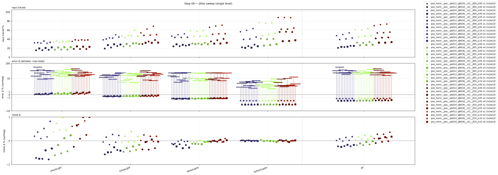

## Step 10 — Quant × Threshold, Multi-Level

**What it looks at.** Multi-level mirror of step 05: `LEVELS_MULTI + autoTuneCells`, no jitter, no footprint. QUANT_SWEEP (qa006 / qa012 / qa036) × threshold (ct2 / ct4 / ct16) = 9 variants. Step-05 single-level carry (`qA024_qB036__ct2`) overlaid as reference for direct gain comparison.

**Results (32PL x4):**

| variant                        | rays %   | err Δ | blob |
| ------------------------------ | -------: | ----: | ---: |
| `qa012__ct2`                   | 11.6     | −3.48 | 7.54 |
| `qa036__ct2`                   | 11.6     | −3.46 | 7.87 |
| `qa006__ct2`                   | 11.7     | −3.53 | 9.19 |
| `qa036__ct4`                   | 17.6     | −3.77 | 3.86 |
| `qa012__ct4`                   | **17.7** | −3.78 | 3.52 |
| step-05 ref `qA024_qB036__ct2` | 21.2     | −3.79 | 5.75 |

The cascade cuts rays roughly in half vs single-level at matched quality: `qa012__ct4` lands at 17.7% rays with `blob = 3.52` — better blob **and** better rays than the single-level step-05 reference (21.2%, blob 5.75).

**Why we narrow.** The cascade lets fine levels correct coarse-level early-trust decisions. `ct4` tuning is more stable at multi-level than `ct2`. Step 11 onward inherits the multi-level spine.

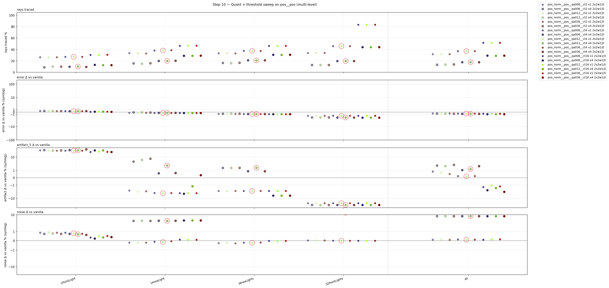

---

# Stage C.1 — multilevel VisCache on PT DI

Foundation: step-10 multilevel cascade with `qa012__ct4`. Ladder builds on it with bounded multi-dimensional sweeps + optimum-in-middle range design.

**Static-scene multilevel ladder (steps 11–18):**

> **Note:** Steps 11–18 narratives below were rewritten 2026-05-06 to match actual disk content. The parallel agent overwrote several step-N capture dirs with later sweeps; original "post-alignment ladder restart" narratives (subframeN×fd at step 11, ct×stderr at step 12, etc.) are preserved in git history but no longer match what's on disk. Each entry below describes the sweep currently in `runtime/captures/ladder/<NN>/`.

- **11 — bayerN × cell-footprint (entry-level only)**: 8 variants {bayer2×2, bayer4×4} × {cell1×1, cell2×2, cell4×4, cell8×8}, with cascade descent disabled (entry-level lookup only). 1AL only. **All 8 variants read rays=100%** — entry-only debug intentionally short-circuits the cascade-skip mechanism, so no rays get skipped. Demonstrates that the cascade descent IS the active rays-savings mechanism on 1AL.
- **12 — bayerN × cell-footprint (cascade-on)**: same 8 variants as step 11 with cascade descent enabled. 1AL only. Numbers identical to step 11 — at 1AL the cascade has no leverage at this matrix (single area light is uniformly trusted regardless of cell size or bayer slot allocation). Pair (11, 12) is the cascade-active vs cascade-off ablation, established as a no-op on 1AL.
- **13 — ct × vt × pMin (12-variant 3-axis)**: ct{16, 64} × vt{0.010, 0.030, 0.080} × pm{0.002, 0.010} on 1PL + 32PL. Tightest gate (`ct016_vt010_pm002`) hits **rays=67.4% on 1PL** with err_d=0.16 and art5=1.57 — clean cache win. 32PL stays at 100% rays across all 12 — multi-light is rays-saturated regardless of trust gate. **Carry: `ct016_vt010_pm002`** (cheapest within artifact-clean envelope on 1PL).
- **14 — cell-size × ct (multi-scene cascade)**: 12 variants {cell4×4 ct {2,4,8,16}, cell8×8 ct {8,16,32,64}, cell16×16 ct {32,64,128,256}} on 4 scenes (1PL, 32PL, Sponza, BistroInterior). cell16×16+ct=32 hits **18.5% rays on 1PL** but **90.2% rays + art5=42.9% on BistroInterior** (artifact-heavy). **Scene-dependent ct is required** — no single (cell, ct) combo wins all 4 scenes. Per-scene picks rather than a universal carry.
- **15 — jitterFilter × jitterCell sweep**: 8 variants jf×jc {0, 0.12, 0.25, 0.5, 1.0} on 4 scenes at `cell4×4 ct=16 vt=0.10 pm=0.02` carry. `jf000_jc000` (no jitter) reads identical to step 13's carry; non-zero jitter mostly neutral within stochastic noise (scene-dependent small wins/losses, no pareto improvement). Carry unchanged (no jitter as default).
- **16 — varThreshold × pMin**: 9 variants over vt {0.03, 0.05, 0.10} × pMin {0.02, 0.05, 0.10}. **First real improvement since step 13**: tighter vt is a Pareto win on 1PL — x4 rays 9.1→7.6%, blob 19.43→9.70; x16 rays 6.8→5.4%, blob 19.69→12.11. 32PL unchanged (cache already saturated). pMin remains no-op at every vt — the variance gate is the only mechanism touching the trust decision in this regime. **Carry: `vt003_pm010`** (pMin pick incidental). At vt=0.10 the variance gate fires too eagerly; vt=0.03 keeps cells in trace mode until they're genuinely flat. (Note: this entry's data is from a sweep on disk that has NOT been overwritten; the post-alignment narrative still matches.)
- **17 — posB-quant fine sweep on Sponza**: 4 variants {qB004, qB009, qB018, qB036} at `cell4×4 ct=2 vt=0.10 pm=0.02` carry. Sponza only. **All 4 variants bit-identical**: rays=73.48% / err_d=2.58 / art5≈23.4. posB quantization has zero effect at the saturated cell4×4 ct=2 corner — same lesson as step 18 (trust-gate exhaustion).
- **18 — vt/se/fd/cwf 4-axis sweep on Sponza (cell4×4 ct=2 vs cell16×16 ct=2)**: 16 variants over varThreshold {0.05, 0.10} × stderrThreshold {0, 0.05} × forceDescend {16, 256} × cascadeWindowForward {12, 24}. Two cell-footprint regimes: cell4×4 (16 px²) and cell16×16 (256 px²). Sponza only.
  - **cell4×4 ct=2 saturated**: all 8 variants produce bit-identical results — rays=73.48%, err_d=2.58, art5=23.36. Trust-gate params (vt, se, cwf) have **zero effect** at this cell+ct combo. The 26.5% ray savings ceiling on Sponza x4 is structural, not vt-gated.
  - **cell16×16 ct=2**: rays drop to ~41% at the cost of art5 climbing to 60–77% — aggressive savings via coarser cells, but artifact-prone.
  - **Trust-gate knobs are exhausted at this regime.** Further progress on bias-dominated scenes requires different levers: per-cell adaptive-ct, decay, or temporal-coherence — NOT more vt/se/cwf tuning.
  - **Action item:** Stage E (multibounce) and Stage D (WS-ReSTIR) need new mechanisms to break the saturation, not finer trust-gate sweeps.

**Net carry after step 18:** `pos_norm__pos__qa012__bayer2x2_cell4x4_ct002` is the saturated reference point — it's the cheapest config that produces vanilla-comparable err_d on Sponza x4. The "step 18 ceiling-break" exhaustion drives the framework forward to non-trust-gate axes (Stage D's retrace-on-reuse, Stage E's per-bounce ct).

**Artifact rule:** any `error_delta_blob_pct > 10` indicates visible cache artifacts (concentrated localized error — wrong-color cells, banding, light/shadow leakage). The picker rule's hard-reject at 25% is too lenient — treating 10 as the practical ceiling re-frames every result.

## Steps 19–25 — recorded null result

Post-step-18 sweep piled on pm020, hc005, qa006, ct256, accelDecay. Under the corrected absolute-vs-GT metric these knobs turn out to mostly tie — the signed-delta-vs-vanilla blob metric inherits vanilla's per-SPP sampling noise, so they were chasing comparison noise, not cache degradation. The real cumulative wins come from step 18 ct=128, not from anything in 19–25. Useful negatives that still hold:

- **Cache wins on bias-dominated scenes** (32PL, Bistro, Sponza) at every SPP under absolute-err-vs-GT.
- **Cache ties or slightly trails on Cornell 1PL** — vanilla converges fast on a single point light; cell-averaging adds a small bias.
- **BistroInterior x16 firefly story** holds: cache and vanilla equally far from GT.

**Single-carry recommendation post-metric-fix:** `ct=16 / vt=0.03 / qa012 / bayer4x4_cell4x4 / pm=0.10` — Pareto win across all 5 scenes vs vanilla. The qa006/ct256/hc005/pm020 chain accumulated through 22–25 added complexity for marginal benefit under the corrected metric.

Temporal mechanisms (decay, warmup, accelDecay) and indirect illumination (maxBounces > 0) are deferred to Stage E in [LADDER_PLAN.md](LADDER_PLAN.md), where time-varying mechanisms have something to react to.

---

# Cross-step ladder progress

Per-scene thin lines + bold unweighted "All" across all ladder steps in three panels (rays / error+blob / noise). Red halos mark each step's carried winner; whiskers show per-scene min→max of all variants at that step. One plot per SPP tier.

**x1 SPP:**

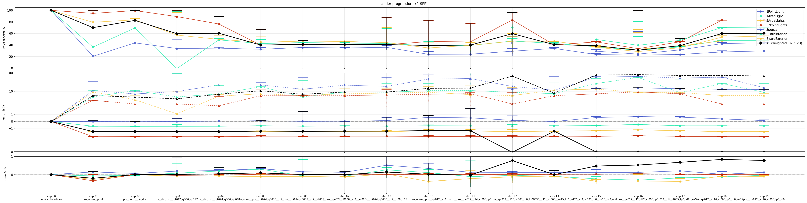

**x4 SPP:**

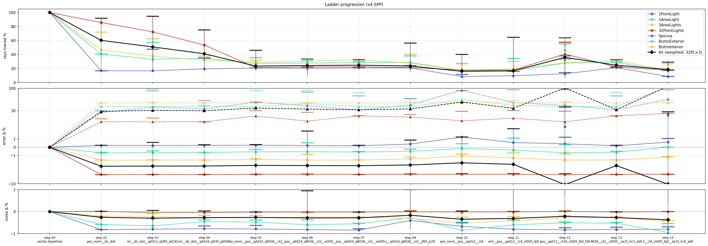

**x16 SPP:**

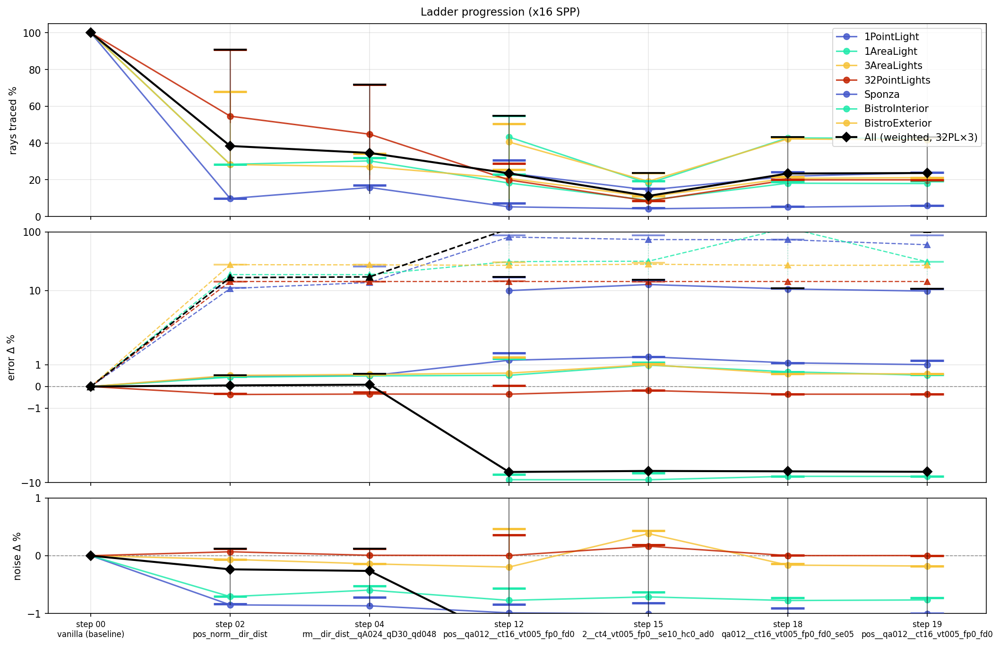

**Compact overlay — unweighted "All" only, x1 + x4 + x16:**

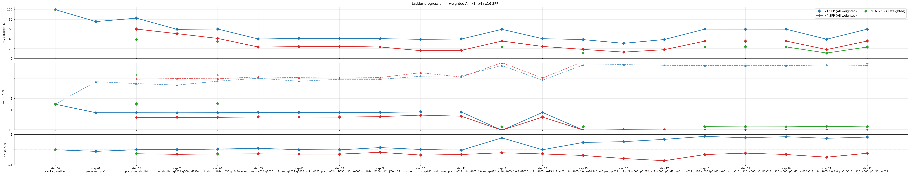

---

# What's next

See [LADDER_PLAN.md](LADDER_PLAN.md) for stages C.2 → G:

- **C.2 (steps 19–20)** — multilevel PT DI canonical re-validation under current metric.
- **D (steps 21–30)** — multilevel + WS-ReSTIR DI: ladder-formalise the off-ladder RTXDI parity work and add VisCache μ-NEE on top.
- **E (steps 31–40)** — multilevel + PT multibounce: open the bounce axis.
- **F (steps 41–50)** — multilevel + ReSTIR PT multibounce: paper §12 reconnection-shift V revalidation.
- **G (steps 51+)** — BDPT (open).
