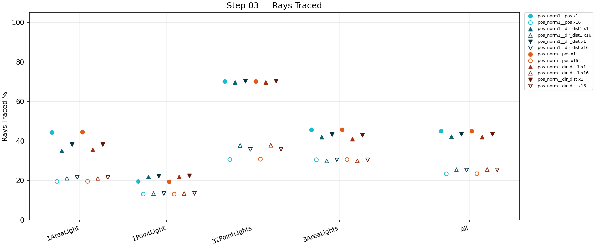

# VisCache Dev Log

Systematic ladder test results. One entry per ladder step.
Full plates and stats in each step's subfolder.

**Diagnostic plate layout** (4×3 grid):

| | col 1 | col 2 | col 3 | col 4 |
|---|---|---|---|---|
| **r1** | render | accum raysTraced | accum error | accum noise |
| **r2** | frame level | accum maturity | accum mean | accum variance |
| **r3** | accum coldmiss | frame qAHash | frame qBHash | frame probeSteps |

---

## [Step 00 — Vanilla Baselines](step00/STEP00.md)

Vanilla PathTracer (no VisCache) at x1 / x16 / x4096 SPP. Error and ground-truth reference for downstream steps. No VisCache plates.

| x1 SPP | x16 SPP | x4096 SPP |
|--------|---------|-----------|
|  |  |  |

---

## [Step 01 — Initial Exploration](step01/STEP01.md)

Naive first pass: single level, uniform QUANT_SMALL, all 10 variants (pos_norm1 + pos_norm families), 4 scenes × x1 SPP.

Best variant: **pos_norm__dir1_dist1** — 39.6% rays traced (60.4% savings), 0.2% cold miss.

---

## [Step 02 — Quantization Refinement](step02/STEP02.md)

Tuned bin sizes, norm1 family, x1 vs x16 SPP, 4 scenes each.
**Finding: single qB cell is not enough** — collapsed B variants plateau at 42% rays on multi-light scenes.
Fine B-side (pos, dir_dist1, dir_dist) converges to 23–25% rays across all scene types.

Best mean at x16: **pos_norm1__pos** — 23.4% rays (76.6% savings), 0.2% cold miss.

---

## [Step 03 — Normal Family Comparison](step03/STEP03.md)

Fine B-side only × norm vs norm1, x1 and x16 SPP, 4 scenes each.
**Finding: norm vs norm1 makes no measurable difference** on convex geometry.
**Decision: proceed with `pos_norm` only** — uncollapsed normals handle thin-plate geometry
correctly; the CornellBox is too convex to expose the alias risk of `norm1`.
Best: **pos_norm__pos** at 23.4% mean rays x16 (76.6% savings).

