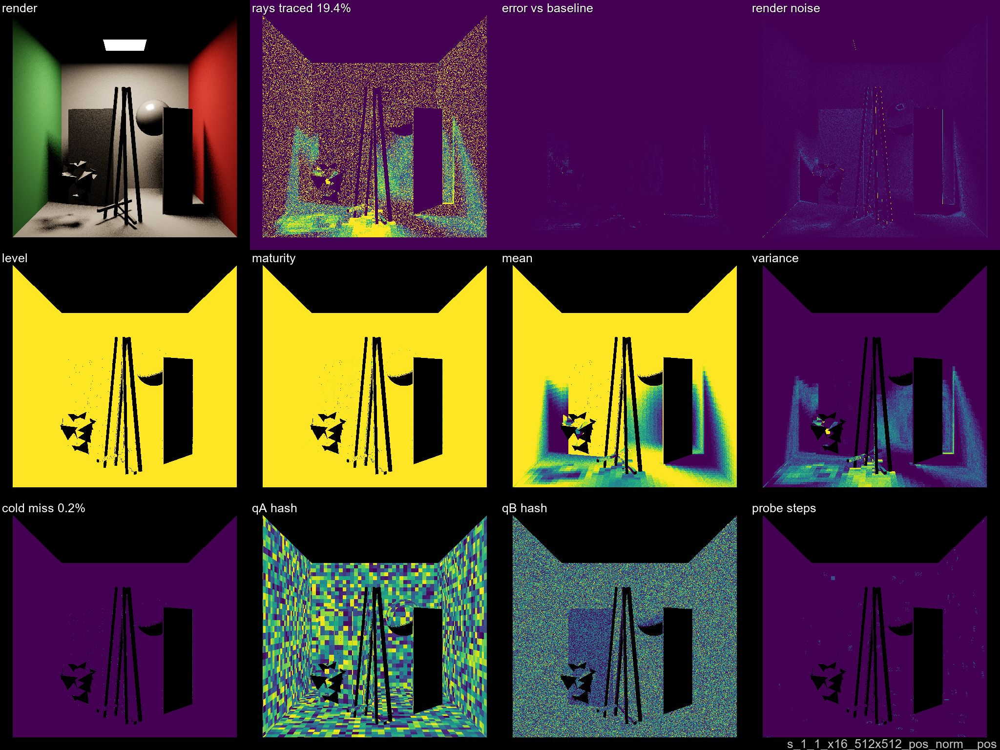

# VisCache Dev Log

Systematic ladder test results. One entry per ladder step.
Full plates and stats in each step's subfolder.

**Diagnostic plate layout** (4×3 grid):

| | col 1 | col 2 | col 3 | col 4 |
|---|---|---|---|---|
| **r1** | render | accum raysTraced | GT-err Δ vs vanilla | noise Δ vs vanilla |
| **r2** | frame level | accum maturity | accum mean | accum variance |
| **r3** | accum coldmiss | frame qAHash | frame qBHash | frame probeSteps |

Both r1c3 and r1c9 use the same continuous bipolar ramp anchored at viridis(0) = dark purple for Δ = 0. Positive values (VisCache degraded / noisier) walk the full **viridis** palette (purple → blue → green → yellow); negative values (VisCache better / smoother) fade from purple toward **black**. Darker-than-purple = better; brighter-than-purple = worse. Plate labels report mean and per-pixel `[min … max]` signed %.

- **r1c3 GT-err Δ** = OkLabDistance(viscache, GT) − OkLabDistance(vanilla\_xN, GT) at matched SPP — perceptual error vs ground truth, relative to same-SPP vanilla.
- **r1c9 noise Δ** = bilateral\_noise(viscache LDR) − bilateral\_noise(vanilla\_xN LDR) at matched SPP — screen-space noise difference, independent of GT.
- Step 00 also emits per-SPP `{tag}_vanilla_gterr.png` — vanilla\_xN's absolute OkLab error vs GT — as the reference noise floor the viscache delta is measured against.

---

## [Step 00 — Vanilla Baselines](step00/STEP00.md)

Vanilla PathTracer (no VisCache) at x1 / x16 / x4096 SPP. Error and ground-truth reference for downstream steps.

| x1 SPP | x16 SPP | x4096 SPP |
|--------|---------|-----------|
|  |  |  |

---

## [Step 01 — Cold-Start Tiling + Subframe Mitigation](step01/STEP01.md)

`PRESET_MINIMAL` + `RR_ADAPTIVE` + `FOOTPRINT_OFF`, `QUANT_MID`, 1 logical frame, 1 spp. Sweep: 1×1 (artifact
baseline), 2×2 (+warmup 0/1/2), 4×4 (+warmup 0/1/8). Subframe gate disperses per-pixel cell writes across
N² Bayer sub-dispatches, breaking the tile-local first-writer-wins pattern while preserving warp coherence.

A **subval** control variant (`pMin=2.0`, bootThreshold/matureThreshold = 1 << 20) runs alongside — pins RR
to always-trace, isolating Bayer-dispatch + accumulation plumbing from cache-skip effects. noise_blob=0.00
across all N and scenes: the subframe path is bitwise-stable vs vanilla accumulation.

**Insight — RR skip activity is cell-count-bound, not subframe-bound**: on single-light scenes (1AreaLight,
1PointLight) 1×1 main sees ~2-4% RR skips at stock `bootThreshold=8`; multi-light scenes (3AreaLights,
32PointLights) stay at 100% trace because QUANT_MID's fine cells never reach maturity in 1 logical frame.
2×2 / 4×4 see no skips either — dispersion doesn't change the total per-cell sample count, only the order.

**Insight — CV+RRR estimator variance shows up as noise in main-sweep plates**: cells where `0.01 < p < 1`
and we happen to trace (`xi < p`) feed `mu + (V − mu)/p` into the contribution. When `p < 1`, that's a
genuine unbiased estimator with variance, not a bug — shows up as modest noise_blob elevation in 1AL 2×2
(+54%) vs the subval plumbing baseline (0). Structural; not a plumbing issue.

**Open points / possible improvements**:
- Step 01's current cell size (`QUANT_MID`) no longer exposes the cold-start tile artifact that was the
  original motivation for this step — cells are too fine to mature in 1 frame. Reintroducing a coarser
  `QUANT_01` variant (e.g. posA=0.5) would make the demo meaningful again on multi-light scenes.
- Subval carries a small per-scene constant err_blob bias (+0.7–2.5%), invariant across N. Attributable to
  `Lr * visWeight` vs bare `Lr` emission divergence and diagnostic UAV scheduling in the `USE_VISCACHE_VISIBILITYCHECK=1`
  compiled shader. A true bitwise-vanilla control requires gating the whole NEE path on `#ifdef`, not a runtime flag.

---

## [Step 02 — Initial Exploration](step02/STEP02.md)

Naive first pass: single level, uniform QUANT_SMALL, all 10 variants (pos_norm1 + pos_norm families), 4 scenes × x1 SPP.
Warmup-write-only ON, footprint OFF, no cascade.

Best variant: **pos_norm__dir1_dist1** — 39.6% rays traced (60.4% savings), 0.2% cold miss.

---

## [Step 03 — Adaptive RR + Quantization Sweep](step03/STEP03.md)

PRESET_MINIMAL + RR_ADAPTIVE. 4 quantization settings (qA→qD, posA 0.03→0.24 geometric) × 3 non-collapsed
norm-active B-side variants (pos, dir_dist1, dir_dist). 12 runs per scene.
Variant names: `pos_norm__<bside>__<qtag>`. Footprint still OFF.

> **Note (2026-04-14):** The original step 03 included a fourth variant `dir_nearest` (later renamed
> `dir_cleardist`) that collapsed the distance bin and stored a per-cell distance signal for a short-ray
> visibility override. The concept was useable under the surface-target assumption but the complexity
> (second per-slot buffer, eviction-reset coupling, bin-homogeneity caveats, firefly risk on mispredictions)
> outweighed the expected gain over proper `dir_dist` binning. Moved to future work — see paper
> conclusion, "Per-cell distance prior for collapsed-distance addressing". Step 03 reruns at 12 variants.

---

## [Step 04 — Norm1 vs Norm, SPP Convergence](step04/STEP04.md)

Fine B-side only × norm vs norm1, x1 and x16 SPP, 4 scenes each.
**Finding: norm vs norm1 makes no measurable difference** on convex geometry.
**Decision: proceed with `pos_norm` only** — uncollapsed normals handle thin-plate geometry
correctly; the CornellBox is too convex to expose the alias risk of `norm1`.
Best: **pos_norm__pos** at 23.4% mean rays x16 (76.6% savings).

---

## [Step 05 — Threshold Sweep, `footprintScale = 0`](step05/STEP05.md)

Single level, `footprintScale = 0` (pure bootThreshold gate, no footprint-aware trust). Sweeps bootThreshold over {4, 8, 16} with matureThreshold fixed. x1 / x4 SPP.

**Key observation — depth gradient in maturity**: the `r1c4_accum_maturity` column shows a clear depth gradient under all three threshold values — near-camera cells (large `cellPixels`, many parallel writes per dispatch) reach bootThreshold in one or two frames and read as "mature" (bright), while far cells (small `cellPixels`, sparse writes) stay immature (dark) much longer. This is the tile-boundary artifact that the footprint-aware trust gate is designed to fix: near cells *look* mature after one dispatch not because their estimates are actually stable, but because many threads wrote to the same cell within a single frame without producing spatial diversity.

**Motivates the footprint addition** (step 06): scaling the trust floor by `log2(cellPixels)` lifts near-camera cells' maturity bar so they have to collect writes across *frames* (where camera jitter provides genuine spatial diversity), not just within one dispatch. Far cells' trust threshold stays at `bootThreshold` as before.

---

## [Step 06 — Multi-Level Cascade + Footprint](step06/STEP06.md)

Adds `LEVELS_MULTI` + auto-tuned cell sizes on top of step 05.
Cascade descent lets fine levels correct coarse-level early trust decisions.

---

## [Step 07 — Quality Threshold Sensitivity](step07/STEP07.md)

Same as step 06 with `THRESH_HIGH` (bootThreshold=64, varThreshold=0.20 — higher than step 06's 8/0.10).
Isolates the effect of demanding more samples before trusting an entry.
