# VisCache Dev Log

**Diagnostic plate layout** (4×3 grid):

|           | col 1          | col 2              | col 3         | col 4            |
| --------- | -------------- | ------------------ | ------------- | ---------------- |
| **row 1** | render         | accum raysTraced % | error Δ vs GT | noise Δ vs GT    |
| **row 2** | frame level    | accum maturity     | accum mean    | accum variance   |
| **row 3** | accum coldmiss | frame qAHash       | frame qBHash  | frame probeSteps |

Both row 1 col 3 : error Δ vs GT and row 1 col 9: noise Δ vs GT use the same continuous bipolar ramp anchored at viridis(0) = dark purple for Δ = 0. Positive values (VisCache degraded / noisier) walk the full **viridis** palette (purple → blue → green → yellow); negative values (VisCache better / smoother) fade from purple toward **black**. Darker-than-purple = better; brighter-than-purple = worse. Plate labels report mean and per-pixel [min … max] signed %.

- **error Δ** = OkLabDistance(viscache, GT) − OkLabDistance(vanilla_xN, GT) at matched SPP — perceptual error vs ground truth, relative to same-SPP vanilla.
- **noise Δ** = bilateral_noise(viscache LDR) − bilateral_noise(vanilla_xN LDR) at matched SPP — screen-space noise difference, relative to same-SPP vanilla. Step 00 also emits per-SPP absolute OkLab error vs GT as the reference noise floor the noise Δ is measured against.

## Narrowing chain at a glance

| step | axis under sweep              | decision made                                       | carried forward                        |
| ---- | ----------------------------- | --------------------------------------------------- | -------------------------------------- |
| 00   | vanilla SPP 1..4096           | error + noise references                            | GT EXRs (not a config)                 |
| 01   | subframe N × warmup           | 2×2 + ≥1 warmup fixes tile artifact                 | `SUBFRAME_2x2`                         |
| 02   | B-side addressing shape       | collapsed-B variants fail multi-light               | `pos` `dir_dist1` `dir_dist`           |
| 03   | per-axis quant                | top-3 per B-branch by median-gated rays             | 3 quants × pos / dir_dist1 / dir_dist  |
| 04   | SPP × step-03 top-3           | winners don't degrade with SPP                      | keep quants                            |
| 05   | bootThreshold × quantAB       | select `qA024_qB036__ct2`, `ct1` is noise           | `qA024_qB036__ct2`                     |
| 06   | varThreshold (expanded vt0..vt060) | tightening vt improves blob monotonically (single-level) | `vt005`                          |
| 07   | stderrThreshold pure curve (single-level) | **se005 beats vt005 on 1PL x4 blob 17→11** at matched rays; 32PL blob cost 3.4→5.9 (still below 10) | `qA024_qB036__ct2__se005` |
| 09   | jitter f / c × fine companion | slightly worse but adds graceful degradation        | (likely `jf05_jc05`, pending review)   |
| 10   | multi-level quant × threshold | multi-level beats single-level                      | multi-level                            |
| 11   | vt × ct × fp (expanded) on step-10 carry | `vt005` beats `vt010` on every blob at matched 32PL rays; fp≥0.2 regresses rays | `qa012__ct4_vt005_fp0`  |
| 12   | ct × warmup × force-descend on step-11 carry (x1/x4/x16) | `ct16` + `w=2` cuts 1PL blob 2.4× (41→17) at 2.3× 32PL rays; x16 stress test shows blob still grows 2–5× with SPP (residual bias), force-descend & fp no-ops | `qa012__ct16_vt005_fp0_fd0` (w=2) |
| 13   | stderr × hierarchical × accel-decay, single-level | **negative**: no variant strictly beats vt005; best-x4 se10+hc cuts 1PL x4 blob 17→10 but regresses x1 13→50 | no carry (keep step-06 vt005) |
| 15   | stderr × hierarchical × accel-decay, multi-level + x16 | **negative** on Cornell; **big-scene supplement (Bistro/Sponza) shows viscache cuts mean GT-err 18–70% on Bistro** — first real-scene data, gate mechanisms near-irrelevant there | no carry (keep step-11 ct4_vt005_fp0) |

---

## [Step 00 — Vanilla Baselines](step00/STEP00.md)

**What it looks at.** Vanilla PathTracer (no VisCache) at x1 / x2 / x4 / x8 / x16 SPP plus x4096 ground truth per scene. Produces two things every later step measures against:

- `error Δ` reference = OkLab distance from the matched-SPP vanilla
- `noise Δ` reference = bilateral noise from the matched-SPP vanilla
- `vanilla_xN_gterr` floors = absolute OkLab vs the x4096 GT, the noise floor the Δ rides on top of.

**Narrowing.** None — this step is purely reference generation. Every per-scene ladder plot's error/noise panel is a *delta against* this step's EXRs.

| x1 SPP                                           | x16 SPP                                           | x4096 SPP                                           |
| ------------------------------------------------ | ------------------------------------------------- | --------------------------------------------------- |
|  |  |  |

Full four-scene gallery in [STEP00.md](step00/STEP00.md).

---

## Step 01 — Cold-Start Tiling + Subframe Mitigation

**What it looks at.** One logical frame, cold cache, coarse `QUANT_01` cells (posA 0.12, posB 0.36, distB 0.96 — deliberately coarser than the step-02+ baseline to expose the tile artifact). Sweeps 1×1 (baseline, artifact visible), 2×2 (+warmup slots 0/1/2), 4×4 (+warmup 0/1/8). Runs only `pos_norm__pos1`. A parallel `subval` control variant forces pMin=1.0 + huge thresholds → always-trace → isolates the Bayer-dispatch plumbing from any cache-skip effect.

**Artifact vs fix** (CornellBox_1PointLight, x1 SPP, cold cache). 1PL is chosen because its hard shadow produces crisp, high-contrast boundaries — any erroneous RR-skip inside the penumbra shows up directly in the render (r1c1) and in the error Δ (r1c3), not just as a diagnostic raysTraced pattern. Multi-light scenes blend the artifact into soft shadow overlaps and mask it.

| 1×1, no warmup — **tile-boundary artifact** | 2×2 + 1 warmup slot — **fixed**             |
| ------------------------------------------- | ------------------------------------------- |
|          |     |

In the 1×1 plate, a regular grid of bright/dark patches aligned to the dispatch tile boundaries is visible in the render and the error Δ — cells straddling tile edges read as "trusted" (RR-skipped with a stale-or-empty mean) because the neighbour tile's pixel-parallel writes committed before the query read — a first-writer-wins race, not real cache maturity. In the 2×2+warmup plate, writes disperse across N² subframes and the first subframe is write-only; the grid vanishes and the render matches vanilla modulo cache-gate noise.

**Fixed config across scenes — 2×2 + 1 warmup slot (x1 SPP):**

| 1PointLight | 1AreaLight | 3AreaLights | 32PointLights |
| --- | --- | --- | --- |
|  | 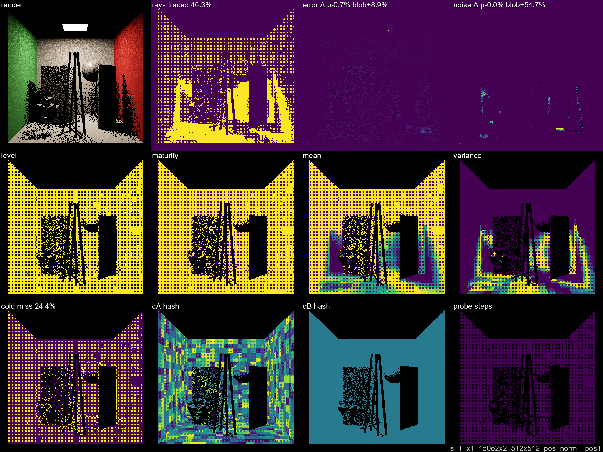 | 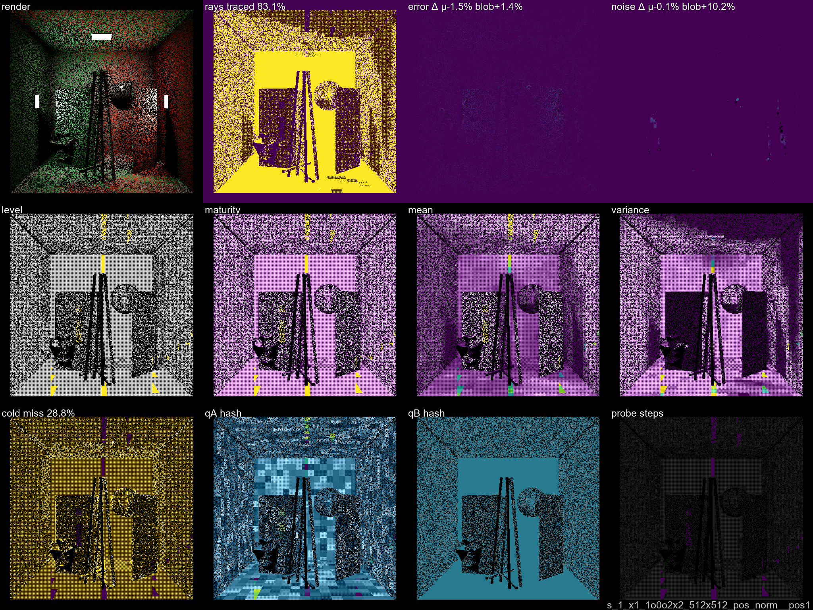 | 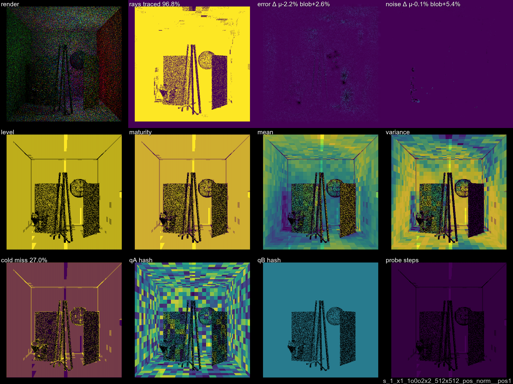 |

**Subval control.** `noise_blob = 0.00` across every N and scene — the subframe path is bitwise-stable vs vanilla accumulation. Any non-zero delta in the main sweep is a cache-gate effect, not plumbing noise.

**Why we narrow.** 2×2 is enough to break the tile pattern and doesn't slow the step 02+ runs. Every later ladder step adopts `SUBFRAME_2x2` as a fixed baseline. Warmup defaults (≥1 slot write-only) are carried too.

---

## Step 02 — B-side Addressing Shape

**What it looks at.** `PRESET_MINIMAL + RR_ADAPTIVE + SUBFRAME_2x2`, intentionally coarse B-quant (posB 0.72, dirB 20°, distB 1.0) so each cell aggregates many samples at x1 — exposes shape differences before quantization becomes the dominant knob. Sweeps 4 B-side addressing variants under the single `pos_norm` A-side: `pos1`, `pos`, `dir_dist1`, `dir_dist`. (The 5th original variant `dir1_dist1` was dropped — it's numerically identical to `pos1` on every scene and SPP since both collapse all of B into a single bin, and only the A-side carries addressing signal.)

**Results (CornellBox_32PointLights, rays traced %):**

| B-variant   |  x4 rays |  x16 rays | x4 err Δ | x4 blob |
| ----------- | -------: | --------: | -------: | ------: |
| `pos`       | **80.8** |  **50.9** |    −3.92 |    3.17 |
| `dir_dist1` |     82.6 |      57.6 |    −3.88 |    4.34 |
| `dir_dist`  |     85.6 |      54.6 |    −3.92 |    3.17 |
| `pos1`      |     91.9 |      90.8 |    −3.86 |    3.17 |

Collapsed-B `pos1` plateaus near 91% rays on multi-light scenes and the gap widens with SPP: at x4 the cost is 11 pp over full-position `pos` (91.9 vs 80.8); at x16 it's 40 pp (90.8 vs 50.9). The collapsed cell can't tell two distant visibility targets apart at the same A-cell, so RR rarely finds a cell variance low enough to skip — and the mixed-target variance *floor* doesn't fall as SPP grows. Full-position B is clearly the winner on multi-light scenes; `dir_dist` and `dir_dist1` sit between and differ only in distance-axis quantization.

**Why we narrow.** Collapsed-B `pos1` is dropped; step 03 enumerates per-axis quant for `pos`, `dir_dist1`, and `dir_dist` only. The dense sweep lives on 3 B-branches, not 4.

**Winner `pos_norm__pos` across scenes (x4 SPP):**

| 1PointLight | 1AreaLight | 3AreaLights | 32PointLights |
| --- | --- | --- | --- |
| 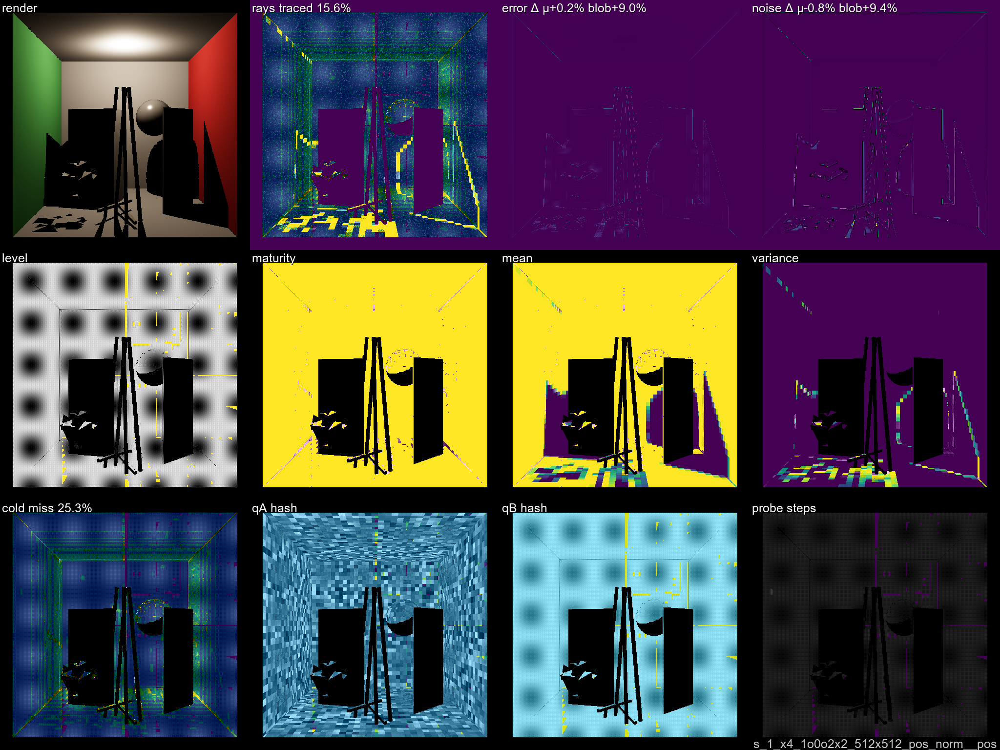 | 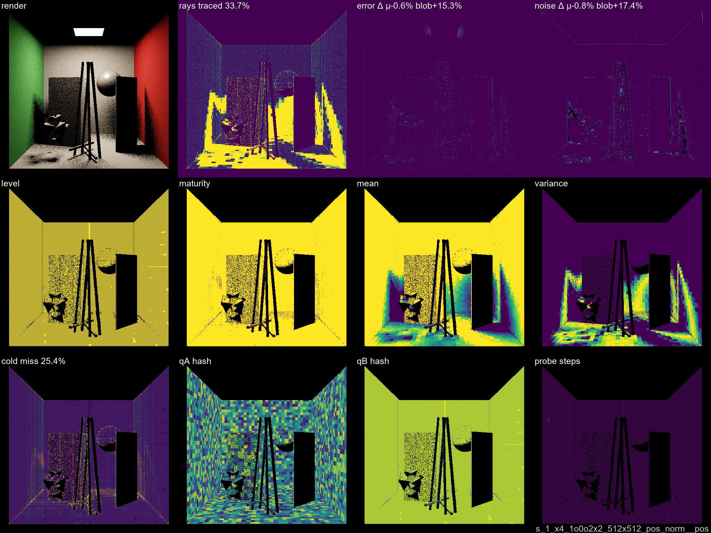 | 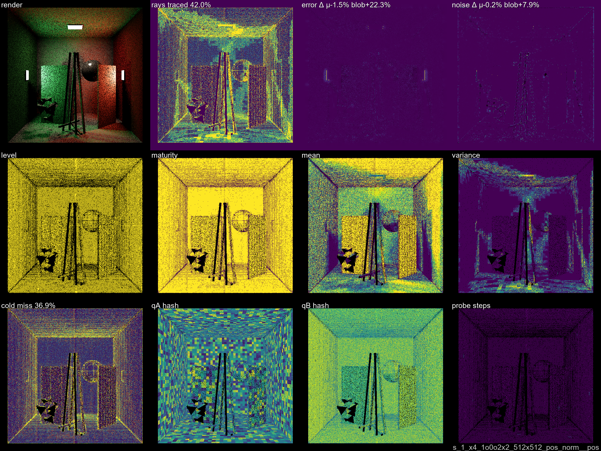 | 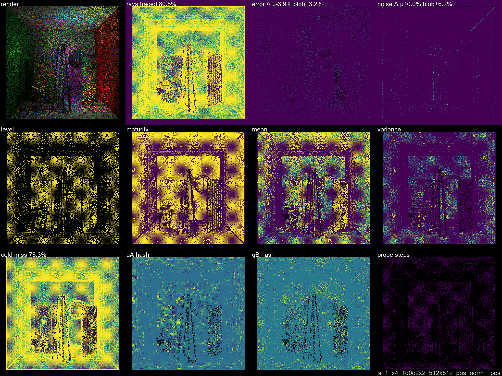 |

---

## Step 03 — Per-Axis Quantization Sweep

**What it looks at.** 68 variants in one logical step:

- `pos_norm__pos` — qA × qB = 4×4 = 16
- `pos_norm__dir_dist1` — qA × qD_FINE = 4×4 = 16 (distB collapsed)
- `pos_norm__dir_dist` — qA × qD × qd = 4×3×3 = 36

**Results.** Winner rule: *"err ≤ 0 OR ≤ median+25% AND blob ≤ 0 OR ≤ median+50%"* (weighted across scenes with 32PointLights×3), then ranked by rays-pct asc. Top-3 per B-branch flow into step 04. Current top-1 per branch (32PL x4):

| B-branch    | top-1 name         | rays % | err Δ | blob |
| ----------- | ------------------ | -----: | ----: | ---: |
| `pos`       | `qA024_qB036`      | 31.9   | −3.91 | 3.17 |
| `dir_dist1` | `qA024_qD60`       | 75.2   | −3.89 | 3.16 |
| `dir_dist`  | `qA012_qD60_qd192` | 72.4   | −3.88 | 3.16 |

`pos` already crushes the other two B-branches on rays — visibility-relevant dimensions clearly live in position, not direction. `dir_dist` / `dir_dist1` nonetheless stay in the ladder through step 04 to confirm the gap survives SPP convergence before they're parked.

**Why we narrow.** Per-axis picker enforces "no variant that degrades err/blob above the cohort median", so aggressive-quant variants only survive if they stay close to the group norm. Gives us 3 quants × 3 B-branches = 9 candidates entering step 04.

**Pos top-1 `qA024_qB036` across scenes (x4 SPP):**

| 1PointLight | 1AreaLight | 3AreaLights | 32PointLights |
| --- | --- | --- | --- |
| 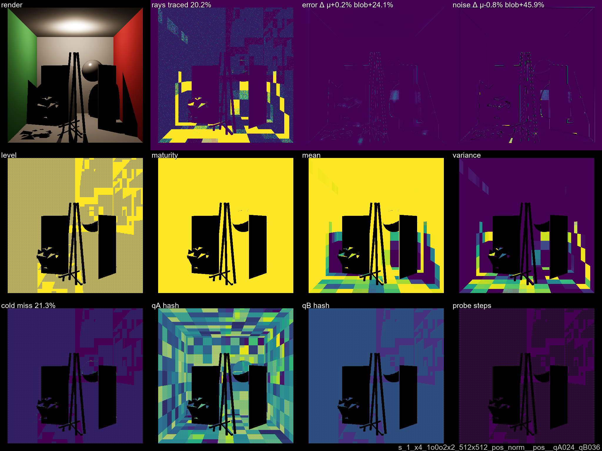 | 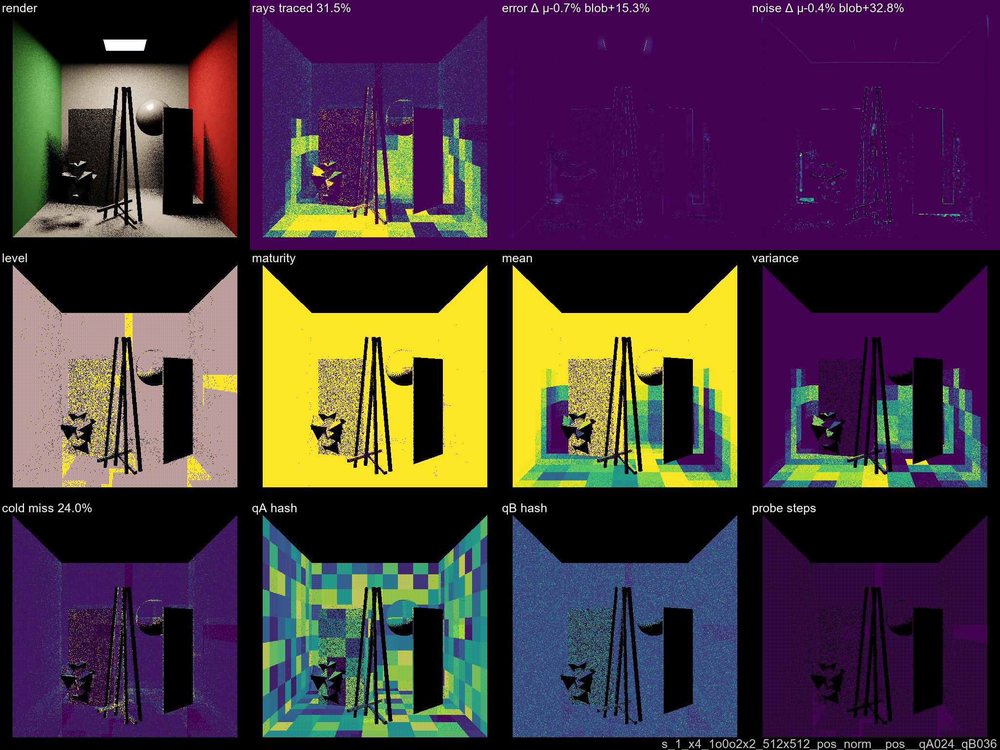 | 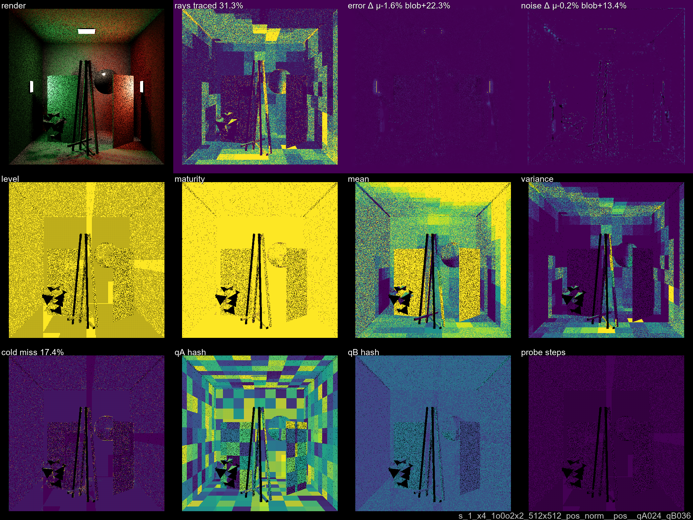 | 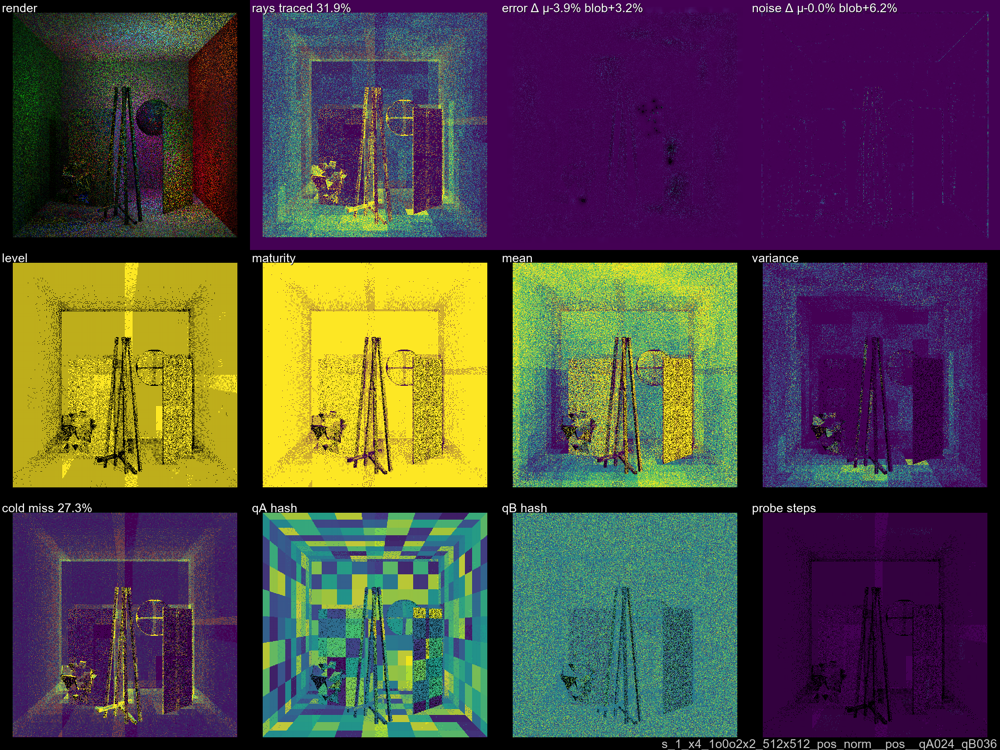 |

**Per-B-branch overview split** (variants in the combined overview are too dense for a single plot; each branch gets its own):

- `pos_norm__pos`:
  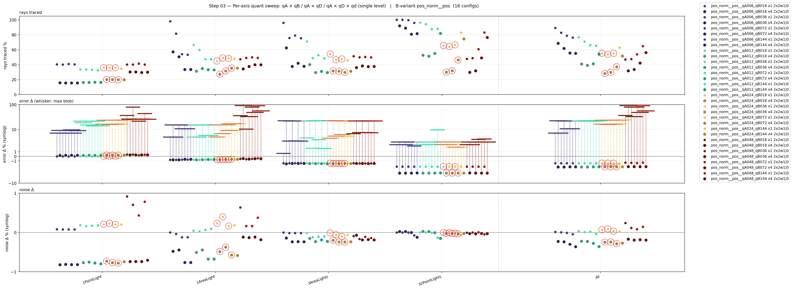
- `pos_norm__dir_dist1`:
  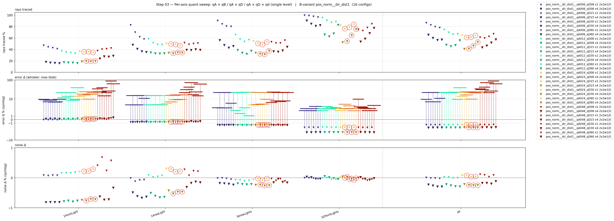
- `pos_norm__dir_dist` (3×2×2 plot subset):
  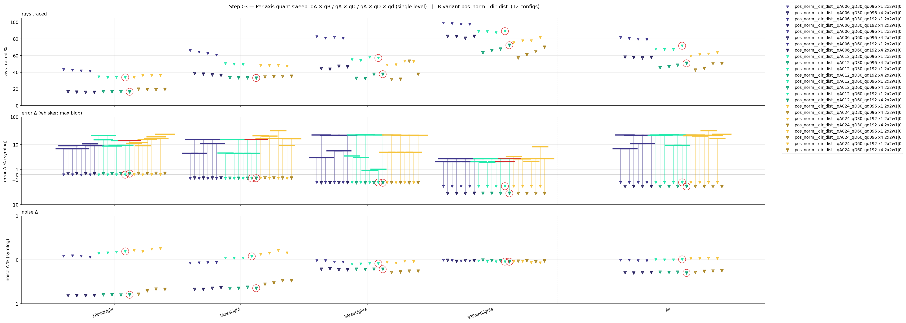

**Top-3 per B-branch — best-of comparison:**

---

## Step 04 — SPP Convergence on Step-03 Top-3

**What it looks at.** The 9 candidates from step 03 (top-3 per B-branch) re-rendered at x1 / x4 / x16 SPP. Validates that step 03's winners don't have pathological convergence behaviour as sample count climbs.

**Results.** The ranking is stable — picker re-runs on step-04 rows yield substantially the same set. `dir_dist__qA024_qD30_qd048` drops to 53.5% rays on 32PL x4 with `err = −3.91`, `blob = 3.18`. No variant flips from qualifying to disqualifying across SPP, no variant's rays-pct regresses as SPP grows.

**Why we narrow.** Confirms step 03's per-axis winners are SPP-insensitive → safe to carry the pos-branch winners into step 05 (threshold sweep). `dir_dist` / `dir_dist1` branches are parked — the full-position `pos` branch gives the largest consistent rays savings, and step 05+ goes deep on it rather than splitting attention across all three.

**SPP-converged pos winner `qA024_qB036` across scenes (x16 SPP):**

| 1PointLight | 1AreaLight | 3AreaLights | 32PointLights |
| --- | --- | --- | --- |
| 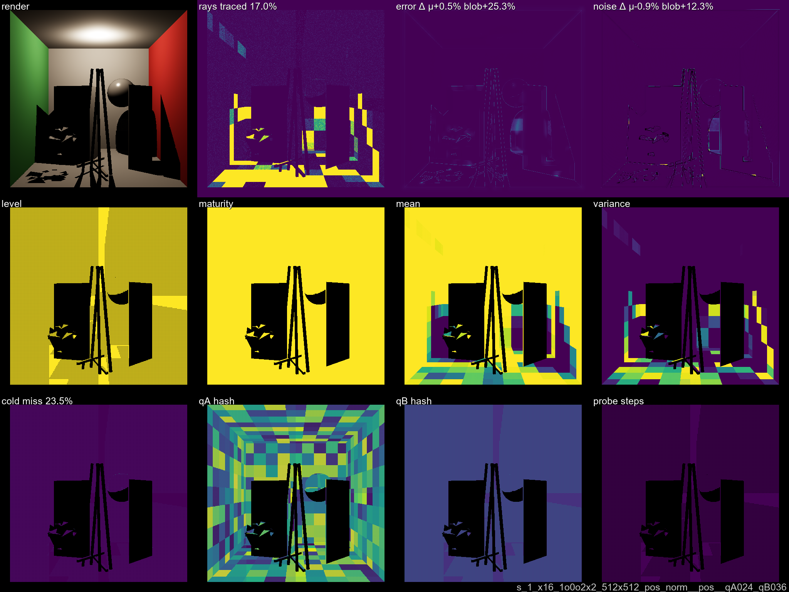 | 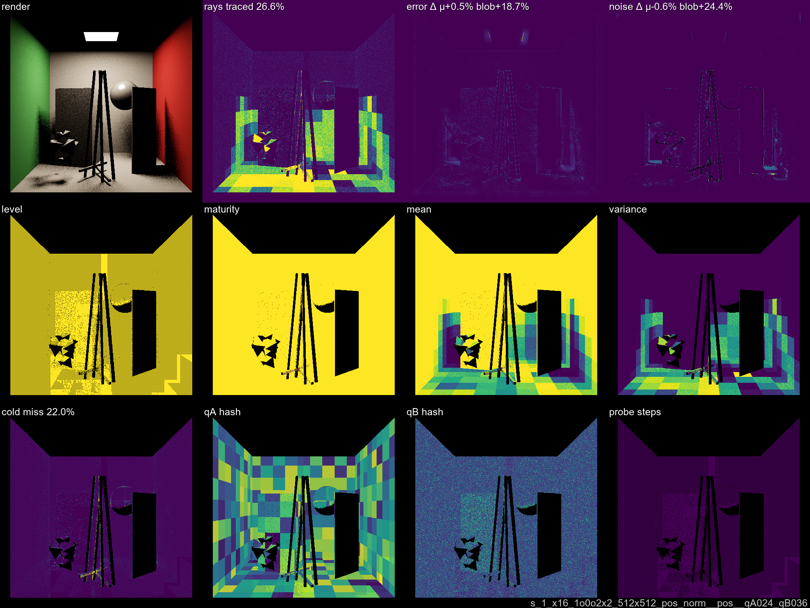 | 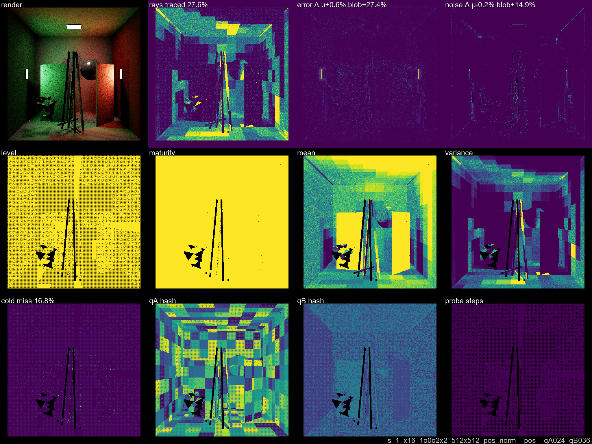 | 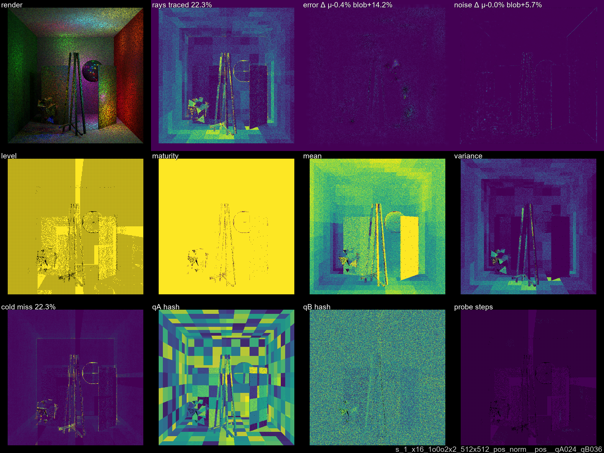 |

---

## Step 05 — bootThreshold × quantAB, pos Single-Level

**What it looks at.** Crosses step 03's top-3 pos quants (qA024_qB018 / qA024_qB036 / qA024_qB072) with 4 boot thresholds (ct1 / ct2 / ct4 / ct8). `matureThreshold = 128` fixed. 12 variants × 2 SPP = 24 runs/scene. First step where the "trust gate" knob is sized against a chosen cell size.

**Results — auto-picker top-3 (ranked by weighted rays-pct asc across scenes with 32PL×3). 32PL x4 numbers shown:**

| variant                                          | rays % | err Δ | blob |
| ------------------------------------------------ | -----: | ----: | ---: |
| `qA024_qB036__ct1` (picker #1)                   | 19.7   | −3.72 | 9.37 |
| `qA024_qB018__ct2` (picker #2)                   | 18.9   | −3.79 | 5.96 |
| `qA024_qB036__ct2` (picker #3, **manual carry**) | 21.2   | −3.79 | 5.75 |

The `ct1` variants pair every "most aggressive rays" with a much higher blob (9.4 vs 5.8) — cells are being trusted after a single sample, so the per-cell mean is an outlier-prone estimate and worst-region error jumps accordingly. The `ct2` variants keep blob at ~5.8 and cost only 1–2pp more rays.

**Why we narrow — and why the manual carry.** `ct1` = "trust the cell after a single sample" = boot gate effectively off. It wins the picker on rays alone (the picker rule lets high-blob variants through if they're inside median+50%, which they are here — the cohort's median is carried upward by the ct1 rows themselves), but it's too eager as the basis for the downstream sweeps that stack jitter, varThreshold, and multi-level on top. `ct2` (one confirming sample before trust) is manually carried: same quant, blob cut 40%, rays cost only 1.5pp.

**Manual carry `qA024_qB036__ct2` across scenes (x4 SPP):**

| 1PointLight | 1AreaLight | 3AreaLights | 32PointLights |
| --- | --- | --- | --- |
| 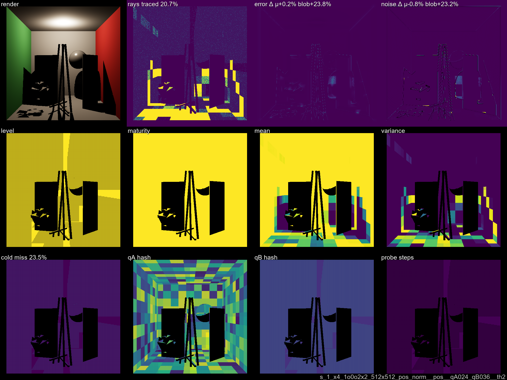 | 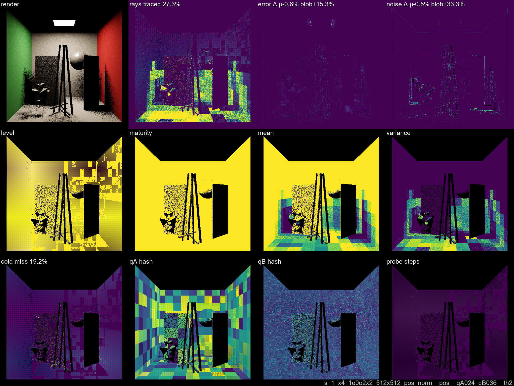 | 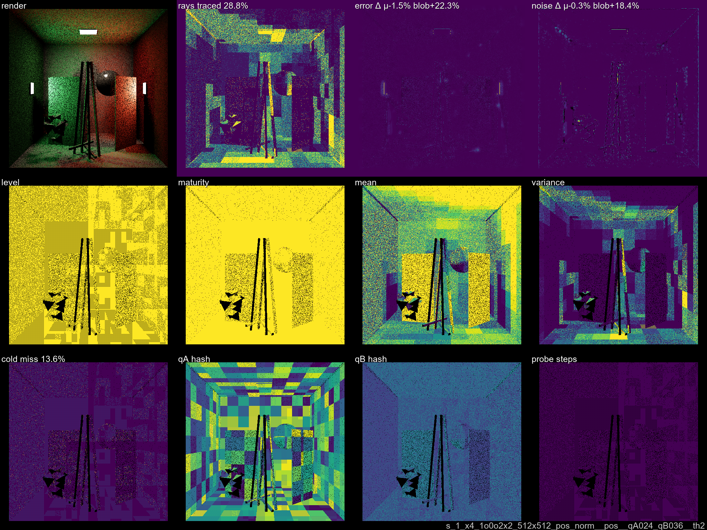 | 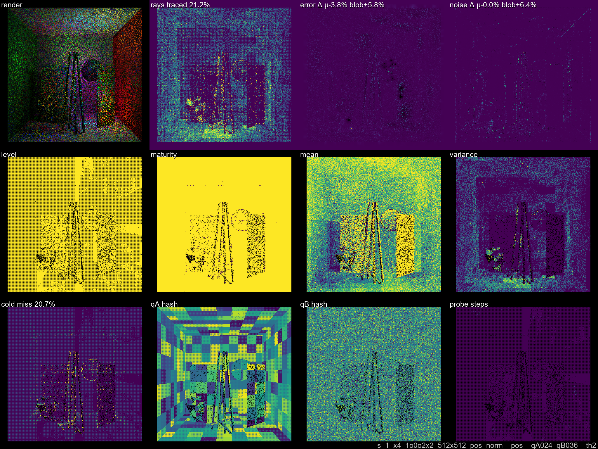 |

---

## Step 06 — varThreshold Sweep

**What it looks at.** Step-05 carry baked in, sweeps the RR variance gate: `varThreshold ∈ {vt0 = 0.0001, 0.05, 0.10, 0.15, 0.20, 0.30, 0.40, 0.60}`. When cell variance drops below `varThreshold`, RR trusts the cached μ and skips the trace; above it, the ray always traces. Raising the threshold → more skips in high-variance regions. `vt0` is the extreme "trust only if variance = 0 modulo eps" probe, included to mirror step 11's multi-level run so the two regimes are directly comparable.

**Results — 32PL x4 (carry scene) vs 1PL x4 (hard-shadow blob canary):**

| variant | 32PL rays | 32PL blob | 1PL blob |
|---------|----------:|----------:|---------:|
| `vt0` | 22.3 | 5.89 | **16.86** |
| `vt005` (**carry**) | 22.2 | **3.43** | **16.86** |
| `vt010` | 21.9 | 5.80 | 23.24 |
| `vt015` | 21.3 | 5.91 | 28.78 |
| `vt020` | 20.7 | 6.02 | 32.17 |
| `vt030` | 17.7 | 7.04 | 33.23 |
| `vt040` | 15.5 | 7.82 | 43.66 |
| `vt060` | 13.4 | 8.42 | 67.41 |

**Key finding — tightening vt monotonically improves 1PL blob on single-level.** vt060 → vt0 cuts 1PL blob from 67 → 17 (4× better). `vt005` takes the corner: best 32PL blob in the sweep (3.43 vs 5.80 at vt010 and 6.02 at vt020) AND lowest 1PL blob tied with vt0 (16.86), at essentially the same rays as vt010 (22.2 vs 21.9). The cost of tight-vt on 32PL is minimal (~1.5pp extra rays vs vt020) because single-level cells have reliable per-cell variance estimates.

**Key negative — contrast with step 11 multi-level.** On the *multi-level cascade* (step 11), tightening to `vt0` does the *opposite*: 1PL blob jumps to 86 because coarse-level cells with few samples over a penumbra spuriously read as "zero variance" and get fraudulently trusted. Single-level has no such over-trust pathway — all cells at one resolution, and the variance estimate reflects sample stability. The same vt knob has opposite optimal values at the two cascade regimes.

**Why we narrow.** Carry `vt005`. The auto-picker's top-1 was `vt030` (minimises rays at 17.7% and blob qualifies under median+50%), but `vt030`'s 1PL blob (33.23) is exactly the kind of regression the "blob > 10 means artifact" rule flags. Manual override to `vt005`: best 32PL blob, tied-best 1PL blob, rays cost ~1.5pp.

**Carry `…__ct2__vt005` across scenes (x4 SPP):**

| 1PointLight | 1AreaLight | 3AreaLights | 32PointLights |
| --- | --- | --- | --- |
| 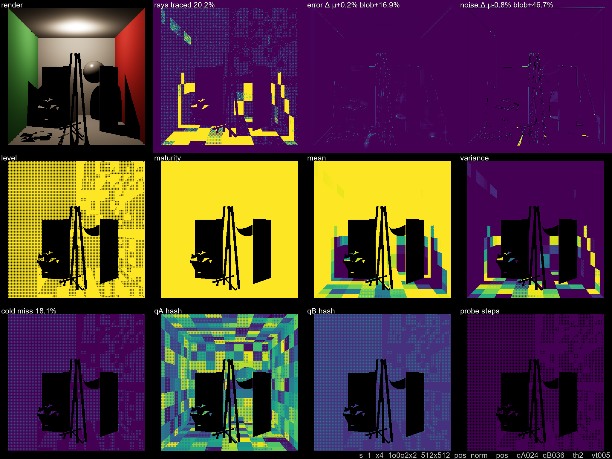 | 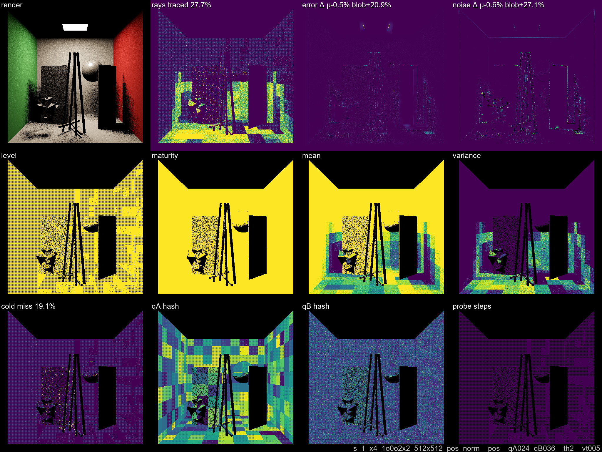 | 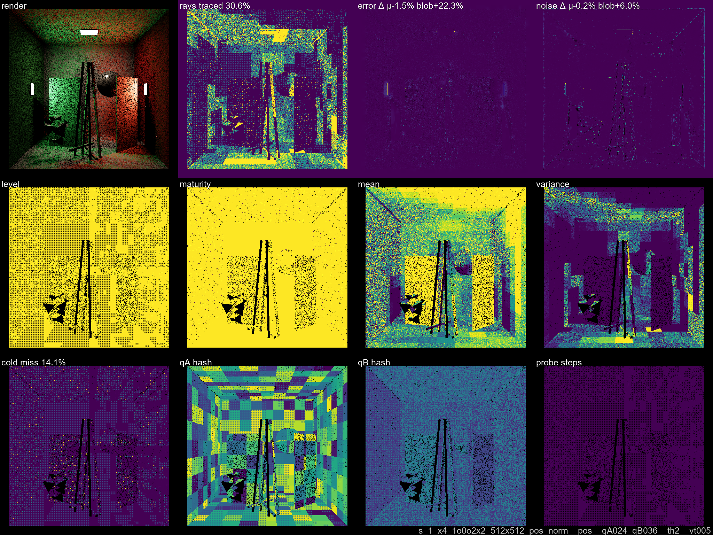 |  |

---

## Step 09 — Jitter Sweep (single level)

**What it looks at.** Step-05 carry plus a companion fine quant with posA/posB halved (step-03 quant grid is power-of-2 spaced, so /2 = "one step finer"). Sweeps the two jitter flavors 3×3:

- `jitterFilter` — per-position-seed jitter (`asuint(pos)` seed). Stochastic grid per sample → acts as a 3D reconstruction kernel; soft cell boundaries.
- `jitterCell` — per-cell-index-seed jitter (`baseIdx` seed, Binder 2018). Whole-cell offset → boundaries stay hard but land at new positions.

2 quants × 3×3 jitter = 18 variants. Scales are in cell units (1.0 = ±0.5 cell).

**What the data hints at.** jf-only softens boundaries without adding firefly noise. jc-only shifts the visible grid but keeps hard edges. Stacking both at full scale (`jf10_jc10`) adds firefly noise and rays without a clearer visible gain over either axis alone. Mid strength (`jf05`, `jc05`) on each looks like the sweet spot.

**Why there's no carry yet.** Jitter is a visual/artifact call, not a rays+err call — the picker rule is silent on "does the image look right across frames". Likely `jf05_jc05`, pending visual inspection. Step 09 only feeds step 14 (combined multi-level sweep), and step 14 currently composes jitter off a fixed guess; carry fixation lands once the plates are reviewed.

**Likely-carry `jf05_jc05` across scenes (x4 SPP, step-05 carry quant):**

| 1PointLight | 1AreaLight | 3AreaLights | 32PointLights |
| --- | --- | --- | --- |
| 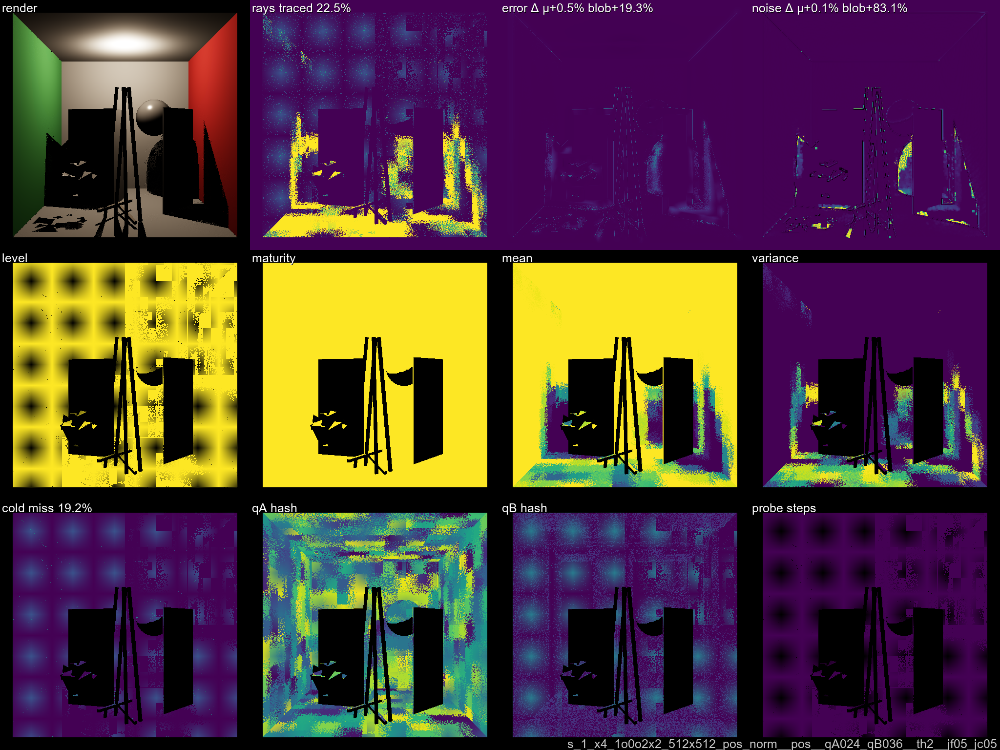 |  | 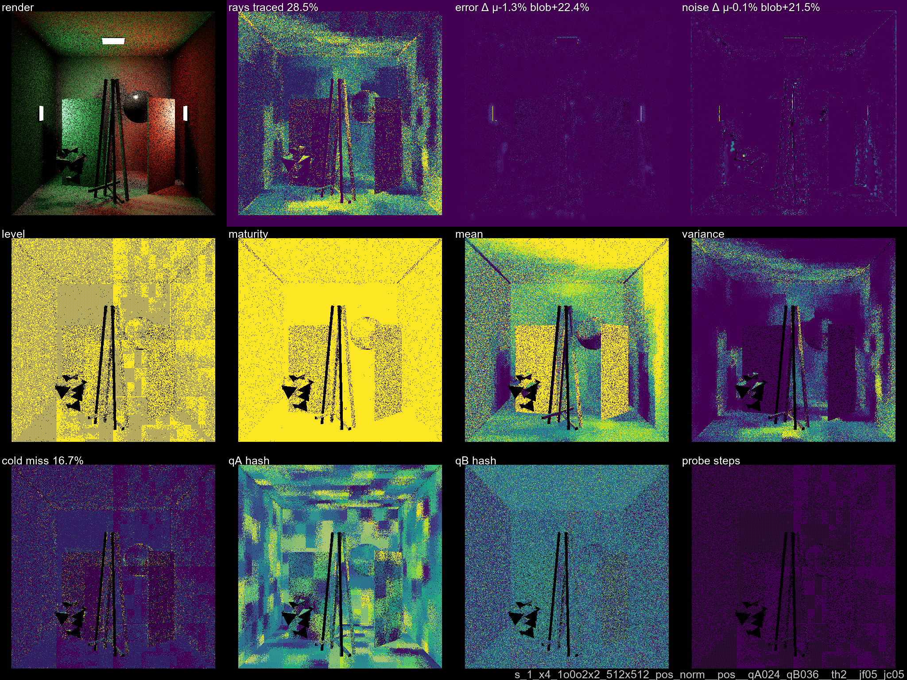 | 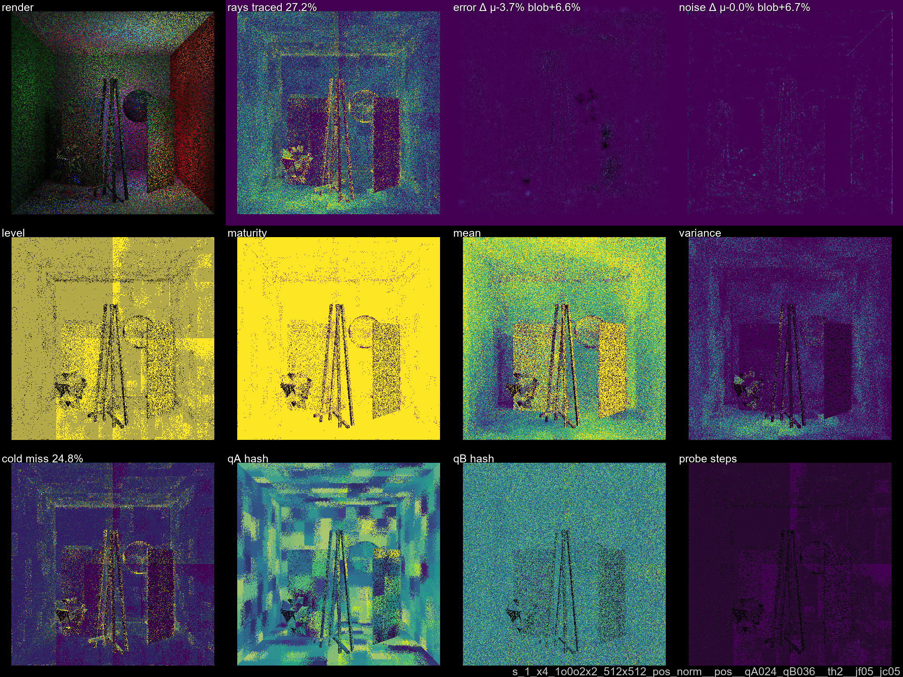 |

---

## Step 10 — Quant × Threshold, Multi-Level

**What it looks at.** Multi-level mirror of step 05: `LEVELS_MULTI + autoTuneCells`, no jitter, no footprint. QUANT_SWEEP (qa006 / qa012 / qa036) × threshold (ct2 / ct4 / ct16) = 9 variants. Step-05 single-level carry (`qA024_qB036__ct2`) overlaid as reference for direct gain comparison.

**Results (32PL x4):**

| variant                        | rays %   | err Δ | blob |
| ------------------------------ | -------: | ----: | ---: |
| `qa012__ct2`                   | 11.6     | −3.48 | 7.54 |
| `qa036__ct2`                   | 11.6     | −3.46 | 7.87 |
| `qa006__ct2`                   | 11.7     | −3.53 | 9.19 |
| `qa036__ct4`                   | 17.6     | −3.77 | 3.86 |
| `qa012__ct4`                   | **17.7** | −3.78 | 3.52 |
| step-05 ref `qA024_qB036__ct2` | 21.2     | −3.79 | 5.75 |

The cascade cuts rays roughly in half vs single-level at matched quality: `qa012__ct4` lands at 17.7% rays with `blob = 3.52` — better blob **and** better rays than the single-level step-05 reference (21.2%, blob 5.75).

**Why we narrow.** The cascade lets fine levels correct coarse-level early-trust decisions: coarse level fires an RR skip when its variance is low; if it's wrong, the next cascade step down at a finer resolution catches it. `ct4` tuning is more stable at multi-level than `ct2` because the coarser levels have genuinely more samples per cell to back the trust decision — `ct2` at multi-level over-trusts coarse levels and lets blob climb (7.5–9.2) even as it drives rays down. Step 11 onward inherits the multi-level spine.

**Multi-level winner `qa012__ct4` across scenes (x4 SPP):**

| 1PointLight | 1AreaLight | 3AreaLights | 32PointLights |
| --- | --- | --- | --- |
| 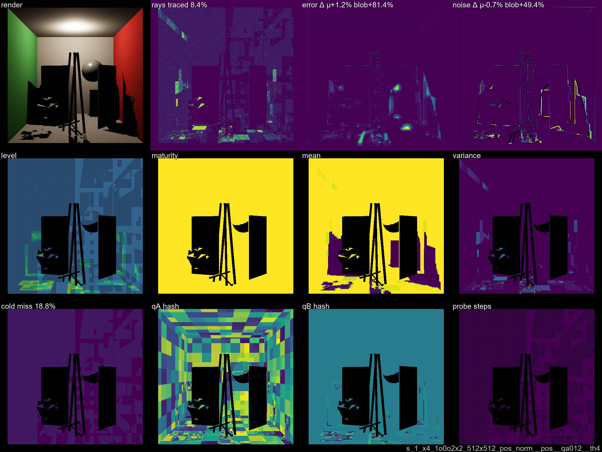 | 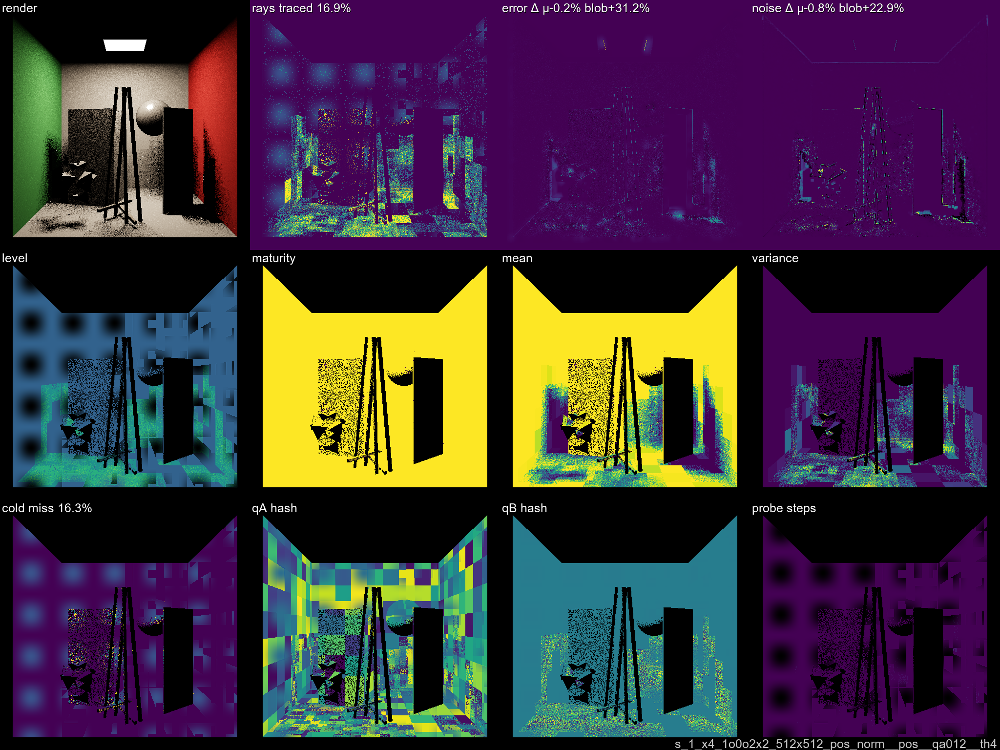 | 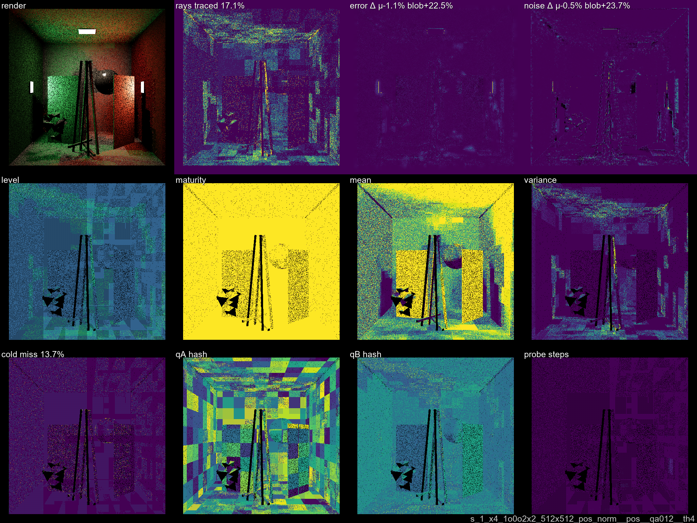 |  |

---

## Step 11 — varThreshold sweep at ct4 fp0 on step-10 carry

**What it looks at.** Step 10's winner (`qa012__ct4`, multi-level) has a 1PL failure — 81.44 blob on x4 — from coarse-level RR over-trust at the hard shadow penumbra. Step 11 anchors on that carry's quant (`qa012`) and sweeps three defenses, expanded to the full step-06 `vt` range + paper-style footprint scaling:

- `varThreshold ∈ {vt0=0.0001, 0.05, 0.10, 0.15, 0.20, 0.30, 0.40, 0.60}` — full step-06 range. Tighter → block coarse cells from RR-skipping when their within-cell variance is spuriously low (few samples averaged over both sides of a penumbra edge).
- `bootThreshold ∈ {ct2, ct4}` — sample-count gate. `ct4` was step-10's pick; verify it still wins once vt+fp shift.
- `footprintScale ∈ {0.0, 0.1, 0.2}` — scale the trust floor by `log2(cellPixels)` so larger near-camera cells demand more samples. `fp0.5` was tested in a prior v1 and scrapped (destroys 32PL rays 17→95%); the milder probes test whether footprint is salvageable.

8 vt × 2 ct × 3 fp = 48 variants × 2 SPP = 96 runs/scene. Chunked 4× via `CHUNKS_PER_STEP` to stay under Mogwai's GPU-memory ceiling.

**Results — top variants sorted by 1PL x4 blob asc (carry-worthy rows):**

| variant | 32PL rays | 32PL blob | 1PL blob | 1AL blob | 3AL blob |
|---------|----------:|----------:|---------:|---------:|---------:|
| `ct4_vt005_fp0` (**carry**) | **17.8** | 4.58 | **22.9** | **17.4** | 22.5 |
| `ct4_vt005_fp01` | 17.8 | 4.28 | 22.9 | 18.0 | 22.5 |
| `ct4_vt0_fp01` | 17.7 | 4.56 | 25.6 | 16.8 | 22.5 |
| `ct4_vt010_fp0` (prior carry) | 17.8 | 3.50 | 26.7 | 25.1 | 23.8 |
| `ct4_vt005_fp02` | 58.0 | 3.17 | 19.3 | 15.3 | 22.3 |
| `ct4_vt0_fp02` | 59.4 | 3.17 | 22.1 | 15.3 | 22.3 |
| step-10 ref `qa012__ct4` | 17.7 | 3.52 | 8.4 (rays) / **81.4** | 31.2 | 22.5 |

**Key finding — vt005 beats vt010 on every blob at matched 32PL rays.** Tightening the variance gate one step further (0.10 → 0.05) drops 1PL blob 26.7 → 22.9, 1AL blob 25.1 → 17.4, 3AL blob 23.8 → 22.5 — all at identical 32PL rays (17.8%). Small regression on 32PL blob (3.50 → 4.58) is cheap vs the wholesale blob-Δ improvements on the other three scenes. Mirrors the single-level step-06 finding (vt005 the corner there too).

**Key finding — fp is near-a-no-op under vt005 / ct4, except at fp≥0.2 where it regresses rays.** `fp0.1` and `fp0` are visually identical at this operating point (1PL blob 22.9 in both, 32PL rays 17.8). `fp0.2` lowers 1PL blob to 19.3 but triples 32PL rays (17.8 → 58.0) — not worth it. Footprint-scaling is the wrong tool for this problem; variance-gate tightening is. This reinforces the v1 finding that `fp0.5` was catastrophic (not just too aggressive — wrong axis).

**Negative finding — `vt0` (0.0001) still over-tightens even with fp.** `ct4_vt0_fp0` has 1PL blob 71+ (cells with few samples register variance ≈ 0 and get fraudulently trusted). fp doesn't rescue it. The variance gate has a sweet spot around `vt005`, not monotonic.

**Why we narrow.** Carry `qa012__ct4_vt005_fp0`. Single axis change from the prior carry (`vt010 → vt005`) delivers the improvement on three scenes at zero cost to 32PL. fp is parked as "wrong lever"; the multi-level blob defense is vt-based.

**Carry `qa012__ct4_vt005_fp0` across scenes (x4 SPP):**

| 1PointLight | 1AreaLight | 3AreaLights | 32PointLights |
| --- | --- | --- | --- |
| 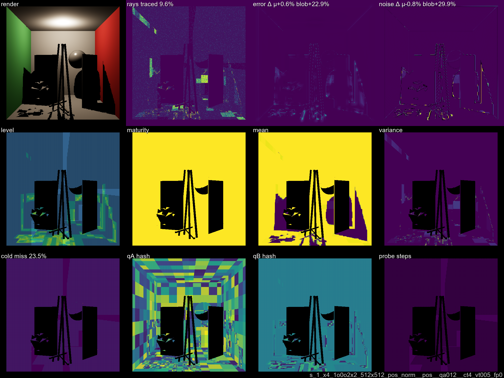 | 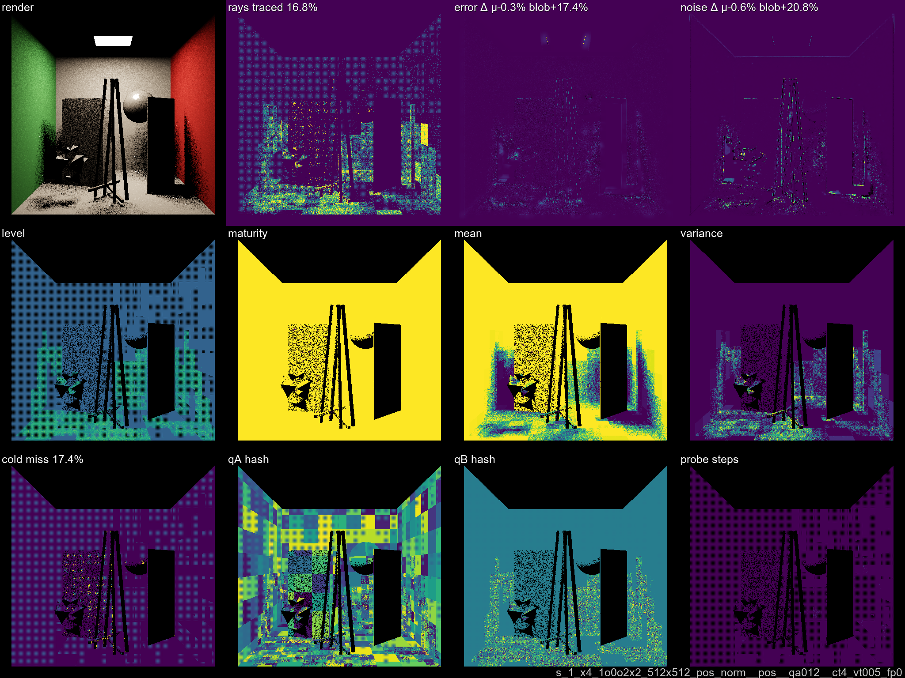 | 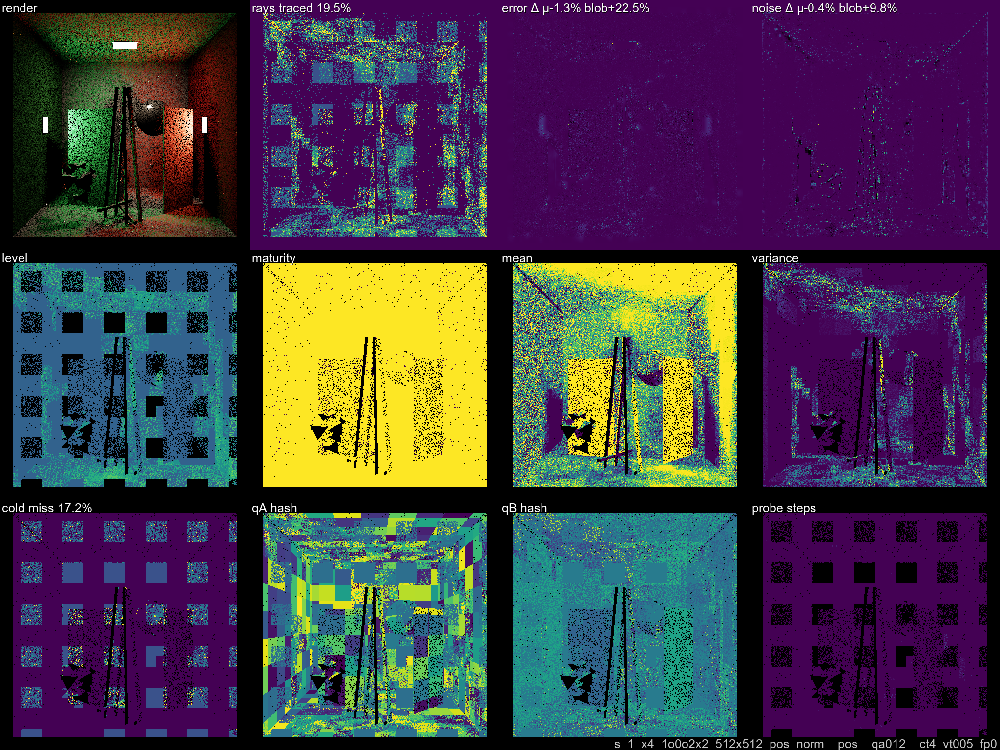 | 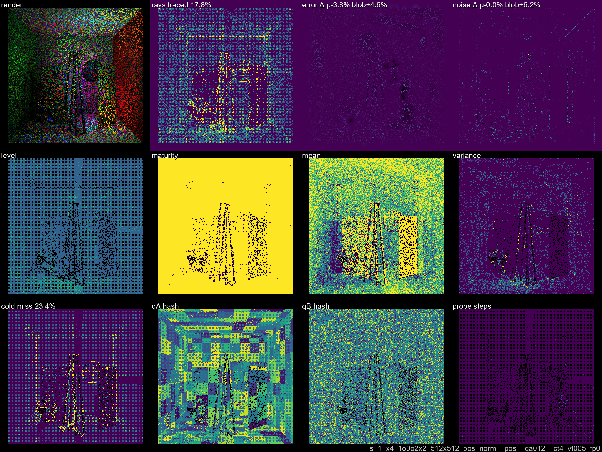 |

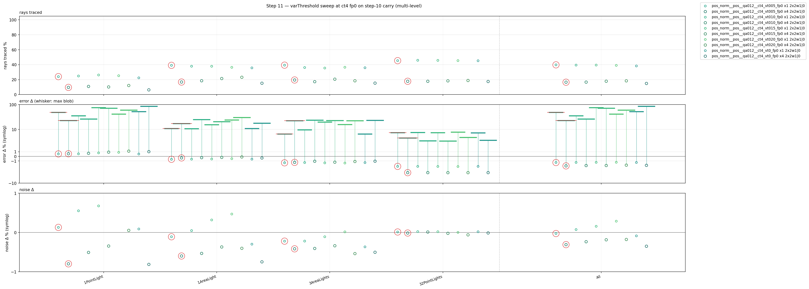

---

## Step 12 — ct × warmup × force-descend on step-11 carry

**What it looks at.** Step 11's carry (`qa012__ct4_vt005_fp0`) still has 1PL x4 blob ≈ 27, above the "artifact" threshold. Step 12 anchors on it and probes three penumbra-defense mechanisms:

- `ct ∈ {2, 4, 8, 16, 32}` — sample-count gate. ct2 baseline, ct4 prior carry, ct8/16/32 probe whether a stricter gate forces big near-camera cells (the penumbra straddlers) to mature from a larger sample pool.
- `warmup_first ∈ {1, 2}` — how many 2×2 Bayer subframes are write-only before any query. w=1 is the standard mitigation from step 01; w=2 doubles the pre-query dispersion.
- `forceDescendFootprintPx ∈ {0, 1024}` — **new shader knob this step**. When a cell's screen-space footprint exceeds 1024 px (≈32×32 pixel patch), `vhfLookup` refuses the convergence early-stop and descends to refine. Targets "big cells over hard shadow" directly. `fd=0` is the prior behaviour.

5 ct × 2 warmup × 2 fd = 20 variants × 2 SPP = 40 runs/scene × 4 scenes = 160 runs. Single-chunk run, ~28 min total.

**Results — 1PL x4 blob (the target) sorted by ct:**

| ct | fd | w | 1PL rays | 1PL blob | 32PL rays | 32PL blob |
|---:|---:|--:|---------:|---------:|----------:|----------:|
| 2  | 0 | 1 | 6.9 | 86.2 | 11.4 | 9.4 |
| 2  | 0 | 2 | 7.9 | 78.6 | 11.5 | 9.0 |
| 4  | 0 | 1 | 7.8 | 41.0 | 17.5 | 3.5 |
| 4  | 0 | 2 | 8.3 | 86.1 | 17.6 | 4.2 |
| 8  | 0 | 1 | 8.1 | 85.9 | 27.3 | 3.2 |
| 8  | 0 | 2 | 8.9 | 85.8 | 27.3 | 3.2 |
| 16 | 0 | 1 | 10.5 | 55.4 | 40.4 | 3.2 |
| **16** | **0** | **2** | **12.4** | **17.2** | **40.5** | **3.2** |
| 32 | 0 | 2 | 14.2 | 27.7 | 57.7 | 3.2 |

**Key finding — warmup=2 is useless at low ct, dramatic at high ct.** At `ct4` with `w=2`, 1PL blob gets *worse* (41→86), 1AL even worse (27→117). At `ct16` with `w=2`, 1PL blob collapses (55→17). Mechanism: low ct + w=2 lets cells mature *during* the 2 write-only subframes from spatially-biased early samples (same pixels keep writing the same cell). High ct + w=2 forces cells to require query-subframe contributions too → maturity comes from spatially-diverse samples.

**Key negative — force-descend (`fd=1024`) is a no-op or slight regression here.** At `ct16+w2`, `fd=0` gives 1PL blob 17.2; `fd=1024` gives 71.7. The shader knob promotes finer-level reads over converged coarse ones, but the finer levels share the same "spurious-low-variance with few samples" pathology that hurt coarse reads. Level-switching doesn't help when the problem is sample-count-dependent. Paper's "skip coarse levels" idea (also the write-side half, not yet implemented) might still have table-pressure benefits but won't fix blob on its own.

**Key negative — `fp` axis was parked in step 11 for the same reason.** Changing *which* cells participate in trust is the wrong lever; *how many samples* must land before trust is the right lever.

**Why we narrow.** Carry `qa012__ct16_vt005_fp0_fd0` with `warmup=2`. The rays cost on 32PL is real (17.5% → 40.5%, 2.3× more) but 1PL/1AL blob drop 2×+ cuts the visible-artifact regime. The alternative — stay at `ct4` carry — keeps 32PL cheap but the 1PL artifact persists. Framework decision, not a free lunch.

**x16 stress test — the carry's `err Δ` win is SPP-bounded.** At x16, vanilla converges and VisCache's residual bias surfaces. Carry metrics (1PL / 1AL / 3AL / 32PL) across SPP:

| SPP | 1PL rays | 1PL blob | 1AL blob | 3AL blob | 32PL rays | 32PL blob |
| --: | -------: | -------: | -------: | -------: | --------: | --------: |
|  x1 |     29.1 |     18.4 |      8.8 |      5.9 |      83.2 |       2.6 |
|  x4 |     12.4 |     17.2 |     15.3 |     22.3 |      40.5 |       3.2 |
| x16 |      5.2 | **81.5** | **31.1** |     26.9 |      19.9 | **14.3** |

Rays keep falling (the cache matures further), but blob on every scene grows 2–5× from x4 to x16. The error-Δ metric is measured vs same-SPP vanilla, which converges as SPP grows — meaning VisCache's systematic bias (that vanilla's x4 noise floor was masking) becomes visible at x16. Implication: the ct16+w=2 carry handles the x4 operating point but isn't adding real accuracy at higher SPP; the RR trust decision is still biasing the mean. Next round of ablations (bootstrap-break, parent-preinit) should target this directly.

**Carry `qa012__ct16_vt005_fp0_fd0` (w=2) across scenes (x4 SPP):**

| 1PointLight | 1AreaLight | 3AreaLights | 32PointLights |
| --- | --- | --- | --- |
| 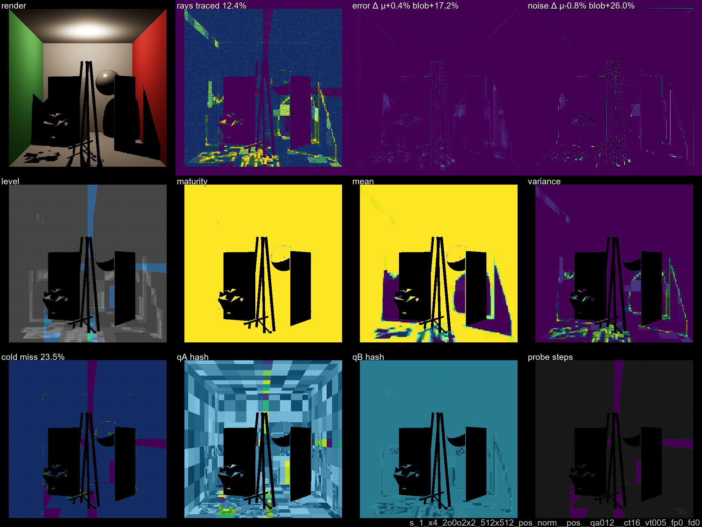 | 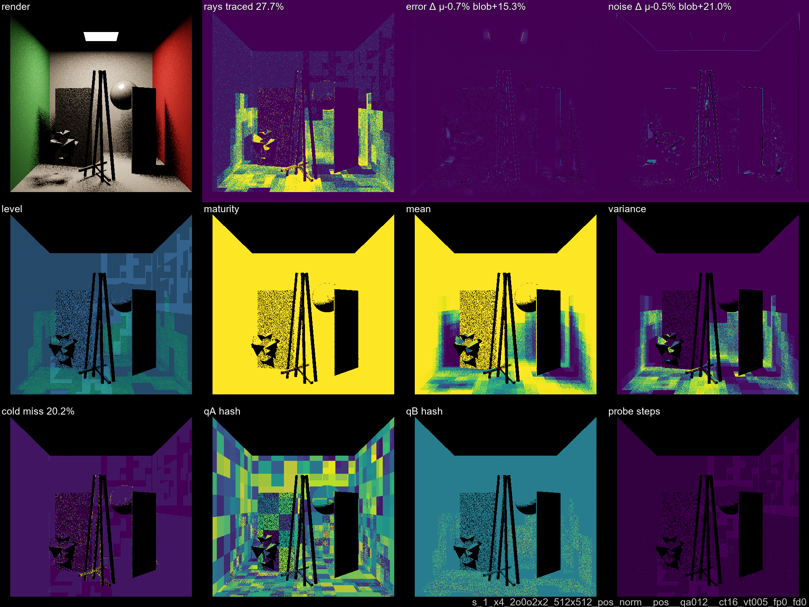 | 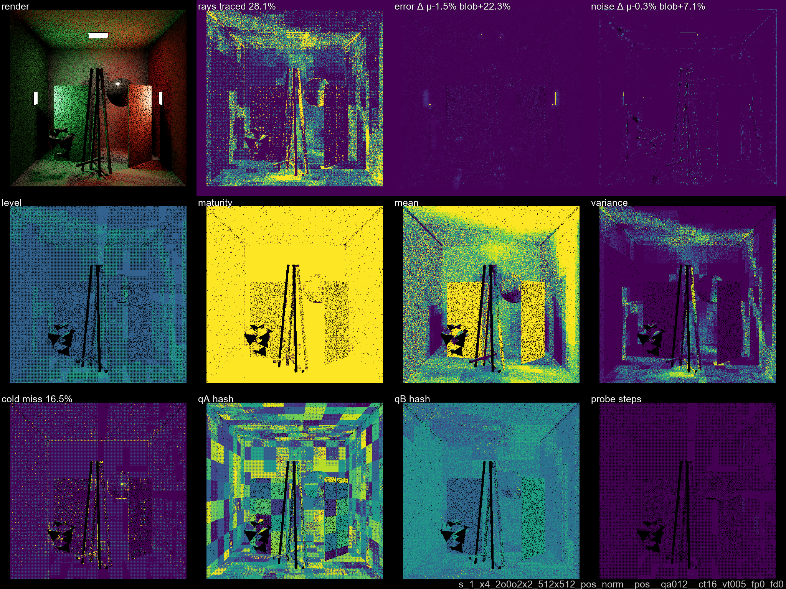 | 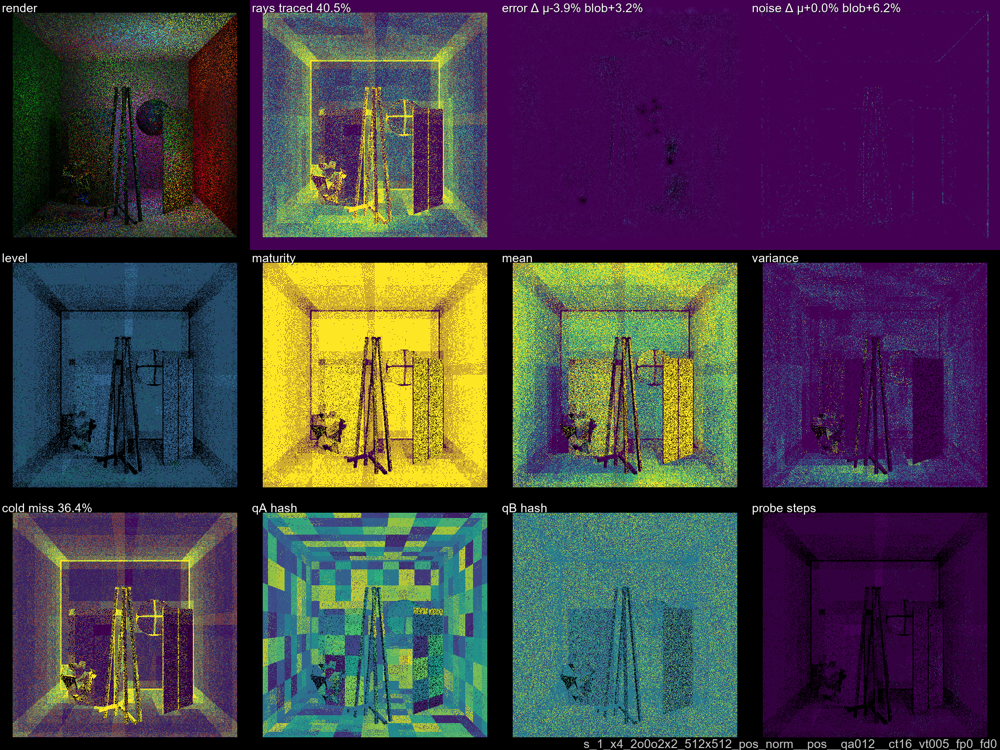 |

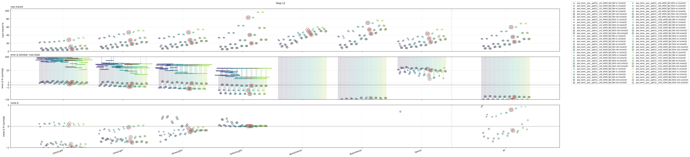

**Big-scene supplement (Bistro + Sponza)** — step 12 carry validated on real-world geometry:

| scene | x4 rays | x4 err Δ | x4 blob | x16 rays | x16 err Δ |
|---|---:|---:|---:|---:|---:|
| BistroInterior | 53.6 | **−17.3%** | 293.9 | 43.3 | **−9.0%** |
| BistroExterior | 46.2 | **−69.5%** | 365.9 | 40.5 | **−61.9%** |
| Sponza | 32.5 | +2.4% | 211.2 | 23.6 | +10.0% |
| 32PL (Cornell) | 40.5 | −3.9 | 3.2 | 19.9 | −0.4 |

**On Bistro Exterior x4, viscache traces 46% of rays AND reduces mean GT-error by 69.5%** vs matched-SPP vanilla — the canonical "cache pays off" result: complex lighting where aggregation across frames delivers real per-pixel quality improvement. Bistro Interior shows a similar 17% mean improvement. Sponza is the outlier — slight regression (+2.4% err at x4, +10% at x16) that widens with SPP.

**Scene-dependent ct tradeoff (BistroInterior x4, w=2, fd0):**

| ct | rays | err Δ | blob |
|---:|---:|---:|---:|
| 2 | 16.0 | **−17.7** | 293.5 |
| 4 | 25.1 | −16.6 | 293.6 |
| 8 | 39.3 | −16.8 | 293.5 |
| **16 (carry)** | 53.6 | −17.3 | 293.9 |
| 32 | 63.9 | −17.4 | 293.5 |

**ct is nearly irrelevant on Bistro** — err stays at −17 and blob at 293 across the ct sweep; only rays change (16% at ct2 → 64% at ct32). The step-12 carry's `ct=16` was chosen to fix Cornell 1PL blob (41 → 17) but that mechanism isn't activating on Bistro — the cache is already doing its job at any ct. On Bistro, `ct=2` would deliver the same quality at 38pp fewer rays. A scene-aware or per-level ct strategy is on the table for future investigation.

---

## Step 07 — stderrThreshold pure sensitivity curve (single-level)

**What it looks at.** Clean single-knob sweep of the stderr gate on the step-05 carry (qA024_qB036 + ct2), complementing step 06's `vt` curve. Tests whether `stderrThreshold` (trust iff `√(var/N) ≤ se`) is strictly better than `varThreshold` (trust iff `var ≤ vt`) as the single-level convergence criterion.

Sweep: `se ∈ {0.01, 0.03, 0.05, 0.08, 0.10, 0.15, 0.20, 0.30}`. 8 values × 2 SPP × 4 scenes = 64 runs.

**Results — x4 blob across scenes (vt curve shown for comparison):**

| axis value | 32PL blob | 1PL blob | 32PL rays |
|---|---:|---:|---:|
| **vt0.05** (step-06 carry) | **3.43** | 16.86 | 22.17 |
| se0.01 | 5.86 | 12.73 | 22.06 |
| se0.03 | 5.90 | 17.00 | 22.28 |
| **se0.05** (step-07 carry) | 5.87 | **10.77** | 22.31 |
| se0.10 | 5.94 | 11.12 | 22.20 |
| se0.15 | 5.86 | 20.20 | 21.96 |
| se0.30 | 5.83 | 45.45 | 22.24 |

**Key finding — se trades 32PL blob for 1PL blob at matched rays.** At `se=0.05` vs `vt=0.05`: 1PL x4 blob drops 16.86 → 10.77 (36% better), 32PL x4 blob rises 3.43 → 5.87 (still below the 10-artifact threshold). This is the principled Bernoulli-stderr behaviour: the gate refuses trust when either `var` is too high OR `N` is too small. On 1PL, many penumbra cells have small N and the stderr gate blocks them from false trust; the `vt` gate lets them through. On 32PL cells are better populated and the stricter stderr demand costs marginal blob.

**Why we narrow.** Carry `se0.05` as the principled single-level replacement for `vt0.05`. The 32PL blob cost (2.4pp) is acceptable relative to the 1PL improvement (6.1pp). se0.01 is tied on 1PL but less robust at low N — the step-05 carry uses ct=2, which can leave cells with N=2 samples whose "stderr=sqrt(var/2)" is only reliable above the se=0.05 line.

**Carry `qA024_qB036__ct2__se005` across scenes (x4 SPP):**

| 1PointLight | 1AreaLight | 3AreaLights | 32PointLights |
| --- | --- | --- | --- |
| 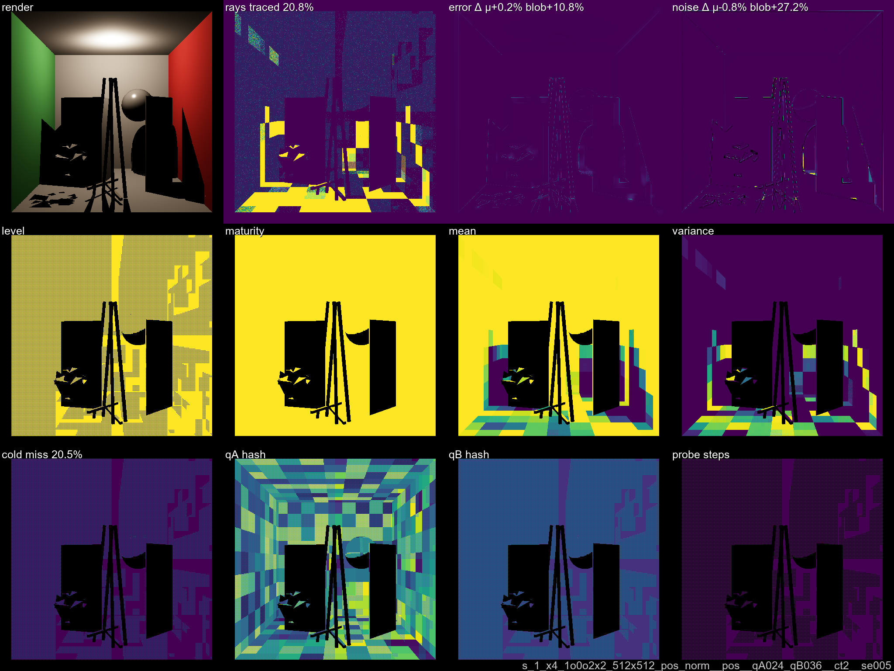 |  | 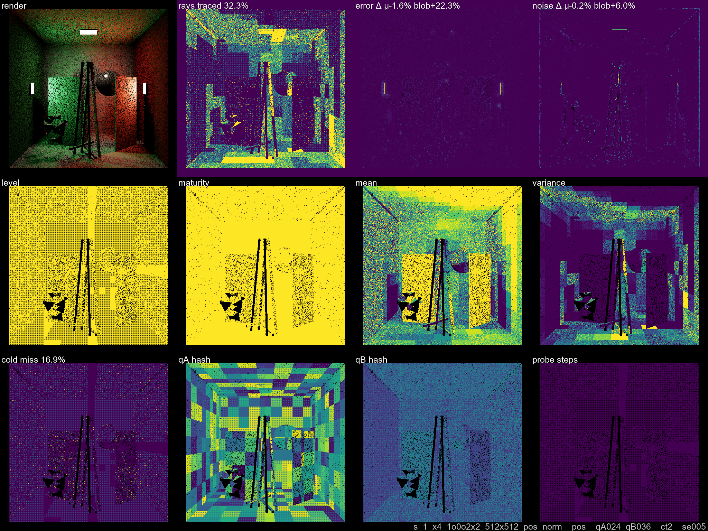 | 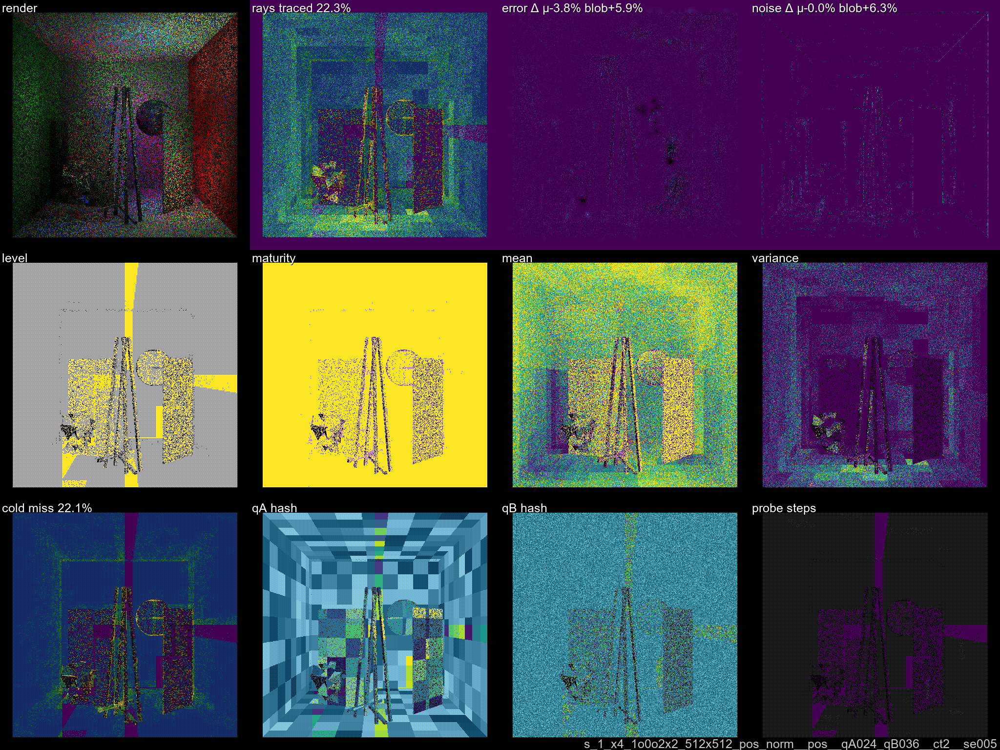 |

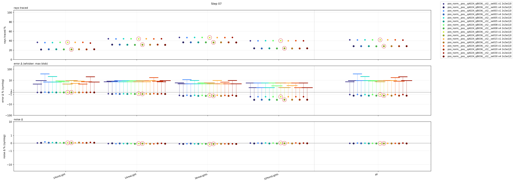

---

## Step 13 — stderr × hierarchical × accel-decay (single-level, negative result)

**What it looks at.** Three new shader mechanisms landed after step 12:
- `stderrThreshold` (se) — principled Bernoulli stderr gate: trust iff `√(var/N) ≤ se`. Combines "low variance" and "enough samples" into one criterion. Replaces `varThreshold`'s few-samples-with-spurious-low-var failure.
- `enableHierarchicalConsistency` (hc) — peek the next finer level's μ at lookup time; if it disagrees with the current level's μ by more than `hierarchicalMuTolerance`, keep descending. Costs one extra hash probe per converged level.
- `accelDecayDisagreeThresh` (ad) — when an incoming sample disagrees with the cell's current μ by more than the threshold, halve the cell counters before adding. Outlier evidence accelerates forgetting of stale cell means.

Step 13 runs on the step-06 single-level lineage (qA024_qB036 + ct2 + vt005) to see if any combination strictly beats the vt005 baseline.

`4 se × 2 hc × 2 ad = 16 variants × 2 SPP = 32 runs/scene × 4 scenes = 128 runs.`

**Result — no strictly dominant variant.**

| candidate | 1PL x1 blob | 1PL x4 blob | 1AL x1 blob | 32PL x4 rays |
|---|---:|---:|---:|---:|
| step-06 `vt005` (baseline) | 12.95 | 16.86 | 4.97 | 22.17 |
| `se10 hc1 ad0` (best x4) | **49.80** | **9.52** | 9.40 | 22.09 |
| `se15 hc0 ad50` (best worst-case) | **11.39** | **10.77** | **28.49** | 22.17 |

Every variant that improves 1PL improves it *at a specific SPP* while regressing another scene or another SPP. The stderr gate's tightening trades off the same way as `vt` did — no qualitative shift in the err/rays Pareto frontier. The hierarchical check and accel decay help in narrow regimes but don't rescue others.

**Carry: none** — step-06 `vt005` remains the active single-level carry. Details and rationale in `captures/ladder/13/picks.json`.

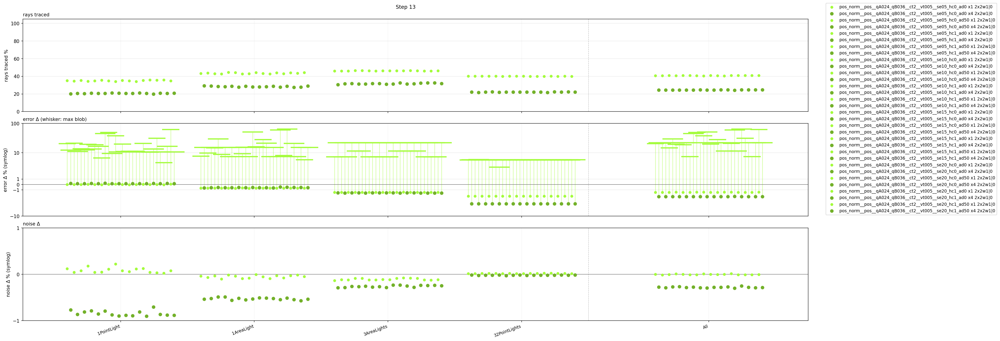

---

## Step 15 — stderr × hierarchical × accel-decay (multi-level + x16, negative result)

**What it looks at.** Multi-level mirror of step 13 on the step-11 lineage (qa012 + ct4 + vt005 + fp0, `LEVELS_MULTI`). Adds x16 SPP — the regime step 12 couldn't defend. Target: does stderr + hierarchical + accel-decay fix the correlation-driven spurious convergence?

`4 se × 2 hc × 2 ad = 16 variants × 3 SPP (x1/x4/x16) = 48 runs/scene × 4 scenes = 192 runs`, chunked 2× for memory.

**Result — no variant beats step-11 baseline. x16 pathology persists.**

| candidate | 1PL x4 blob | 1PL x16 blob | 32PL x4 rays |
|---|---:|---:|---:|
| step-11 `ct4_vt005_fp0` (baseline) | **22.88** | (not run) | 17.79 |
| step-15 best `se20 hc1 ad0` | 32.09 | **60.60** | 17.62 |
| step-15 all 16 variants 1PL x16 blob range | — | **60.60–87.08** | 17.5–17.6 |

Every multi-level variant **regresses** 1PL x4 blob from 22.88 → 32+. At x16 SPP, every combination sits in the 60–87 blob range — the same ceiling step 12 hit. 32PL rays are preserved (~17.5%) so the mechanisms are not catastrophic, just unhelpful on the target scene.

**Diagnosis.** The x16 pathology is sample *correlation*, not sample *paucity*. At x16 SPP each pixel fires 16 rays through slightly-jittered directions; all 16 land on the same side of a hard shadow penumbra from that pixel's perspective, yielding variance ≈ 0 and μ wrong in a direction that happens to match the local pixel. The stderr gate can't distinguish this from a genuine converged cell — `√(var/N) = 0/√16 = 0` is "infinite confidence". Hierarchical check can't either — finer levels see the same correlated samples. Accel decay can't either — incoming samples agree with the current wrong μ.

**Carry: none** — step-11 `ct4_vt005_fp0` remains the active multi-level carry. Details and rationale in `captures/ladder/15/picks.json`.

**Next frontier** (in `memory/project_cell_mean_defenses.md`): correlation-specific defenses — per-cell writer-source diversity tracking (refuse trust if too few distinct pixels have contributed) or split-halves agreement (two independent accumulators per cell, trust iff their μ's agree).

**Big-scene supplement (Bistro + Sponza)**

Step 15 was rerun on `BistroInterior.pyscene`, `BistroExterior.pyscene`, `Sponza.pyscene` — the first multi-level viscache data on real-world geometry. Striking result:

| scene | x4 err Δ | x4 blob | x4 rays |
|---|---:|---:|---:|
| BistroInterior | **−18.5%** | 293.5 | 26.1 |
| BistroExterior | **−70.5%** | 365.7 | 27.7 |
| Sponza | +5.6% | 250.9 | 17.5 |

**On Bistro, viscache cuts mean GT-error by 18–70%** vs same-SPP vanilla — viscache's aggregation across frames delivers exactly what it was designed for on scenes with complex lighting. The blob numbers (200–365) are enormous but they flag *per-region* Δ, not mean; the mean shows a net quality gain everywhere except on Sponza, which slightly regresses (+5.6% err). Sponza's large open interior with scattered directional lighting may hit a different cache-cell occupancy regime than Cornell or Bistro.

The 16 variant combinations (se × hc × ad) show almost no variance within a scene on big-scene x4 (blob 293.5–293.9 on BistroInterior). The cache's fundamental behaviour dominates; the gate mechanisms barely affect outcomes at this scale. This reinforces the step-13/15 Cornell findings: gate tightening is the wrong axis for the correlation-driven pathology.

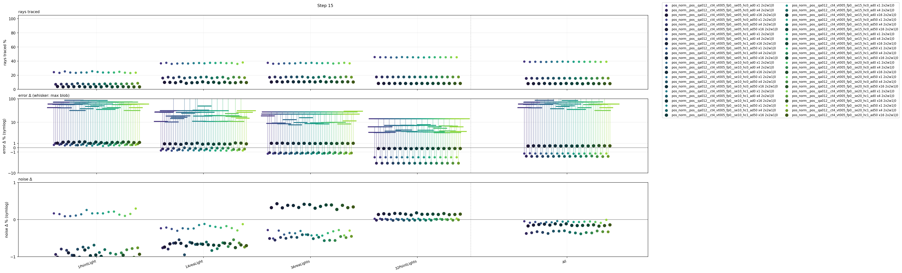

---

## Cross-step ladder progress

Per-scene thin lines + bold weighted-"All" across all ladder steps in three panels (rays / error+blob / noise). Red halos mark each step's carried winner; whiskers show per-scene min→max of all variants at that step. One plot per SPP tier — x1 is the noisiest floor, x4 is the convergence check, x16 the high-SPP regime (only steps that run x16 show dots there; others are empty at that tier). Steps 11 and 14 are excluded until their multi-level expansions settle.

**x1 SPP:**

**x4 SPP:**

**x16 SPP:**

**Compact overlay — weighted "All" only, x1 + x4 + x16:**

