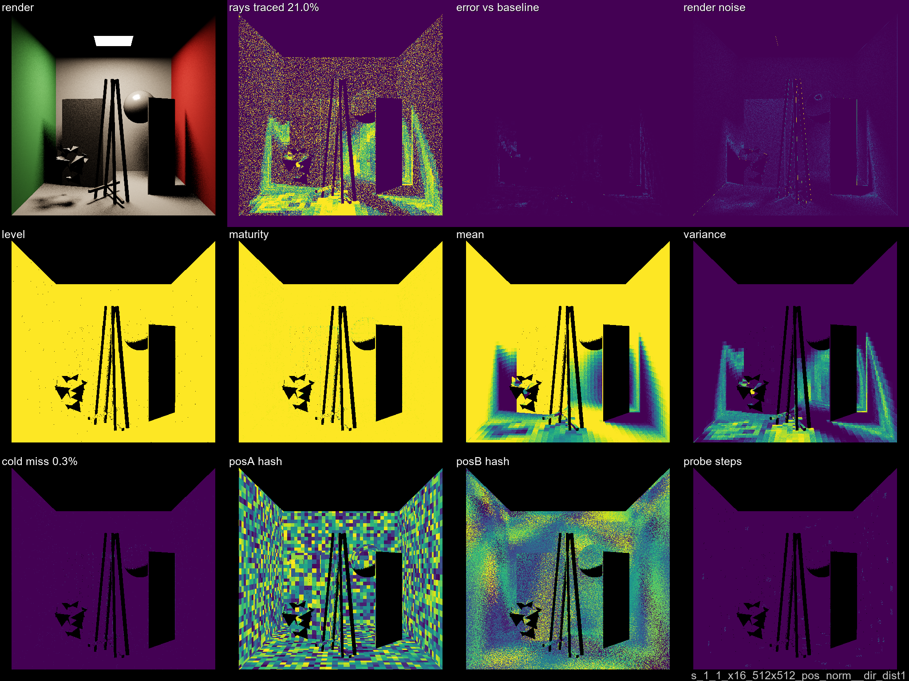

# VisCache Dev Log

Systematic ladder test results. One entry per ladder step.
Full plates and stats in each step's subfolder.

**Diagnostic plate layout** (4×3 grid):

| | col 1 | col 2 | col 3 | col 4 |
|---|---|---|---|---|
| **r1** | render | accum raysTraced | accum error | accum noise |
| **r2** | frame level | accum maturity | accum mean | accum variance |
| **r3** | accum coldmiss | frame qAHash | frame qBHash | frame probeSteps |

---

## [Step 00 — Vanilla Baselines](step00/STEP00.md)

Vanilla PathTracer (no VisCache) at x1 and x32768 SPP. Error and ground-truth reference for downstream steps. No VisCache plates.

---

## [Step 01 — Initial Exploration](step01/STEP01.md)

Naive first pass: single level, uniform QUANT_SMALL, all 10 variants (pos_norm1 + pos_norm families), 4 scenes × x1 SPP.

Best variant: **pos_norm__dir1_dist1** — 39.6% rays traced (60.4% savings), 0.2% cold miss.

---

## [Step 02 — Quantization Refinement](step02/STEP02.md)

Per-variant tuned bin sizes, norm1 family, x1 vs x16 SPP comparison across 4 scenes.

Best at x16: **pos_norm__dir_dist1** — 21.0% rays traced (79% savings), 0.3% cold miss.

