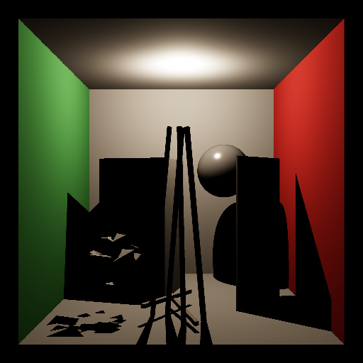
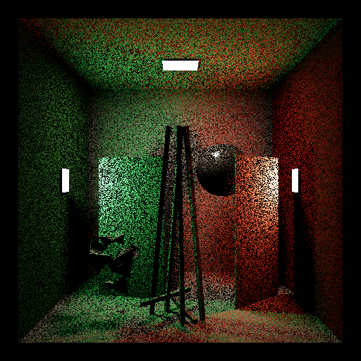
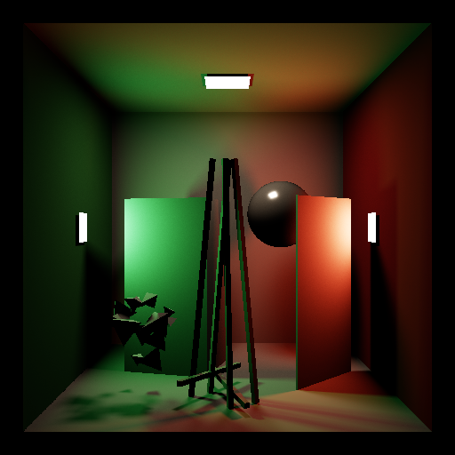
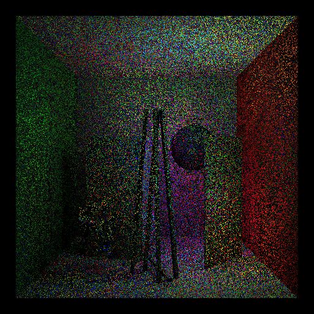
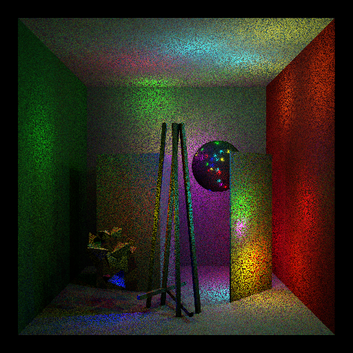

# Step 00 — Vanilla Baselines

Vanilla PathTracer (no VisCache). Three SPP levels: x1 (noisy reference), x16 (mid), x4096 (near ground truth).
Used as error and noise reference for all downstream steps.

[← Dev Log overview](../DEVLOG.md)

## Baseline renders — CornellBox_1AreaLight

| x1 SPP | x16 SPP | x4096 SPP |
|--------|---------|-----------|
|  |  |  |

## Baseline renders — CornellBox_1PointLight

| x1 SPP | x16 SPP | x4096 SPP |
|--------|---------|-----------|
|  |  |  |

## Baseline renders — CornellBox_3AreaLights

| x1 SPP | x16 SPP | x4096 SPP |
|--------|---------|-----------|
|  |  |  |

## Baseline renders — CornellBox_32PointLights

| x1 SPP | x16 SPP | x4096 SPP |
|--------|---------|-----------|
|  |  |  |
