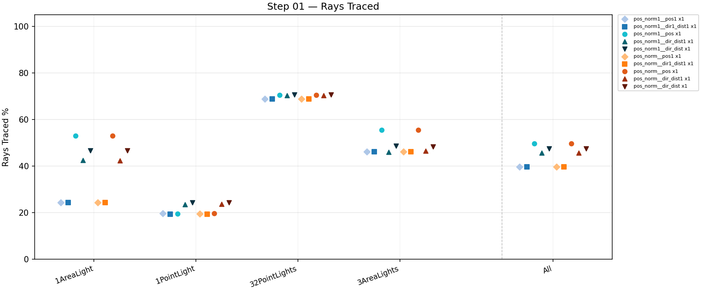
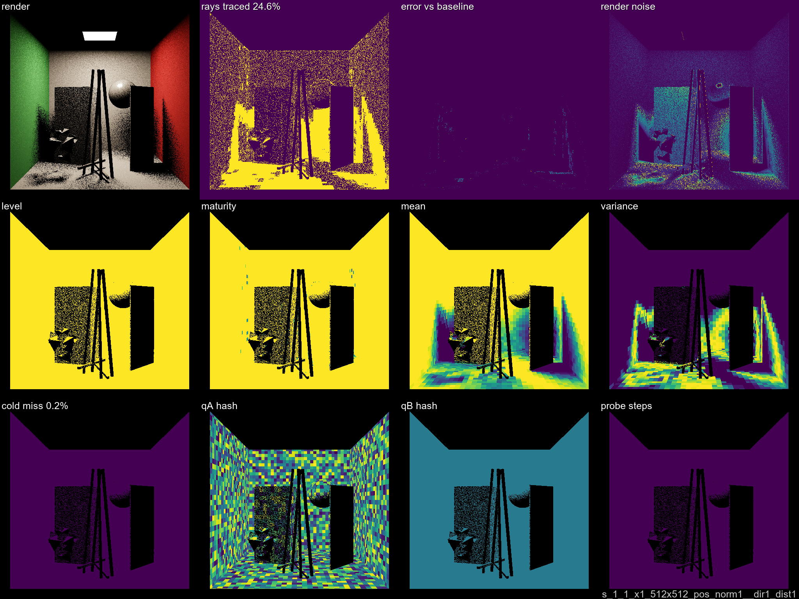
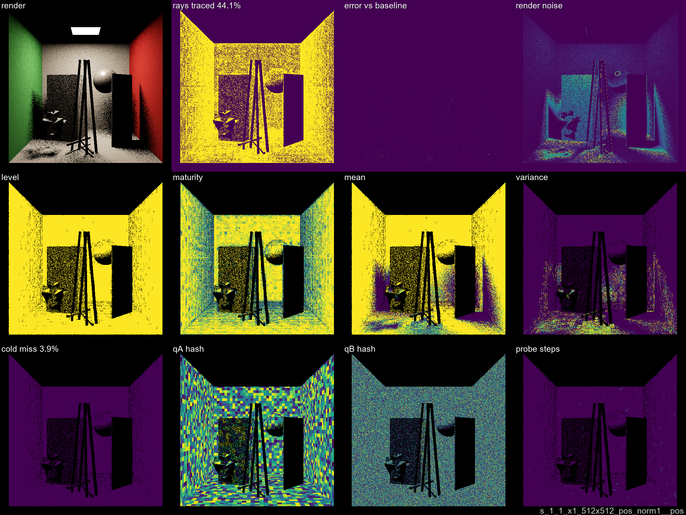
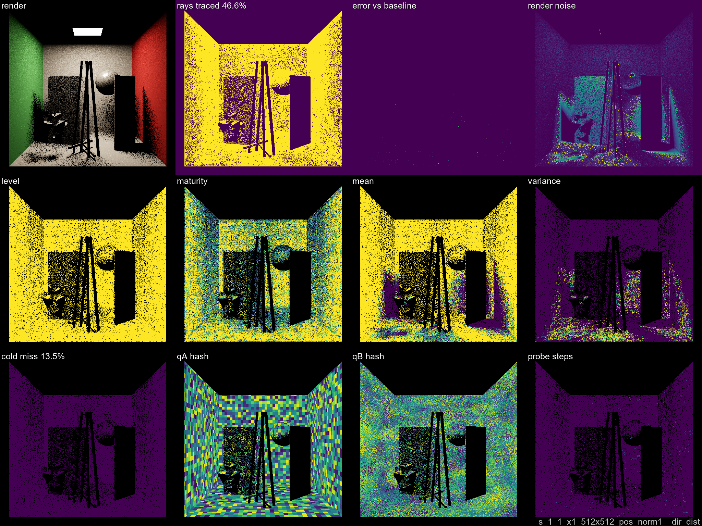
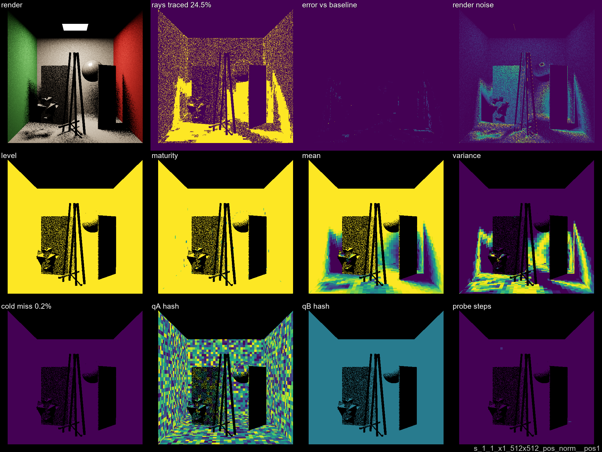
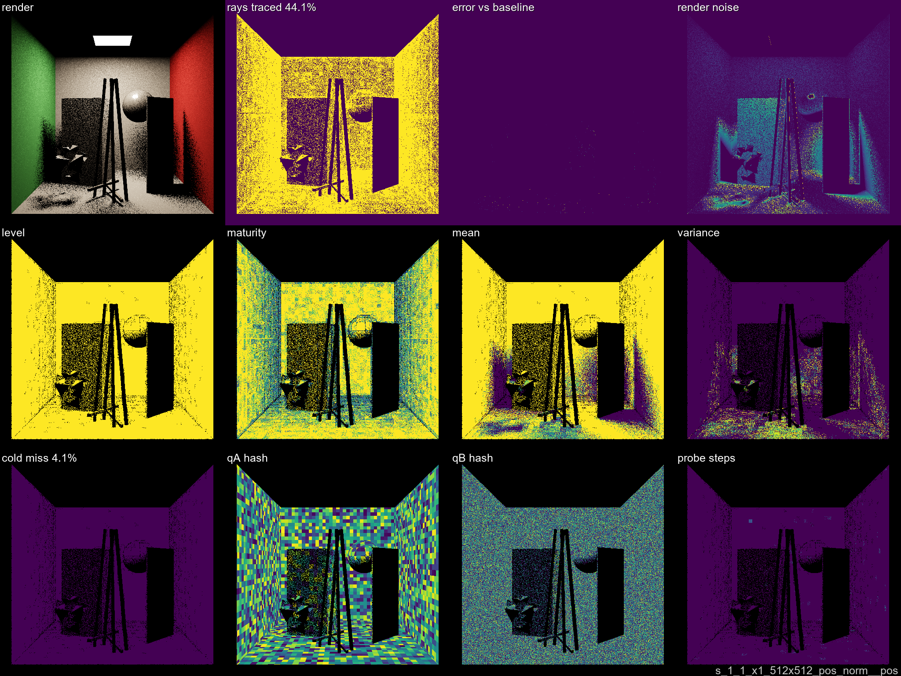
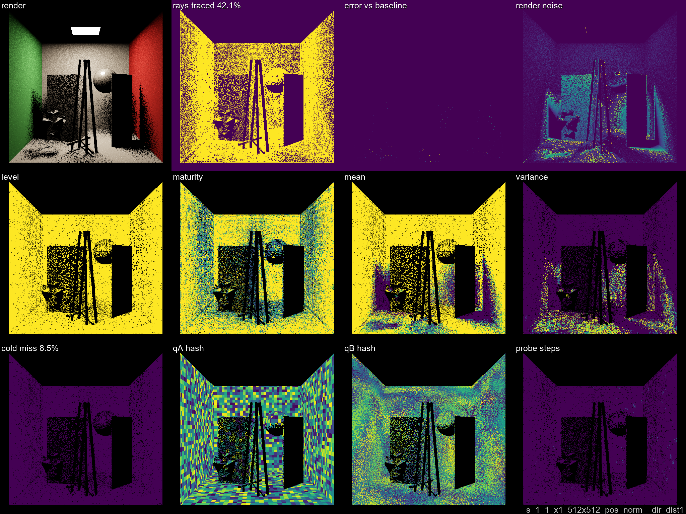
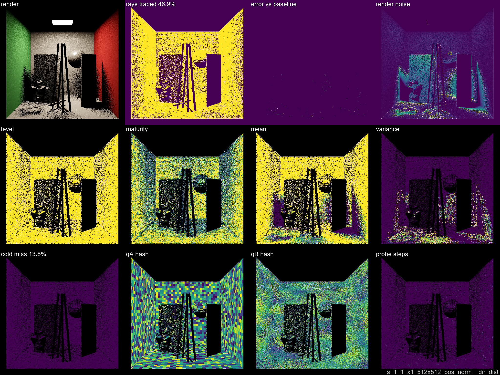

# Step 02 — Initial Exploration

**Naive first pass.** Single level, uniform QUANT_SMALL quantization.
10 variants: all 5 B-side configurations × 2 normal families (norm1 collapsed, norm active ~60°/bin).
Config: 4 scenes × 1 warmup + 1 render frame × x1 SPP, 512×512.

[← Dev Log overview](../DEVLOG.md)

## Overview plot

## Results summary

| variant | rays % | savings | cold miss |
|---------|-------:|--------:|----------:|
| pos_norm__dir1_dist1  | 39.6 % | **60.4 %** | 0.2 % |
| pos_norm1__dir1_dist1 | 39.7 % | 60.3 % | 0.2 % |
| pos_norm__pos1        | 39.7 % | 60.3 % | 0.2 % |
| pos_norm1__pos1       | 39.7 % | 60.3 % | 0.2 % |
| pos_norm1__dir_dist1  | 45.6 % | 54.4 % | 14.0 % |
| pos_norm__dir_dist1   | 45.7 % | 54.3 % | 14.2 % |
| pos_norm__dir_dist    | 47.5 % | 52.5 % | 18.0 % |
| pos_norm1__dir_dist   | 47.6 % | 52.4 % | 17.8 % |
| pos_norm1__pos        | 49.6 % | 50.4 % | 32.4 % |
| pos_norm__pos         | 49.7 % | 50.3 % | 32.6 % |

Collapsed variants (__pos1, __dir1_dist1) top the table — near-zero cold miss and ~60% savings at x1 SPP.
The __pos variant has the highest cold miss (~32%): symmetric fine cells need more than one warmup frame.
Normal family (norm vs norm1) has negligible effect at this quantization level.

## Plates — pos_norm1 family (normal collapsed)

### pos_norm1__pos1
Position-only B-side (posB=10000).

### pos_norm1__dir1_dist1
Direction+distance both collapsed (single angular + single distance bin).

### pos_norm1__pos
Symmetric position B-side (posB=posA=0.06).

### pos_norm1__dir_dist1
Angular bins active (8°), distance collapsed.

### pos_norm1__dir_dist
Full B-side: angular bins (8°) + distance bins (0.24).

## Plates — pos_norm family (normal active, ~60°/bin)

### pos_norm__pos1

### pos_norm__dir1_dist1

### pos_norm__pos

### pos_norm__dir_dist1

### pos_norm__dir_dist

