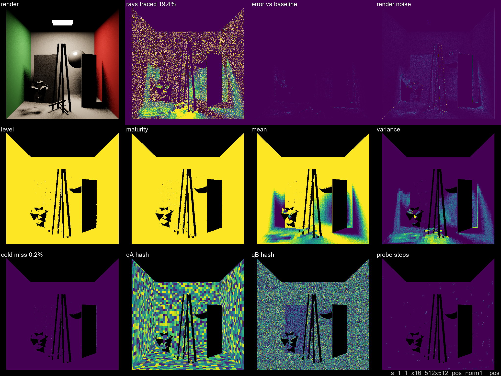
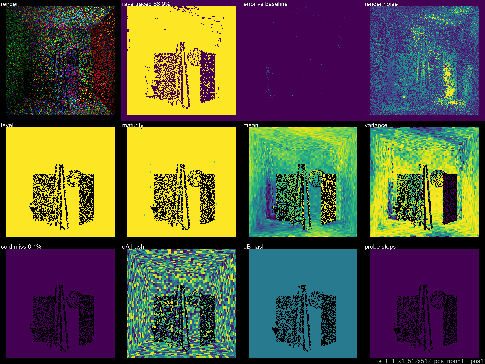
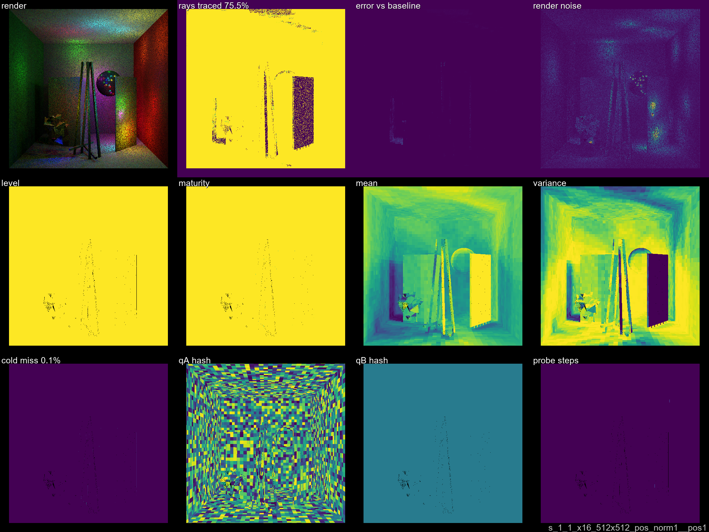
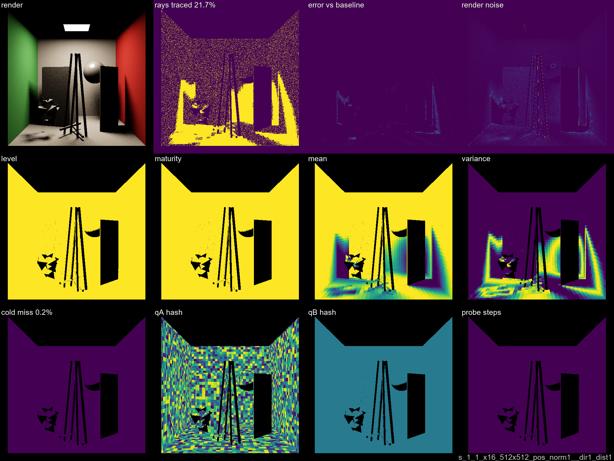
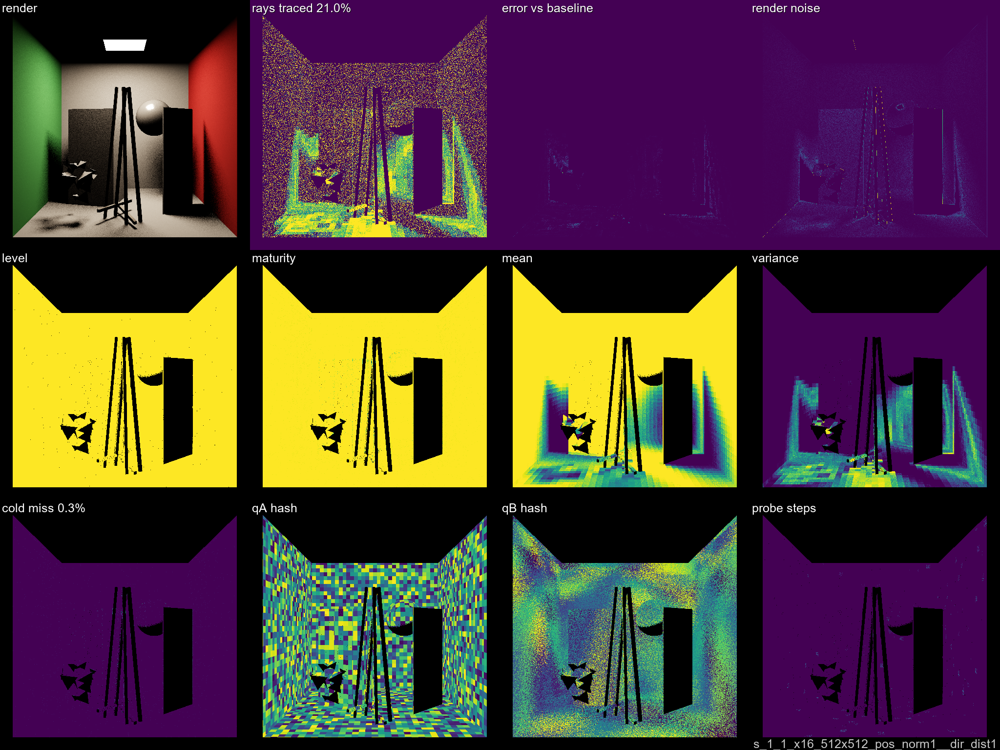
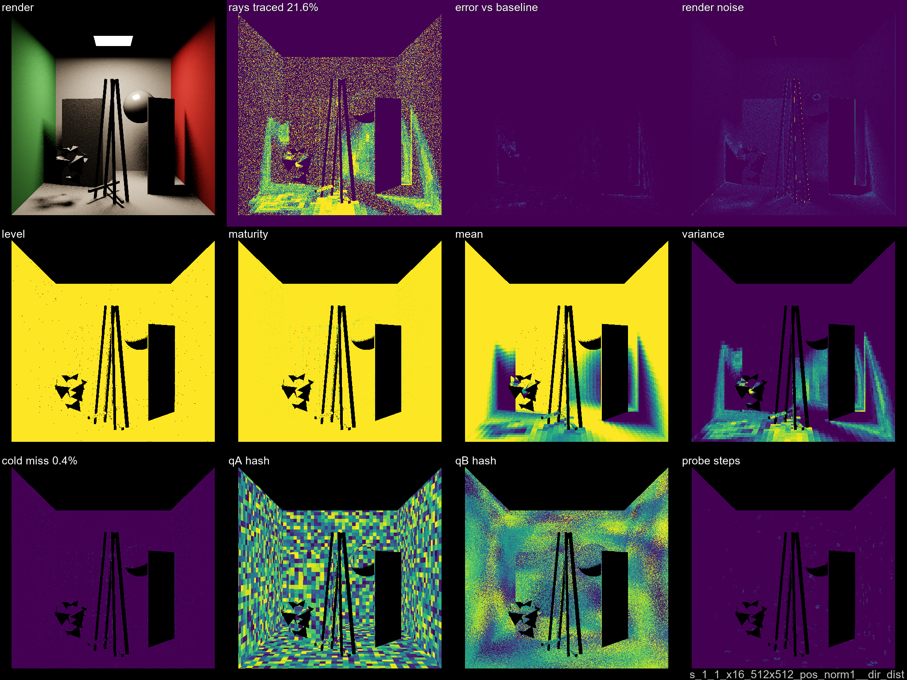

# Step 02 — Quantization Refinement

**norm1 family, tuned bin sizes.** x1 and x16 SPP, 4 scenes each.
Config: 1 warmup + 1 render frame, 512×512.

Key finding: **a single qB cell is not enough.** Collapsed B-side variants (pos1, dir1_dist1)
looked good in step 01 (single 1AreaLight scene), but with multi-light scenes their x16
performance collapses — the single slot blends incompatible radiance estimates from all
secondary hit directions. Fine B-side (pos, dir_dist1, dir_dist) converges to ~23–25% rays
and generalises across scene types.

[← Dev Log overview](../DEVLOG.md)

## Overview plot

## Results summary (mean across 4 scenes)

| variant | x1 rays % | x1 cold | x16 rays % | x16 savings | x16 cold |
|---------|----------:|--------:|-----------:|------------:|---------:|
| pos_norm1__pos        | 44.9 % | 10.8 % | **23.4 %** | **76.6 %** | 0.2 % |
| pos_norm1__dir_dist   | 43.4 % | 11.9 % | 25.3 % | 74.7 % | 0.6 % |
| pos_norm1__dir_dist1  | 42.2 % |  9.4 % | 25.5 % | 74.5 % | 0.4 % |
| pos_norm1__dir1_dist1 | 39.7 % |  0.2 % | 42.1 % | 57.9 % | 0.1 % |
| pos_norm1__pos1       | 39.7 % |  0.2 % | 42.0 % | 58.0 % | 0.1 % |

Collapsed B (pos1, dir1_dist1): near-zero x1 cold miss but **plateau at 42% rays** at x16 —
useful only for single-dominant-light scenes. Full data by scene:

| variant | scene | x1 rays % | x16 rays % |
|---------|-------|----------:|-----------:|
| pos_norm1__pos1 | 1AreaLight      | 24.2 % | 21.7 % |
| pos_norm1__pos1 | 1PointLight     | 19.5 % | 13.0 % |
| pos_norm1__pos1 | 3AreaLights     | 46.3 % | **57.9 %** |
| pos_norm1__pos1 | 32PointLights   | 68.9 % | **75.5 %** |
| pos_norm1__pos  | 1AreaLight      | 44.5 % | 19.4 % |
| pos_norm1__pos  | 1PointLight     | 19.2 % | 13.1 % |
| pos_norm1__pos  | 3AreaLights     | 45.5 % | 30.5 % |
| pos_norm1__pos  | 32PointLights   | 70.2 % | 30.5 % |

For 32PointLights at x16: pos1 saves only 24.5%, pos saves 69.5%.

## Plates — pos_norm1__pos (best mean x16)

<table><tr>
<td></td>
<td></td>
</tr><tr>
<td align="center">x1 SPP</td>
<td align="center">x16 SPP</td>
</tr></table>

## Plates — pos_norm1__pos1 (collapsed B, fails multi-light)

<table><tr>
<td></td>
<td></td>
</tr><tr>
<td align="center">32PointLights x1 SPP</td>
<td align="center">32PointLights x16 SPP — 75.5% rays (only 24.5% savings)</td>
</tr></table>

## Plates — all norm1 variants, CornellBox_1AreaLight

### pos_norm1__pos1

<table><tr>
<td></td>
<td></td>
</tr><tr><td align="center">x1</td><td align="center">x16</td></tr></table>

### pos_norm1__dir1_dist1

<table><tr>
<td></td>
<td></td>
</tr><tr><td align="center">x1</td><td align="center">x16</td></tr></table>

### pos_norm1__dir_dist1

<table><tr>
<td></td>
<td></td>
</tr><tr><td align="center">x1</td><td align="center">x16</td></tr></table>

### pos_norm1__dir_dist

<table><tr>
<td></td>
<td></td>
</tr><tr><td align="center">x1</td><td align="center">x16</td></tr></table>
