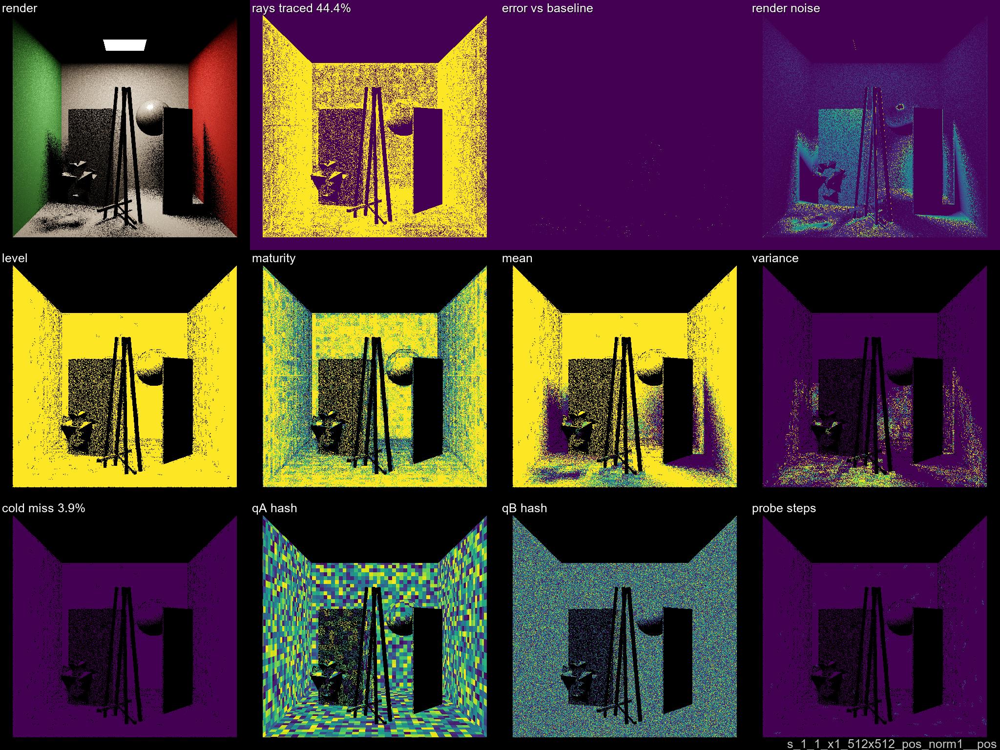
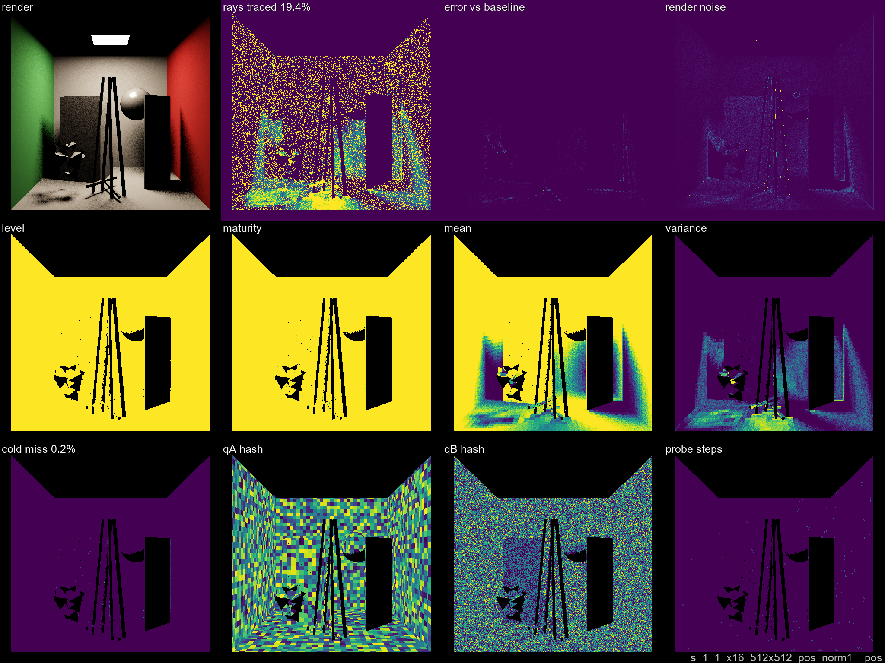
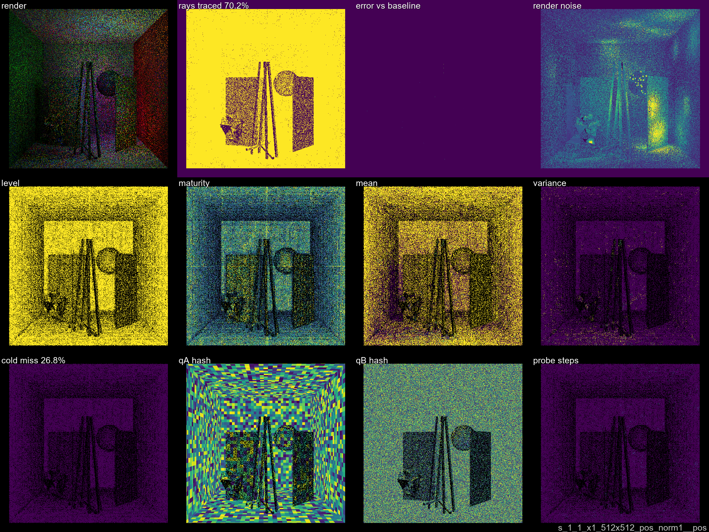
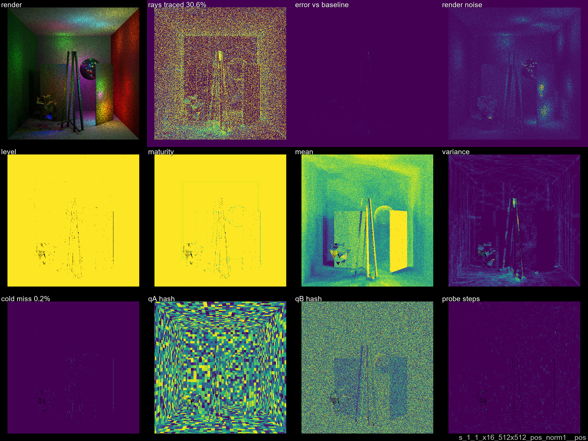

# Step 04 — Normal Family Comparison

**Fine B-side only (pos, dir_dist1, dir_dist) × norm vs norm1.** x1 and x16 SPP, 4 scenes each.
Config: 1 warmup + 1 render frame, 512×512.

Key finding: **norm vs norm1 makes no measurable difference** on convex CornellBox geometry.
All paired variants are numerically identical across all scenes and both SPP levels.

**Decision: proceed with `pos_norm` (uncollapsed normal) only.** Although numerically identical
here, `norm` (~60°/bin) is architecturally superior for thin-plate geometry — surfaces with
opposite normals at the same position (e.g. thin walls, leaf geometry) would alias into the
same slot under `norm1` (all normals → 1 bin). `pos_norm` correctly separates them.
The CornellBox scenes are too convex to expose this, but it will matter on richer geometry.

[← Dev Log overview](../DEVLOG.md)

## Overview plot

## Results summary (mean across 4 scenes)

| variant | x1 rays % | x1 cold | x16 rays % | x16 savings | x16 cold |
|---------|----------:|--------:|-----------:|------------:|---------:|
| pos_norm1__pos       | 44.9 % | 10.8 % | **23.4 %** | **76.6 %** | 0.2 % |
| pos_norm__pos        | 44.9 % | 11.0 % | **23.4 %** | **76.6 %** | 0.3 % |
| pos_norm1__dir_dist  | 43.6 % | 11.9 % | 25.3 % | 74.7 % | 0.6 % |
| pos_norm__dir_dist   | 43.6 % | 12.1 % | 25.3 % | 74.7 % | 0.6 % |
| pos_norm1__dir_dist1 | 42.1 % |  9.4 % | 25.5 % | 74.5 % | 0.4 % |
| pos_norm__dir_dist1  | 42.0 % |  9.6 % | 25.5 % | 74.5 % | 0.4 % |

Norm family has negligible effect — same pattern across all scenes. Not a useful tuning axis.
Best: **pos (either norm)** at 23.4% mean rays x16. All variants within ~2 pp of each other at x16.

## Per-scene detail (x16)

| variant | 1AreaLight | 1PointLight | 3AreaLights | 32PointLights |
|---------|----------:|------------:|------------:|--------------:|
| pos_norm1__pos  | 19.4 % | 13.1 % | 30.5 % | 30.6 % |
| pos_norm__pos   | 19.4 % | 13.1 % | 30.5 % | 30.7 % |
| pos_norm1__dir_dist1 | 21.0 % | 13.4 % | 29.9 % | 37.7 % |
| pos_norm__dir_dist1  | 21.0 % | 13.4 % | 29.9 % | 37.8 % |
| pos_norm1__dir_dist  | 21.6 % | 13.4 % | 30.3 % | 35.7 % |
| pos_norm__dir_dist   | 21.5 % | 13.5 % | 30.4 % | 35.9 % |

## Plates — pos_norm1__pos (best, x1 vs x16)

<table><tr>
<td></td>
<td></td>
</tr><tr>
<td align="center">1AreaLight x1</td>
<td align="center">1AreaLight x16</td>
</tr></table>

<table><tr>
<td></td>
<td></td>
</tr><tr>
<td align="center">32PointLights x1</td>
<td align="center">32PointLights x16</td>
</tr></table>
